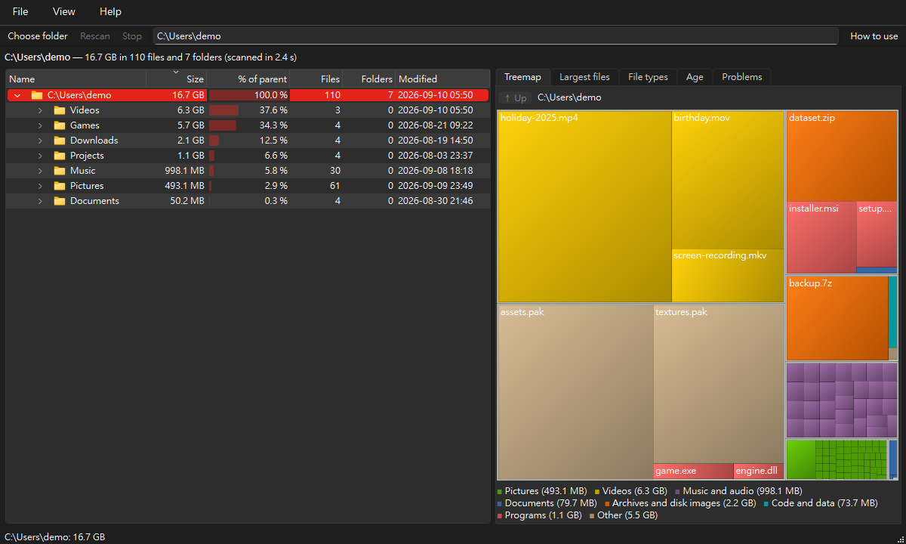

# FileTree

**See where your disk space goes.** FileTree scans a folder or a whole drive, adds up every file inside
it, and shows you the biggest folders and files first — in a folder tree, a colourful treemap and a list
of the largest files. When you find something you no longer need, move it to the Recycle Bin right from
the window.

[English](README.md) | [繁體中文](README/README_zh-TW.md) | [简体中文](README/README_zh-CN.md)



From the tree, Search or Largest files, select real entries and right-click → **Move to folder…** or **Rename…**. The modal preview lists every outermost source/destination and refusal reason, up to 1,000 selected entries. Choose an existing folder, or a filename pattern with literal `{name}`, `{stem}`, `{ext}`, `{n}` tokens. Existing names default to **skip**; an explicit numbered-suffix choice previews the exact alternative names. Changing options invalidates approval; choose **Preview paths** again. **Apply reviewed paths…** asks a default-No plain-text question with every eligible pair in Details; refused/unchanged rows stay visible and are skipped. Execution freezes options, rechecks complete source coverage and captured parent identities, and uses native same-volume exclusive rename without copying or overwriting. Protected, linked, special, known unavailable, changed and cross-volume entries are refused. Stop/close waits through the current rename and preserves completed changes. Per-item failures and actual paths remain visible; an unexpected post-rename receipt attempts exclusive rollback, with retained destinations reported if rollback fails. Concurrent filesystem mutation is not transactional. Outside destination parents are rescanned on the owned worker with counts/errors shown; closing rebuilds the current root to refresh all affected parents within it and invalidates old capacity metadata. A canceled refresh stays visible. The Python API provides `namespace_moves.prepare_namespace` / `execute_namespace` with moved/skipped/failed outcomes and both parent paths. Native macOS remains unverified; use the separate **Move to another drive…** workflow for verified copies.

Select scanned folders in the tree, Search or Largest files and right-click → **Move to another drive…**. Choose an existing folder on another volume; review every exact pair and explicit skip/suffix collision choice. **Copy and verify reviewed folders…** asks a default-No plain-text question and freezes the options. Progress names the current file. Stop/close cancels and joins the worker; originals and partial destinations remain, with actual paths/errors shown. Successful copies enable **Move verified originals to Recycle Bin…**, which uses the existing protected-folder approval and a separate default-No Trash question listing the source/copy pairs and 64 MiB verification limit. The Trash worker verifies every copy again immediately before moving its original; a failed check stops remaining moves. **Leave a junction/symbolic link** is off by default and captured for the batch. Only successful Trash creates this original-path redirect; a collision never overwrites an arrival. A failed redirect keeps the verified copy and the original in Trash, reports the exact paths, and may leave an empty original-path directory on Windows. No automatic Trash follows copying. Outside destination parents are rescanned on the worker; current source parents refresh after Trash, or the current root refreshes if Trash is declined. Closing the main window joins active path-operation dialogs and reports copy-gate errors received while joining Trash. Native Windows C→D copies/ADS and junctions on owned fixtures are verified; native macOS remains unverified.

The Python API adds `verified_copy.prepare_copy` / `copy_folders` / `verify_copy` for explicitly reviewed exclusive ordinary-folder copies, including cross-volume destinations. Previews retain every outermost pair/refusal and explicit skip/suffix collision choices, up to 1,000 selections. Protected ordinary sources can be read; their eventual Trash approval remains the existing protected-source flow. Linked, special, known unavailable/reparse, incomplete, changed and mounted payloads are refused. No existing name is overwritten. Copies preserve empty folders and create separate copies of hard-link names. Complete child names, file counts and lengths are compared; every main file/Windows named stream smaller than 64 MiB is SHA-256 compared, while larger values are length-only. Native Windows copying preserves ADS; stream-query failures prevent verification. POSIX extended attributes are copied and compared strictly; macOS uses native descriptor copying/resource-fork comparison, with attributes at/above 64 MiB length-only. File metadata uses platform support; Windows directory security inherits the destination and POSIX setuid/setgid/sticky bits are not transferred. Known filesystem boundaries and Linux same-device mount IDs are checked at destination descriptors. Failure stops the batch, keeps every original and reports retained partial destinations; cancellation keeps partial data too. A verified proof must be rechecked before the separately approved existing Trash action. This API never trashes, deletes or redirects originals. Observations are not a concurrent filesystem transaction. Native macOS remains unverified.

The Python API adds `trash_restore.capture_origin` / `prepare_restore` / `restore` for explicit same-volume freedesktop undo on Linux. Capture the original scanned snapshot and parent identities before Trash, then prepare only its actual recognized current-user private `files`/`info` destination and exact `.trashinfo` path/date. Preparations read bounded no-follow metadata (100k entries/128 levels). Restoration rechecks full payload/receipt/parent/owner/mount observations and uses native exclusive rename; existing or arriving original-path names are never overwritten. Changed post-rename observations attempt exclusive rollback. Only the matching receipt is removed after successful restore; metadata cleanup failure reports truthful restored/retained status and actual paths. No payload deletion/copy fallback exists. The status-bar Undo and Windows Shell `undelete` integration remain pending; native Linux proof runs on disposable private fixtures in a dedicated CI job. No existing user Trash scope is used. Canceled restoration reports a visible reason while retaining the payload/receipt. Native CI verified success, collision refusal, changed-payload refusal and replaced-info-parent refusal on owned fixtures.

**Options → Count observed hard links once** is off by default, persisted and captured for future scans. It adds separate counted logical/allocation totals while preserving named file lengths, allocation and counts. The summary shows counted totals, observed aliases and unknown records; the header menu offers initially hidden **Counted size / Counted disk size** columns. The lexical first observed name contributes bytes; aliases count zero only in the counted fields. Charts and their legends use counted totals; Largest/Search/type/age/owner lists and parent/drive shares keep named semantics. Unknown/inconsistent metadata retains named estimates; shared extents and directory metadata remain unknown. Branch and post-Trash rescans rebuild the full root in this mode, transferring contribution when the counted name leaves. Running workers retain their captured option. CSV appends `accounted_size_bytes`, `accounted_allocated_bytes` and `hard_link_accounting` (0/1); folder JSON adds counted values and a mode flag, preserving named `size` for saved comparison/history. HTML/XLSX reports retain named tables plus counted entry/summary columns. The CLI accepts `--count-hard-links` and emits counted byte totals and `hard_link_accounting` metadata. Disabled counted fields fall back to named estimates. The Python API uses `ScanOptions(count_hard_links=True)` and `Node.accounted_size/accounted_allocated`; reapply `account_hard_links` on a worker after mutating a captured tree. This reuses recorded stat without extra OS/payload calls. A native owned two-name fixture kept 2 MiB named totals, 1 MiB counted totals, two real file lengths and one alias.

Expand a recorded **ZIP / 7z / RAR** file after scanning to read its contents on demand. Rows marked **[virtual]** show declared uncompressed sizes; they stay outside disk totals, charts, exports and file actions. Members are never extracted and nested archives are not opened. ZIP uses the standard library, 7z uses installed `py7zr`, and RAR uses `rarfile` with `unrar` or `bsdtar` on PATH; without one, RAR remains a plain file with a reason in its tooltip. Changed, unreadable, malformed or password-protected headers also remain plain files. Known cloud placeholders and source links are refused. Member links, traversal/absolute names, duplicate conflicts and excessive names/depth are omitted with a visible count. The inventory is capped at 100,000 entries, 1,024-character names, 128 levels and 32 MiB of cumulative parser reads; decoded 7z header sizes are checked before decoding. At most two reads run together. Right-click the source file → **Stop reading this archive** to stop; stopping or closing waits through the current decoder call. Rescanning retries previews; a new scan or tree edit invalidates old replies. The expanded-folder text filter covers real filesystem entries and hides virtual rows while active. Preview reads headers, not member contents, so it does not verify their CRC or actual extracted sizes.

In **Clean up → Duplicates**, choose **Similar photos** and a minimum file size (default 1 MiB), then **Find similar photos**. This separate search decodes recorded image types with installed `Pillow`, normalizes EXIF orientation and the first animation frame, and compares a 64-bit difference hash from a grey 9×8 image. Set Hamming distance 0–16 (default 4). Each group stays within the threshold of its first observed image; members can be farther apart from each other. Colours, uniform images or unrelated scenes can collide, so compare thumbnails and originals. This is a visual candidate list: explicit keeper/extra-copy selection and recovery estimates remain available only for exact duplicates. Manual selected-file actions use the existing confirmation/protection flow. The worker refuses changed/link/known cloud files, skips unsupported/broken/oversize images with counts, deduplicates recorded hard-link identities, and caps successful signatures at 100,000, sources at 128 MiB, pixels at 40 million and displayed image rows/thumbnails at 1,000. Stop/new scan/mode change/tree edits invalidate replies; closing joins current decoding calls. Thumbnails stay in memory, source bytes are unchanged, and this search has no network calls or automatic file actions.

**Options → Measure Windows per-file allocation** is off by default and applies to future full/branch scans; enable it and rescan. It uses a no-follow metadata handle and `FILE_STANDARD_INFO`, validating full 64-bit volume/128-bit file identity (legacy stat identity on Python before 3.12), size and modification time. This measures ordinary and XPRESS/WOF allocation even when ordinary compression flags are absent. Known cloud/offline files retain zero without a query; unsupported, denied or changed metadata falls back to the documented size estimate. Per-file queries cost extra scan time. File payloads are not read; shared extents and directory metadata remain unknown, and hard links still count per name. Default scans retain cluster estimates for ordinary files. Native owned-fixture validation preserved contents through NTFS and XPRESS8K compress/uncompress; an exact rescan retained 73,728 allocated bytes for a 2 MiB XPRESS fixture whose ordinary compression flags were absent.

On Windows, a scanned folder's context menu offers **NTFS compression…**. A cancellable read-only preview shows the largest 1,000 recorded log/text/code/executable/possibly uncompressed-image candidates, complete counts and logical/named allocation. Potential saving is **0–candidate allocation**, with no guaranteed compression rate or freed space. Choose NTFS, XPRESS8K (rarely modified data), or uncompress; restoration lists safe recorded types regardless of compression flags. **Process listed files…** asks a default-No question naming the scope, mode, listed count and logical bytes. Only those listed files are processed, not all candidates; directory defaults and unlisted files stay unchanged. Native tools run only on current fixed local NTFS, recheck recorded identities and pin all ancestors/files against rename/delete. Links, known cloud/offline, sparse, hidden/system, hard-linked, protected and changed/unknown entries are refused. No shell, wildcard or `/s` recursion is used. Uncompress invokes both `/u` and `/u /exe`. Compression can slow writes and uncompression needs free space. Stop/close terminates and joins the command; earlier/current files may retain partial changes. Results show known matched before/after allocation, unknowns and the first 20 errors. Closing triggers a full/branch rescan with transient per-file allocation; future manual scans follow the Options setting. The preview reads no payload; confirmed native operations can read it. Double-click selects the recorded file before processing, Ctrl+C copies rows. Native fresh owned-fixture validation preserved SHA-256, restored allocation, refused hard links and left junction peers untouched.

The **Users** tab groups recorded files by owner over the whole scan, showing the largest 1,000 owner groups with full group/file/byte counts, logical size, named allocation, file count and logical share. POSIX uid comes from the existing scan stat; Windows **Options → Capture Windows file owners** is off by default because per-file security queries are costly. Enable it and rescan; the setting applies to future full/branch scans. A shared immutable uid/SID key adds one owner slot (measured +8 bytes per node). Windows captures regular-file owner SIDs read-only, skips links and cloud/offline files, and rechecks recorded metadata after the query. Disabled, denied, missing or changed owners form an explicit **Unknown owner** group; incomplete scans also flag omitted data. Opening the tab starts cancellable analysis and account-name resolution off the GUI thread; unresolved names retain uid/SID. Stop, tab changes, new scans and closing discard canceled replies and close joins owned workers. Moves and branch rescans invalidate totals. **Refresh recorded totals** reaggregates the scan; rescan to obtain changed file ownership. Ctrl+C and Current list CSV export work here. Folder ownership never assigns its descendants; hard links still count per name and allocation remains estimated. File ownership does not prove actual use or removal permission, and this tab creates no cleanup actions. File-owner records are absent from folder-only JSON/history.

**Options → Capture file access/creation times** is off by default and applies to future full/branch scans; enable it and rescan. It adds 16 bytes per regular-file snapshot, using the stat already read, with no new Node fields or extra timestamp queries. The tree header offers optional **Recorded access** and **Created** columns, hidden by default. **File → File times…** filters files by recorded access/creation dates at least a chosen number of days old (0–36,500; default 730), shows the largest 1,000 matches with full match/byte/unknown counts, supports Ctrl+C and exact tree activation, and has Stop/close joining. Whole-tree filtering runs on a worker. Missing/future dates stay unknown; directories and links have no captured dates. Creation uses birthtime where available (legacy Windows ctime only on Python versions without birthtime), never POSIX ctime. NTFS `NtfsDisableLastAccessUpdate` is queried read-only, including initialized/system-managed bits: disabled or unknown configurations cannot produce access-age matches, while creation filtering remains available. Registry values can require restart and do not prove the effective policy on every volume. Other filesystems/providers can defer or suppress atime too, and background reads can change it; recorded dates never prove actual use. This view does not prepare cleanup actions. Largest-files CSV adds `accessed`/`created` ISO dates, empty when unavailable; folder-only JSON/history has no file dates.

Use **Pause / Resume** in the scan bar to suspend taking new folders. Current folder reads finish and the live tree keeps refreshing; **Stop** and closing still work while paused. Final analysis cannot be paused. The elapsed time includes pauses; resuming keeps the same scan and counts.

**Options → Gentle scanning** is off by default and applies to new scans. Each disposable scan thread uses Windows background CPU/I/O mode or Linux nice 10 plus the lowest best-effort I/O priority. The UI thread is unaffected. Unsupported platforms, denied changes and partial priority application are reported; readable folders still scan. I/O effects depend on the device scheduler and a scan can take longer. The CLI and measurement tool accept `--gentle`; CLI JSON includes `warnings`.

Treemap and Sunburst share **Colours → By modified age**, using the same age ranges as the Age list and a legend from light (recent) to dark (older). Colours use the scan/analysis time, not the current clock while hovering. Folder colour represents its newest recorded modification; unusable/future dates and grouped small tiles are grey. This shows modification age, not last access or whether files are unused.

**File → Export** and the chart context menu can save the chart on screen as **PNG**. PNG includes the current viewport, colour mode and selection. **SVG** is available for Bars and Sunburst: full bounded bar rows or rings are drawn as vector shapes/text, without using the cached sunburst bitmap. PNG encoding and file writes run on an export worker; files are replaced atomically, and closing waits for the export.

**File → Print current view** (`Ctrl+P`) opens the system print dialog. **File → Export → Current view (PDF)** saves one A4 page, with landscape/portrait chosen from the captured view. Both fit the visible results, including the current tab and viewport, inside printable margins without distortion or cropping. They print captured pixels; scroll-hidden entries are outside this view. PDF writes run on an export worker using Qt's PDF engine and atomically replace the requested file; closing waits for completion.

The Chart tab has clickable folder breadcrumbs and **Back / Forward** (`Alt+Left` / `Alt+Right`). History keeps up to 100 visits in the current scan; navigating after Back replaces the forward branch. New scans reset history, and rescans discard detached entries. Long paths scroll, with earlier ancestors available from **…**.

Expand **Details** below the folder tree to see the selected entry’s logical size, size on disk, file/folder counts and recorded modification date, plus miniature type and age distributions. The panel remembers whether it is expanded. Distributions run on a cancellable background worker only when expanded after scanning, use recorded entries, and separate unknown/future dates. Selecting elsewhere replaces stale results; closing joins the workers.

**File → Export → Current list (CSV)** saves Search, Duplicates, Changes, File types, Age, Largest files, Clean-up suggestions or Problems, with displayed labels, units, filters and sorting. Grouped lists include headings and their entries, even if collapsed. **Ctrl+C** while a list or the folder tree has focus copies its selected rows with column headings as quoted tab-separated text; text fields keep normal copying. Formula-like text is escaped for spreadsheets. CSV capture yields between short GUI batches and streams through a bounded queue to an atomic export worker; changing the list cancels the export and preserves any existing target.

Double-click an extension in **File types** to see its largest files and up to 1,000 **Containing folders**, with matching bytes, file counts and shares of all matching bytes. Folder totals count only files directly inside each folder, so nested folders do not overlap. Both lists are computed together on a cancellable worker and respect **Selected folder only**. Changing the extension, scan or scope discards old replies; **Show all** restores the ordinary list. Age drill-down also runs off the UI thread.

On Windows, **Details** explains hibernation/page/swap files, Windows.old, the Recycle Bin, System Volume Information, WinSxS, Windows Update downloads and Delivery Optimization caches. Recognition uses drive-root or installed-Windows paths, including descendants, rather than matching names anywhere. Buttons open the relevant Windows settings or system tool; FileTree never runs cleanup commands or moves these system-managed entries. The operation worker also rejects a folder containing them and rechecks resolved paths. WinSxS totals can include shared hard links; unseen system data stays unknown.

The four charts expose accessible names, keyboard instructions and the current folder/selected entry with recorded size and counts. Focus a chart with Tab or a click: **arrow keys** select its rendered entries, **Enter** opens a selected folder, and **Backspace** goes up. Tree diagram retains Up/Down card selection and Right/Left expand/collapse. Bars and Tree diagram scroll selected rows into view. Navigation uses bounded chart geometry; grouped/hidden entries remain available in the folder tree. Modified shortcuts such as Alt+Left retain their existing behavior.

**View → Theme → System / Light / Dark** switches immediately and remembers the choice. System restores the native platform style/palette; explicit themes use consistent Qt controls and contrasting text, selection and disabled colours. Palette/style changes invalidate chart images. Treemap and Sunburst choose black/white labels by actual fill contrast; treemap gradients are retained only when both ends keep at least 4.5:1 contrast. Bar names and values use the active palette, outside their coloured bars.

## Features

**Options → Scan workers…** sets concurrency from 1 to 32 for new scans and branch rescans; the existing default remains up to 4 (bounded by CPU count), and invalid stored settings use that default. Running scans retain their workers. Slow shares may benefit from more concurrency, while disks/servers can slow down under excessive load; choose based on your environment. On Windows, paste an absolute UNC path such as `\\server\share` using your current account's permissions. Denied/disconnected branches remain incomplete. The welcome page includes this hint. Real UNC/mapped-drive performance, allocation and disconnect validation remain pending because no share is available.

**Recycle Bins…** on Welcome, Clean up or the View menu reviews drive totals. On Windows, select one local drive and choose **Empty selected drive's Recycle Bin…**. Two questions show the drive, reported bytes and item count and explain permanent deletion. The worker queries totals again and refuses changed totals or incomplete inventories, then calls `SHEmptyRecycleBinW` for that explicit drive. This is a permanent-delete exception limited to the current user's OS bin; no arbitrary path or all-drive scope is accepted. Native emptying cannot be canceled after it starts; Stop/close and activation are disabled until it returns. Items arriving during the OS operation may also be removed. Errors can leave partially emptied bins and are reported alongside refreshed totals. Capacity/bin metadata refreshes afterwards; rescan for an updated main tree. macOS uses the separately reviewed Finder-wide operation described below. Verification never empties a real user bin.

On Linux, the same button first inventories recognized current-user freedesktop Trash on one canonical mounted volume, on a cancellable worker. Two default-No questions list each exact `files` and `info` path, logical payload bytes, top-level items and irreversibility. Only complete private current-uid scopes with matching receipts are accepted; links in scope directories, foreign owners, special entries, missing/orphan receipts, mount boundaries and oversized inventories are refused. Immediately before removal the worker re-derives and compares the complete approval. Descriptor-relative removal never follows payload links or uses the receipt's original path; OS-bin directories remain. Changed entries are skipped; concurrent changes or permission errors may leave partial results, whose removed count and errors remain visible. Stop/close cannot interrupt active emptying. Capacity/bin rows refresh; the old main capacity ledger is discarded and a rescan updates the recorded tree. Native Linux validation runs only on a fresh ext4 image in a private mount namespace, keeping outside link targets unchanged; no real user bin is emptied. Native macOS validation remains outstanding.

On macOS, the unelevated process uid must match the primary logged-in console user; root, switched/unknown users and elevated identities are refused. The account home comes from pwd, independently of HOME. **Empty Finder Trash on all mounted volumes…** reviews the current user's whole Finder Trash, regardless of the selected row. An owned cancellable worker asks Qt for every mounted root, rejects unavailable/omitted/oversized inventories, and surveys the private current-uid home `.Trash` and mounted `.Trashes/<uid>` without following links. Physical scopes are deduplicated, total metadata is bounded to 100,000 entries/128 levels and failures disable approval. Two default-No plain-text questions list scopes, mounted roots, logical bytes/items and irreversibility. The worker compares a freshly derived full approval before running only `/usr/bin/osascript -e 'tell application "Finder" to empty the trash'`, without a shell or path interpolation, and awaits application responses. Finder affects all mounted bins and may remove new arrivals; active emptying cannot be canceled. Automation permission, OS errors or remaining/inaccessible contents stay visible with refreshed metadata; Finder may still be working after an error. The old main capacity ledger is discarded; rescan for current tree data. Tests use disposable POSIX fixtures and mocked Finder execution, and never empty real user Trash. Native macOS permission, APFS, multi-volume and Finder behavior remain unverified because no Mac is available.

Welcome shows a bin size/item label beneath each ready drive; Clean up shows the current scan's drive. Labels initially say **not queried**. **Refresh bin totals** queries a read-only snapshot on a cancellable worker (up to 256 ready roots, prioritizing the scan's drive); labels also refresh after a Trash operation or closing the bin manager. Missing scopes stay unqueried; partial failures show **total unknown**, known bytes/items and a plain-text error, never an empty total. POSIX sizes are logical payload bytes, with overlapping scopes possible; do not sum labels. Formatting follows the selected unit/language. New full scans discard pending replies and reset the Clean-up scope; closing joins outstanding queries. These labels do not create cleanup suggestions or change the recorded tree.

**View → Drive overview…** or **Drive overview…** on the welcome page lists up to 256 ready mounted volumes with complete counts, filesystem names, total/used capacity, an available-space bar, allocation unit, Recycle Bin bytes and item counts. Double-click scans the root; Ctrl+C copies rows. A cancellable worker refreshes the OS values and queries bins without opening payload contents or modifying entries. Available space can exclude reservations/quotas, and repeated mounts can share capacity; do not sum rows. Windows cluster queries retain unknown results instead of using the scanner's fallback estimate. POSIX units use filesystem fragments, not Qt's optimal transfer block size. Windows bin totals come from `SHQueryRecycleBinW`; Linux covers the home freedesktop Trash and mounted-root user bins, macOS the user's `.Trash`/`.Trashes`. POSIX amounts are logical payload bytes, excluding directory/receipt metadata and shared allocation; failures show an unknown total plus known bytes. macOS native validation remains pending. Stop/close joins the worker after current OS calls; it discards canceled replies. Emptying bins remains separate from this read-only overview.

**File → Export → Scan report (HTML / Excel)** saves the whole recorded scan, regardless of current filters or chart navigation, through a cancellable modal worker. Both formats include summary/coverage, largest folders, largest files, extensions, categories and modification-age lists; headings show displayed/total counts. Largest folders overlap; sizes/counts are raw bytes/numbers, allocation remains estimated, and incomplete scopes are marked. Folder/file lists keep 1,000 rows each and extensions 10,000. HTML embeds whole-root Treemap, Bars and Sunburst PNG captures with bounded geometry; it has no scripts, external assets or network requests. Excel uses a worksheet per list with frozen headers and filters, escapes formula-like text and XML controls, caps cells at 32,767 characters and stores integers of 16 digits or more as exact text. Stop/close preserves an existing target until successful atomic replacement. `openpyxl` is an installed application dependency; report generation reads no original file contents.

**File → Projects and rebuildable data…** surveys the recorded scan on a cancellable worker, retaining the largest 1,000 recognized projects and managed stores with complete counts. It separates known logical bytes into **Source / other**, `.git` and **Rebuildable data**, alongside recorded allocation and coverage. Source / other includes unclassified data; nested projects overlap and their rows must not be summed. Git pointer files omit external metadata. Python/conda environment markers and project manifests share the conservative Clean-up recognizers for environments, `node_modules`, Rust output and project-local Gradle data. Double-click selects the project in the tree; Ctrl+C copies rows. **Review eligible rebuildable entries** sends up to 1,000 entries to the existing reviewed Recycle Bin workflow, honoring minimum age, coverage, rule settings and exclusions. Stopped scans cannot propose entries. Generated data can contain custom files and needs manual review. Standalone environments, Maven `.m2`, global Gradle caches and Docker data are identified separately and are not presumed disposable; no cache purge or Docker command runs.

**File → Git history…** inspects the selected working folder (or a selected file's folder) with `git rev-list --objects --all --no-object-names` and `git cat-file --batch-check`. Use it when `.git` dominates a project. The cancellable, 120-second worker keeps the largest 1,000 reachable object IDs, types and **uncompressed lengths**, plus complete counts; bounded pipes avoid buffering the whole history. Ctrl+C copies rows. `git count-objects -v` identifies loose objects that gc may consolidate, but all-ref reachable objects stay and actual savings remain unknown. Git ownership checks are retained; optional locks, automatic maintenance, filesystem-monitor hooks and lazy fetching are disabled. No repository data is modified, gc is never run, and missing objects are not downloaded. An installed Git supporting `--no-lazy-fetch` is required; older/missing Git reports an error. Object names are omitted because Git's name hints can be ambiguous and alter newlines.

The **Filter expanded folders…** box above the tree matches names without regard to case only below folders already expanded. A cancellable background query keeps matching rows and their ancestors; collapsed contents are not searched. Clear the box to restore the tree and expansion state. Selecting a hidden target in a chart/list clears the filter so the target can be shown. Source/proxy mapping preserves selection, sorting, persistent indexes and live updates; totals, charts and exports continue using the complete scan.

**File → Compare two folders…** independently scans two live folders on a gentle worker and shows exact relative paths, only-left/right entries, different types/sizes/times, and each side's metadata. Unicode and case are matched exactly; links are never followed and missing entries beneath unreadable folders remain unknown. Equal metadata is **contents not verified**. Select pairs and choose **Verify selected contents** for complete, snapshot-guarded hashes with Stop; changes, read errors and known cloud placeholders remain unavailable. A hash result describes the verification time. Ctrl+C and atomic CSV export cover the displayed rows (up to 10,000; the total count and incomplete coverage are shown). This comparison is read-only and provides no synchronization action.

**File → Cloud and special files…** inspects recorded metadata on a cancellable worker, showing the largest 1,000 matches with complete matching counts/totals. Recall/offline attributes can describe OneDrive, Dropbox or another provider; the provider and local-content proportion are unknown. **Full content size** is the logical length including online content, while allocation after downloading remains unknown. The list also identifies Windows compressed/sparse flags; allocation below logical size without those flags keeps its cause unknown (it can be sparse, compressed or resident). Recall/offline zero allocation is the scanner's estimate. Incomplete coverage and unavailable metadata are shown. This view opens/downloads no content, adds no per-entry scan fields, and supports sorting, Ctrl+C and double-click to select the entry in the tree.

NTFS named-stream research is available separately on Windows with `python tools/measure_streams.py <folder> --entries 10000 --repeats 5`. It times a normal scan of the entire folder, then a bounded additional metadata survey of files and directories, and prints JSON. It excludes reparse entries, reports failures as unknown and never opens stream contents; named stream lengths are logical bytes, not disk allocation. The 2026-10-07 source-checkout sample found none among 9,749 entries; the extra survey cost 1.694 s versus a 0.466 s scan (five-run medians, including two identity checks per entry). This sample is not drive-wide prevalence evidence; normal scans remain unchanged.

On Windows, **Options → Explorer integration…** adds or removes **Scan with FileTree** in your account's Explorer folder menu (Windows 11: **Show more options**). It is off until you save it, requires no administrator rights, and refuses to overwrite or remove an unowned registration. Register again after relocating the executable or source checkout. The entry uses an absolute, quoted launcher, so a source copy works from Explorer's working directory too. FileTree's entry context menu also offers the native **Properties** dialog on Windows.

- **One click to start**: pick a folder, click a drive, drag a folder onto the window, or paste a path.
- **Parallel, and live**: several folders are read at once; a two-million-entry Windows system drive
  took about 208 seconds with file-identity snapshots and two workers. The tree fills in while the scan runs,
  biggest folders first, and Stop keeps
  what was read so far.
- **Folder tree** sorted largest first, with the space each entry takes on disk, a bar showing its share of
  its folder, file and folder counts, and the last change inside it.
- **Chart**, four ways to see a folder, switched in the corner of the tab (the treemap first): the **treemap** (every file
  a rectangle sized by the space it takes; a folder's files too small to see share one hatched tile), **bars** (one bar per entry of the folder, largest first, with
  its size and share: easiest to read exactly) and the **sunburst** (the folder in the centre, each deeper
  level a ring: the whole hierarchy at a glance), and the **tree diagram** (expandable folder branches,
  left-to-right or top-to-bottom, with size and parent share on each card). Click to find an entry in the
  folder tree, double-click to focus a folder; all four views follow.
- **Largest files**: the 1,000 biggest files anywhere in the scan, with a filter box.
- **Search** (Ctrl+F): find files and folders by name, or by a pattern such as `*.mp4`, anywhere in the scan.
- **Clean up**: suggestions of what can usually go — temporary files, browser caches, crash dumps, package
  caches, build output that can be rebuilt, old installers in Downloads and empty folders — grouped, with
  what deleting each kind does.
- **Duplicates** (in *Clean up*): files with the same content, grouped, with the space the extra copies take; select the
  extra copies after explicitly choosing the kept copy, and move them to the Recycle Bin.
- **Compare with an earlier scan**: save a scan as JSON, and later see which folders grew, shrank,
  appeared or disappeared since.
- **File types** and **Age**: space used per extension and kind (pictures, videos, archives…) and by when
  files last changed; double-click a row to list its largest files.
- **Free space safely**: *Move to Recycle Bin* always asks first and never deletes permanently; entries
  are revalidated on a worker before moving and affected folders are rescanned.
- **Export** the folder list or the largest files to CSV (opens in Excel), or the folder tree to JSON.
- **English, 繁體中文 and 简体中文**, switchable at any time; a built-in *How to use* guide.
- Links and junctions are listed but never followed, so nothing is counted twice and a link loop cannot
  trap a scan. Folders that cannot be read are listed under *Problems* instead of stopping the scan.

## Install

FileTree runs on Windows, macOS and Linux.

**Windows, without Python**: download `FileTree-<version>.exe` from the [Releases](https://github.com/JeffreyChen-s-Utils/FileTree/releases) page and run it;
there is nothing to install.

Starting with the next release, the same page will also offer
`FileTree-<version>-windows-standalone.zip`. Extract the **whole folder** and run its `FileTree.exe` for
faster startup. Keep the DLLs, plugins and translations beside it. The single EXE is easier to carry,
but unpacks its bundled files on every start. Both forms work without Python.

**With Python 3.10 or newer**, from PyPI:

```bash
pip install je_file_tree
je-file-tree
```

Or run it from a copy of the source:

```bash
git clone https://github.com/JeffreyChen-s-Utils/FileTree.git
cd FileTree
pip install -r requirements.txt
python start_file_tree.py
```

`python -m je_file_tree` does the same.

### Build a stand-alone program

To give FileTree to someone without Python, compile it with Nuitka into a program folder or a single
`.exe`: see [nuitka.md](nuitka.md) for the commands and what each option does.

## How to use

1. **Choose what to scan**: click *Choose a folder…* or one of the drives on the start page, drag a
   folder onto the window, or type a path in the box at the top and press Enter. You can also start a
   scan from the command line: `je-file-tree D:\Projects` (or `python start_file_tree.py D:\Projects`).
   Dropping a folder scans it in place and accepts only the Copy action, preserving the source even when Shift requests Move.
2. **Watch it fill in**: the tree appears right away and the biggest folders move to the top while
   FileTree works; the largest files and file types follow when the scan ends. *Stop* (or Esc) ends the
   scan at any time and keeps what was read so far, marked as incomplete.
3. **Find what takes the space**: the biggest folders are at the top of the tree. Open a folder with the
   arrow next to it, or explore the chart on the right.

### Reading the results

| Where | What it tells you |
|---|---|
| Folder tree | Size, *On disk* (the space really taken: whole clusters, so usually a little more; less for compressed files, nothing for files kept only online), *% of parent* (the share of the folder above), number of files and folders inside, last change |
| Chart | *Treemap*: one rectangle per file, sized by space used; each folder has a strip with its name and size, and tiles show their size. The files of a folder too small to see or point at share one grey, hatched tile (*12 more*, with their size); double-click it to show that folder on its own. *Levels* sets how many levels are drawn (2 at first, up to all), *Colours* colours by file type (the legend is under it) or by top-level folder. *Bars*: one bar per entry of the folder shown, largest first, with its size and share of the folder. *Sunburst*: the folder in the centre and each deeper level as a ring, the angles by size, each top-level folder in its own colour; click the centre to go up. *Tree*: expandable folder cards with allocated size and parent share; click the plus sign to open a branch or an “other folders” card to reveal more, choose horizontal or vertical direction, Ctrl+wheel to zoom and use scroll bars to pan. Double-click a folder to focus it and *Up* to go back; all four views follow the same folder, and FileTree remembers the chosen view and tree direction |
| Largest files | The 1,000 biggest files; type in the filter box to narrow the list, double-click to find a file in the tree |
| Search | Files and folders whose name contains what you type; a pattern (`*.mp4`) must match the whole name, several are separated by `;` (`*.iso;*.zip`); conditions under the box narrow it down or search on their own: larger or smaller than a size, changed within a week / month / year or not for one, two or five years, a file type, files only or folders only; a search can be saved under a name and chosen again later; the 1,000 largest matches are listed with the count and total size of all |
| Clean up → Suggestions | Built-in rules require age and path/project evidence. Tooltips explain risk and rebuilding; uncertain groups require manual review and start unchecked. Lower-risk caches can be bulk-selected for review; package stores are excluded. Options → Clean-up policy controls rules, ages and independent exclusions |
| Clean up → Duplicates | Find same-size files by head/full hashes (hard links count once); default minimum 1 MB. Choose the kept copy explicitly in each group, review its path and estimates, then select checked extras for Delete. Changed, protected, unverified and hard-linked groups remain untouched |
| File types | Space per extension; choose a kind above the table to see only that kind, double-click a row to list the largest files of that type |
| Age | Space by when files last changed (within a month … over two years ago); double-click a row to list its largest files |
| Problems | Folders FileTree was not allowed to read; their contents are not counted |

### Freeing space

Right-click any entry to open it, show it in your file manager, copy its path, show it in the chart,
rescan that folder after changes made outside FileTree (the rest of the results stay), scan that folder on
its own, or move it to the Recycle Bin (the Trash on macOS and Linux). To move several entries at once,
pick them with Ctrl+click or Shift+click in the folder tree, the Largest files list or the search results:
FileTree asks once, listing them with their total size. It always asks before moving anything and never
deletes permanently. System and program folders (the Windows folder, Program Files, programs' settings in
AppData, a user's profile folder, and their counterparts on macOS and Linux) are asked about twice, with the
reason; temporary folders and caches are not, since they are what a clean-up is for.

Before each move, FileTree checks the scan's file identity, kind, size and timestamps, current parents,
resolved protection and a folder's contents. Changed, missing or incomplete entries are skipped with
reasons; moved, skipped and failed counts are separate. *Stop* cancels remaining entries; affected
parents are rescanned. The status reports bytes moved: free space increases only after emptying the
Recycle Bin. Recording file identities costs additional scan time and memory, especially on Windows.

When a move fails, background diagnostics name observed programs and process IDs holding the files
open (Windows Restart Manager or Linux `/proc`). No program is closed automatically. Folder diagnostics
cover at most 256 scanned files; inaccessible processes, directory handles and other failure causes
may remain unknown, and an observed holder is not proof of why the move failed.

Clean-up group selection and *Select all* open one review queue before the existing confirmations. Every
path has its rule, reason, date, logical/allocated size, protection and consequence; the selected row's
full explanation appears below the table. Uncheck entries to keep them or open their containing folder.
Parent/child selections collapse to the outermost entry. The background estimate counts shared hard-link
allocation once and gives no recovery credit for a file whose other names remain. Recoverable file data
is a conservative range after emptying Trash; shared extents and directory metadata remain unknown.

**File → Recent actions** shows the latest 500 approved operations, including moves, skips and failures.
The journal keeps only time, original path, device/file identity, reason, outcome and the Trash
destination when Qt provides one; it never stores file contents. Atomic append-only JSONL segments
live in the application's local data directory under `journal/`, retained for 90 days / 50 MB.
Approval is written before acting; if it cannot be recorded, the move is skipped. A result-write
failure stops remaining moves where possible and warns that history may be incomplete. An
approved-only entry after a crash has an unknown final outcome. The CSV export replaces home-directory
prefixes with `{HOME}`; a recorded Trash destination does not guarantee restoration. Retention removes
only FileTree's own journal segments, never scanned files.

Rules explain their category, evidence, minimum age, risk and rebuild instructions. Recent or unknown
dates disqualify candidates; a folder uses its newest descendant (7 days for caches/builds/temporary
files/empty folders, 30 for package downloads/crash dumps, 90 for installers). Browser profiles,
package stores (`.m2/repository`, `.nuget/packages`, `.gradle/caches`) and bare cache/build names are
excluded. Project outputs require manifest evidence; Python caches require generated-file evidence.
Temporary files, crash evidence, downloads, build output and empty folders use *Review manually*, start
unchecked and are excluded from *Select all*. Even a lower-risk cache requires review and confirmation.

**Options → Clean-up policy** enables/disables each rule, sets its minimum age and excludes absolute
paths or name patterns (one per line). Excluded descendants also prevent suggesting their ancestors
as a whole. Settings are independent of **Skip while scanning**: excluded clean-up data still counts
towards disk usage. Defaults preserve the built-in rules until edited. Preview on the current scan
shows candidates and logical bytes added/removed before Save; an edit invalidates the preview. The
policy is stored in QSettings and accepts validated version-1 JSON imports only (supported rule keys,
boolean flags, days 0–36500, exclusions). Invalid saved settings disable suggestions until reviewed;
manual risk cannot be downgraded, and no custom executable rules are supported.

### Seeing what grew

**File → Scan history…** shows this root's retained size-over-time line chart and up to 1,000 scans.
Select an earlier scan to open the existing Changes tab without choosing a file; Ctrl+C copies rows.
History is enabled by default with a **1 GiB total cap across all roots**. **Options → Scan history
settings…** disables future saves or changes the cap (1–16384 MiB); a lower cap applies on the next save.
Existing history remains readable when disabled. Full scans save folder paths/names, totals and coverage
as compatible saved-scan JSON under the application's local data directory, `history/<root-path-hash>/`;
no file contents are stored. Stopped scans and branch rescans are excluded. Finished scans with read
errors are marked incomplete: missing folders do not prove deletion. Named allocation includes separate
hard-link names; comparison describes metadata, not verified contents. Oldest recognized history
metadata is removed to meet the cap, across all roots; linked directories/files and foreign metadata
are refused. A single snapshot exceeding the cap is skipped with a visible error while the scan still
completes. Storage/read failures remain visible; Stop/close joins the owned reader. History is local,
does not schedule scans and never removes recorded source files.

Save a scan with **File → Export → Folder tree (JSON)**. Later, after a new scan, choose **File → Compare with a
saved scan…** and open that file: a **Changes** tab lists every folder that changed, with its size then and
now, the biggest growth first; new folders say *new* and removed ones *gone*. The comparison follows further
rescans until you press *Stop comparing*. Folders are matched by their path below the scanned folder, so a
scan can also be compared with a copy of the same tree elsewhere, such as a backup.

### Keyboard shortcuts

| Key | Action |
|---|---|
| Ctrl+O | Choose a folder |
| F5 | Rescan |
| Esc | Stop the scan |
| Ctrl+F | Search by name |
| Delete | Move the selected entries to the Recycle Bin |
| F1 | How to use |
| Ctrl+Q | Quit |

On macOS use ⌘ instead of Ctrl (⌘R rescans).

### Good to know

- Sizes are real file sizes in binary units (1 KB = 1,024 bytes), the same as Windows Explorer. Pick a
  fixed unit under *View → Size unit*.
- On Windows, FileTree asks for administrator rights when it starts, like TreeSize, so it can read protected
  folders too. Say no and it runs normally; folders it could not read are listed under *Problems*, with a
  *Restart as administrator* button (also in the *File* menu). Turn the question off under
  *View → Ask for administrator rights at start*.
- *Largest files*, *File types* and *Age* cover the whole scan; *Selected folder only*, at the top right of
  those tabs, makes them follow the folder selected in the tree.
- Hidden files are counted. Turn off *View → Include hidden files* to leave them out of the next scan.
- Clean-up shows known bytes and counts of skipped, inaccessible and unread folders; omitted bytes are
  unknown. An incomplete branch is never suggested as a whole or as empty. *Select all* is disabled for
  incomplete scans; rescan the relevant branch before cleaning it. Refreshing clears stale suggestions.
- To leave folders out of every scan, list them in *View → Skip while scanning*: a name such as
  `node_modules` or `*.cache` skips every folder of that name, a path skips one folder. Skipped folders are
  listed greyed out, with size 0.
- Your language, size unit, window layout and recently scanned folders are remembered (on Windows in the
  registry under `HKEY_CURRENT_USER\Software\JE-Chen\FileTree`).

Duplicate totals label extra-copy sizes as **logical size**. Select a file row and press **Keep selected
copy** for each group; its full kept path is marked. Names, dates and parent folders remain visible.
Estimates use those choices, show unique allocation and conservative recoverable file data after
emptying Trash, and leave undecided groups unknown. **Select extra copies** includes only groups that
pass checks for membership, protection, changes and hard-link aliases (including names outside the
scan). After confirmation, every member is fully rehashed against the search digest and rechecked
before that group's moves; a failed check leaves the group untouched and requests a rescan. Stop
cancels remaining work. Platform move failures can still produce partial batches; Trash is not an
atomic group operation. Compressed/sparse files use allocation; known cloud placeholders are not
opened by hashing. Shared extents and directory metadata remain unknown, and moving to Trash does
not itself free space. Isolated-volume validation remains pending.

Matching folders appear above the file groups as **copy = original**, using the search's existing
hashes without reading contents again. Every nonempty file must have a verified hash; relative names,
sizes, hashes and empty-folder structure must match. Unhashed small/unique files, links and incomplete
branches prevent a folder match. Nested matches covered by an outer pair are collapsed, while an
additional outside copy is still listed. These lines compare the search snapshot and do not approve
folder removal.

### Capacity details

On Windows, **File → Installed programs…** lists up to 1,000 Windows uninstall registrations and
recognized Steam/Epic game names, with complete discovered counts and visible metadata failures.
HKLM/HKCU 32/64-bit views are read without modifying the registry. `EstimatedSize` is a reported KiB
estimate; logical/allocated folder totals come only from exact nonlinked folders in the current scan.
Missing locations and unreadable/omitted branches stay unknown or incomplete. Steam manifests are read
from scanned `steamapps`; Epic's fixed `%PROGRAMDATA%/Epic/EpicGamesLauncher/Data/Manifests` location is
also read, so names can match games scanned on another drive. Manifest reads are limited to 1 MiB,
check recorded/open-file snapshots and skip known cloud/link states; malformed/changed records are
reported. Shared/nested installation folders may overlap, so do not sum rows or infer uninstall savings.
Some packaged/portable apps are absent. Double-click selects a matched tree folder; Ctrl+C copies rows.
The button opens Windows' installed-app settings using a fixed URI; no registry uninstall command is
executed. Stop/close joins the background worker and ignores canceled replies. This view is Windows-only.

The line above the tree shows OS used/free space and an estimate of file allocation with hard links
counted once. **Capacity details** distinguishes named allocation, hard-link overcount, Recycle Bin data
seen (already included), omitted/unreadable branches and other mounted volumes. A complete whole-volume
scan can show the unexplained remainder as **unaccounted**. A folder scan, partial scan, missing identities
or an estimate larger than OS used space cannot reconcile the drive. Filesystem metadata/reserved space,
omitted bytes and other-volume totals remain **unknown**, never zero. OS capacity and file snapshots are
measured at different instants; shared extents, snapshots and Windows allocation estimates can affect
the remainder. Owned ext4 capacity/reservation and hard-link/sparse recovery cases have passed CI;
NTFS/APFS and shared-extent validation remain pending, so the ledger is an estimate. Linux logical Trash
payload bytes differ from the ledger's allocated payload-plus-receipt bytes; neither is an extra bucket.
The ledger recognizes an absolute custom `XDG_DATA_HOME/Trash`; relative values use the default data folder.
The CLI scan record includes the same figures under `capacity`. Other-device directory mounts are
listed without traversal. Linux reads `/proc/self/mountinfo` before traversal and before returning a result, and skips exact
directory mount points, including same-device bind mounts and roots reached through ancestor aliases.
Mount boundaries appear in Problems and make omitted bytes unknown; explicitly scanning a mounted
directory itself is allowed. Missing/malformed mount tables stop the scan before traversal. Other POSIX
systems retain device-boundary detection. Linux keeps each directory descriptor open through its entry
metadata reads, checks its mount ID and recorded identity, and refuses a completed result if relevant
mount points or the root mount change. Rescan after the error; failed scans do not enter history.
Unrelated mount changes outside the selected scope are ignored. Linux requires readable proc mount
metadata with mount IDs (kernel 3.15 or later). On kernel 5.8+ with libc support, a checked statx
descriptor query avoids opening/parsing a proc file for each folder; unsupported/denied/missing results
fall back to fdinfo. The returned statx mask must confirm the mount ID. This is not a transactional
filesystem snapshot.
An owned static same-device bind mount in a private Linux namespace has passed CI; CI also probes
live binds before and after opening a folder, and records the cost of guarded folder reads.

Right-click the folder-tree header to choose visible columns; choices are remembered. The name stays visible and starts at a readable width, with horizontal scrolling for extra columns. **% of drive** is optional and divides logical bytes by OS-reported total capacity, alongside **% of parent**. It is unknown until capacity is available, after tree changes and for other-volume entries; hard-link names still count separately, so it does not measure allocated or recoverable space.

## Command line without a window

The console entry uses only the core and never imports Qt. It writes the same atomic CSV/JSON exports
as the window; comparison prints the largest absolute changes, up to `--limit` (1,000 by default).
Console output is newline-delimited JSON with fixed keys (`file-tree-cli/1`), including scan coverage;
comparison adds a `changes` record. Errors are JSON on stderr. Two scan workers are the default;
`--workers`, repeated `--exclude` patterns and `--no-hidden` control the scan.

```bash
je-file-tree-cli scan D:\ --folders folders.csv --largest largest.csv --json tree.json
je-file-tree-cli scan D:\ --compare old.json --limit 20
python -m je_file_tree.cli scan D:\ --exclude node_modules --workers 2
python -m je_file_tree.cli scan D:\ --count-hard-links
```

Exit codes: **0** complete coverage, **1** incomplete coverage (including exclusions/unreadable entries),
**2** invalid arguments, **3** scan/compare/export I/O or invalid saved-scan error, **130** interrupted.
Ctrl+C stops scanning and exports the partial snapshot; a second Ctrl+C aborts immediately. Each export
is atomic independently: an export failure does not roll back earlier completed reports. No removal or
automatic clean-up is available from the console.

## Development

For Python integrations, see the [core API guide](docs/core-api.md): supported imports, scan/search/
duplicate/compare examples, cancellation, atomic exports and allocation limits. The core imports no Qt.

```bash
pip install -r dev_requirements.txt
python -m pytest
python -m ruff check .
python tools/make_screenshots.py
```

`tools/make_screenshots.py` redraws the README pictures from a made-up folder, in every language. The
code layout, the main flows and the design rules are described in [architecture.md](architecture.md).

Measure a whole-drive scan with explicit resource budgets (two workers, 512 MB and 180 seconds by
default). The report marks a stopped scan as partial; duplicate hashing is limited separately. CSV and
JSON exports stream to a temporary sibling, keeping additional memory small even for large scans.

```bash
python tools/measure_scale.py C:\ --gui --memory-mb 768 --duplicates-seconds 10 --output scale.json
```

The Linux desktop CI probe uses a fresh container, Xvfb/X11 and a private session bus to check a strict `ShowItems(as, s)` service, the complete owned-fixture Trash workflow, the disconnected-bus folder fallback through a logging `xdg-open`, and native Traditional Chinese font rendering. It keeps logs, proof JSON and screenshots even on failure; incomplete artifacts fail the job. The repository is mounted read-only; runtime is capped at 1 GB and two CPUs. To reproduce from a Linux shell with Docker running:

```bash
docker build --build-arg DESKTOP_UID="$(id -u)" --build-arg DESKTOP_GID="$(id -g)" -t filetree-desktop-probe -f tools/linux_desktop/Dockerfile .
mkdir -p desktop-evidence
docker run --rm --user "$(id -u):$(id -g)" --memory=1g --cpus=2 -v "${PWD}:/workspace:ro" -v "${PWD}/desktop-evidence:/evidence" filetree-desktop-probe
```

The probe also drives a real Thunar-to-FileTree X11 drag, checks the scanned path and preserves the original file's identity and contents. Before/after desktop captures are retained. macOS verification requires a separate environment.

Linux CI also creates its own 64 MiB ext4 loop image in a private mount namespace. It checks reserved
capacity, hard-link allocation, the differing logical Trash and allocated ledger scopes, duplicate
recovery, sparse-file recovery, a real same-device bind mount, and live binds before/after opening a folder. Only newly created disposable fixtures
are removed; existing volumes and user bins are refused. JSON evidence is retained for seven days.
It also measures guarded versus path-based folder reads on 1,001 folders and 2,000 files.
Compression, actual cloud placeholders, NTFS/APFS and shared extents need separate
validation. With dependencies installed and noninteractive sudo available on Linux:

```bash
python tools/validate_linux_volume.py --evidence volume-evidence
```

## License

MIT — see [LICENSE](LICENSE).
