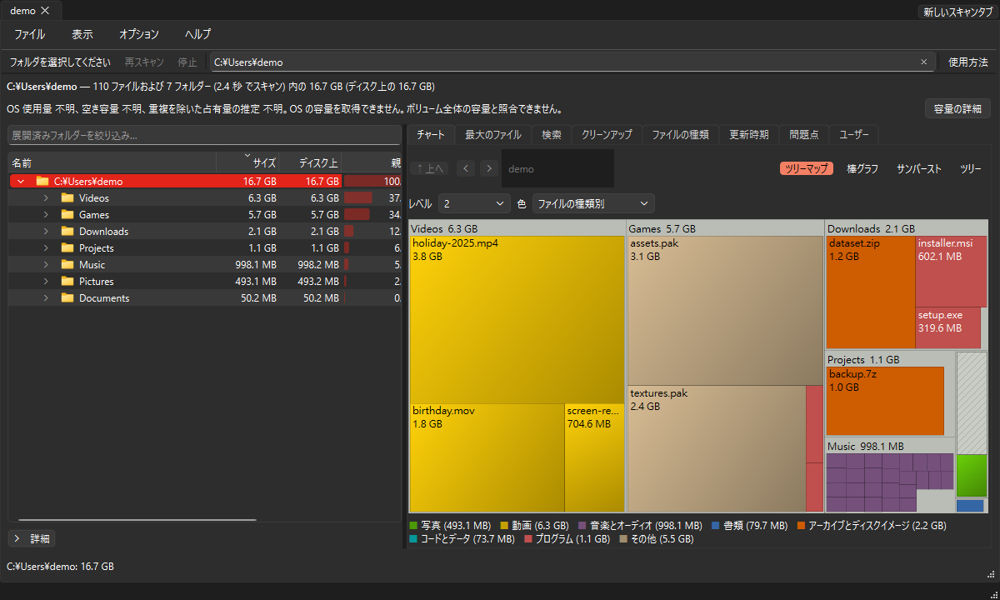

# FileTree

分析やファイル操作のダイアログを閉じるとキャンセルを要求し、ワーカーの終了確認後に非同期で閉じます。実行中のネイティブ呼び出しと所有権を保持し、競合するソース操作を防ぎます。閉じる操作を繰り返しても最初の決定を保持し、部分結果やエラーを閉じる前に表示します。変更されたプレビューはキャンセル済みの読み取り終了後に最新の要求だけを開始し、開始前にキャンセルされた操作は実行しません。Qt のウィジェットとモデルは GUI スレッドで処理します。アプリケーション終了時は引き続きワーカーの終了後にオブジェクトを解放します。

ソース操作と分岐の再スキャンも、キャンセルしたバックグラウンド読み取りの終了を非同期で待ちます。ゴミ箱への移動、元に戻す操作、承認済みのゴミ箱を空にする操作は、所有する読み取りスレッドの終了後に開始します。結果処理も操作スレッドの終了を待ってから他の操作の制限を解除します。停止すると、待機中の移動、元に戻す操作、分岐の再スキャンはネイティブ処理を呼び出さずに取り消されます。

変更監視の切り替えでは以前の読み取りを非同期で終了させ、終了確認後に最新の要求だけを開始します。履歴や比較の結果、定期レビューへの引き継ぎ、仮想ディスク照会の完了処理も、ワーカーの終了を非同期で確認してから次の操作を有効にします。

ドラッグ操作の判定はコピーしたローカルパスだけを使い、ファイルシステムを照会しません。ワーカーが最初の実在フォルダーと明示的な複数フォルダー選択を検証します。連続したドロップはまとめられ、新しいスキャンは待機中のドロップを無効にします。複数フォルダーの検証は件数上限と選択順を保ち、キャンセルした照会の終了後に非同期で閉じます。背景の容量照会とスキャン完了も非同期の終了確認を使います。

フォルダーの検証と開始画面のドライブ検索は所有するワーカーで実行し、画面描画と操作状態にはコピー済みの値を使用します。スキャンの切り替えではキャンセルを要求し、以前のスキャン、変更監視、低負荷スキャンの終了を非同期で確認してから最新の要求を開始します。連続した要求はまとめられ、停止すると開始前の要求を破棄します。時間のかかるネイティブ呼び出しが終了するまでワーカーを保持し、GUI のイベント処理を続けます。スキャン速度の向上を示すものではありません。

**ディスク容量がどこにあるかを確認します。** FileTree は、フォルダーまたはドライブ全体をスキャンし、その中のすべてのファイルを合計し、フォルダー ツリー、カラフルなツリーマップ、および最大ファイルのリストで、最大のフォルダーとファイルを最初に表示します。不要になったものを見つけたら、ウィンドウから直接ごみ箱に移動します。

**オプション → 変更を追跡** (デフォルトではオフ) では、各結果タブは完全な物理 Windows/Linux スキャンを個別に追跡します。バックグラウンドのネイティブ USN/directory-notification/inotify フィードは、制限された変更を 1 秒間結合し、キャプチャされた影響を受けるフォルダーのみを再スキャンします。無関係な保留中のブランチはキューに残ったままになります。スキャン、分析、元の項目に対する操作の確認、モーダル質問、およびライブ Undo オファーは更新を延期します。失われたイベント、不明なスコープ、ハードリンク アカウンティング、およびソース操作のギャップにはフル スキャンが必要です。 5 分間の完全な調整で、観測のセットアップ/再準備のギャップがカバーされます。不完全または結合されたルートとサポートされていないスコープでは、フォローを開始できません。ネイティブ障害は自動再試行なしで表示されたままになります。共有ファイルを含む部分的な Windows ルートには、外部のエイリアスをカバーするための読み取り可能な USN が必要です。オプトアウトしてタブを閉じてキャンセルし、監視処理の終了を待機します。通知にはソース操作権限は付与されません。独立した Python API は `change_watch.watch` です。ネイティブ CI は、Windows USN および Linux inotify を検証しました (Windows/Linux 外部エイリアス書き込みを含む)。

**オプション → バックグラウンド モニター…** はデフォルトではオフになっています。有効にすると、ウィンドウを閉じるときに FileTree がシステム トレイに保持されます。 **Quit** は常にすべての処理の終了を待ってから終了します。トレイが使用できない場合、ウィンドウは表示されたままになります。トレイを紛失すると、隠されたウィンドウが復元されます。ワーカーは 1 分に 1 回、OS の利用可能な容量を読み取り、サポートされているシステム通知とステータス/ツールチップを通じて、しきい値を下回ったこと (デフォルトでは 10%) を報告します。 OS の設定により通知が抑制される場合があります。未知の容量は未知のままです。有効なローカル履歴に保存される 1 スレッドのジェントル スキャンの場合、最大 32 個のフォルダーと 1 ～ 720 時間の間隔を選択します。スキャンでは、結果のタブとソースはそのまま残ります。不完全な検査範囲は明示的なままです。プロセス全体にわたる永続的なクレームにより、重複した試行が防止されます。失敗/キャンセルされた期間は調整されたままになり、失敗した期間は 1 回結合されます。通常のスキャンや元の項目に対する操作の確認を開始すると、低負荷のバックグラウンド処理をキャンセルし、その終了を待ちます。無効にすると、バックグラウンド処理の終了を待ち、ウィンドウが復元されます。 `py -3 start_file_tree.py --background` は権限昇格を省略し、すでに有効になっている監視と利用可能なトレイのみを非表示にします。フラグがそれを有効にすることはありません。自動クリーンアップは実行されません。コア API `background.MonitorConfig`、`claim_scan`、`due_roots`、および `SpaceWarnings` は独立したままです。

**サインイン時にこのモニターを開始する** は、同じダイアログ内の別のオプトインです。実際のネイティブ登録とその場所: 固定の現在のユーザー Windows HKCU 実行値、Linux `$XDG_CONFIG_HOME/autostart/je-file-tree-background.desktop` (デフォルト `~/.config`)、または macOS `~/Library/LaunchAgents/io.github.jechen.FileTree.background.plist` が表示されます。所有エントリを削除するには、チェックを外して同意します。監視を無効にすると、この選択も解除されます。これは、2 番目のコピーを起動したり、このセッションを終了したりすることなく、今後のログインに適用されます。外部/変更されたエントリ、リンクされた POSIX ディレクトリ/ファイル、および共有メタデータは拒否され、目に見えるエラーが表示されます。登録ではリテラルの絶対引数を使用し、シェルは使用しません。プログラムを移動するには、最初に以前のログイン エントリを削除し、次に新しい場所を登録します。 UTF-16 で 260 文字を超える Windows コマンドと、パーセント記号を含む Linux パス (または等号を含む実行可能パス) は拒否されます。 OS 起動ポリシーにより起動を抑制できます。ネイティブ フィクスチャの検証は、実際のログイン起動を証明するものではありません。

ネイティブ CI は、所有するバックグラウンド/履歴/容量ソースのフェーズ JSON と CJK スクリーンショットを保持します。分離された Linux X11 デスクトップには、実際のトレイと表示可能な通知キャプチャが必要です。 Windows/macOS は、トレイの利用可能または利用不可の動作を明示的にレポートします。通知のディスパッチだけでは、OS の表示許可を証明することはできません。これらのプローブは、ホスト ログイン ジョブを登録したり、既存のユーザー ソースを変更したりすることはありません。定期提案のレビュー検証は各ネイティブ環境で Qt ウィジェットの確認画面を使い、実際の「いいえ」ボタンを押して、終了後にプロセスのダイアログ設定を戻します。OS 固有の警告画面の操作は未検証です。確認した Cocoa の再実行では、所有する Qt レビュー／いいえ確認を 8 回、APFS のクリーンアップを 2 回完了しました：[ネイティブ Qt 検証](../docs/updates/background-20261009-native-widget.json)。

独立した Python API `recurring.capture` / `prepare` は、キャプチャされたスキャン メタデータ、効果的なクリーンアップ ポリシー、およびバインドされた保存された履歴を組み合わせて、新しい候補と最大のフォルダー増加を記述します。最大 100 行 / 48 KiB の履歴観察が保持されます。欠落、部分的、不一致、または切り詰められたベースラインは不明のままです。 サイズ上限には履歴保存日時の領域を確保し、収まらないヘッダーは明示的に拒否します。`ScanHistory.save(..., baseline=...)` は、通常の保持上限の下でオプションの観測値を保存します。 `load_recurring` は履歴バインディングをチェックします。ファイルのみのスキャン エラーも不完全な履歴にフラグを立てます。日付の付いた提案は、次のスケジュールされた期間で期限切れとなり、変更されたルール、操作記録、またはキャプチャされたパスを拒否します。これらの API はソースをスキャンしたり移動したりすることはありません。

ファイル → スケジュールされたスキャンの提案には、前回のバインド スキャン以降の新しいジャンク、現在の候補、最大の論理フォルダーの増加など、穏やかなスケジュールされた作業者によって作成されたレポートが表示されます。各リストは最大 100 行を保持し、フルパス ツールチップと Ctrl+C をサポートします。日付、有効期限、合計/保持された候補、範囲、不明な比較は引き続き表示されます。ルール/スケジュール/操作記録の変更によりステータスが更新されます。レポートは、現在のセッションでスケジュールされたスキャンの後に表示されます。ベースラインはローカル履歴保持の下で保持されます。無効なプロポーザル メタデータは、通常の保存された履歴と目に見えるエラーを保持します。ソースは自動的に移動されません。現在の候補を再スキャンして確認すると、新しいタブで通常のフォアグラウンド スキャンが開き、ワーカー上でキャプチャされた/ネイティブ ツリー全体が検証され、既存の編集可能なクリーンアップ キューと保護フォルダー/ゴミ箱の確認が使用されます。変更された/部分的/期限切れになったプロポーザルは続行できません。再スキャンをキャンセルするかタブを閉じると、レビューの意図は破棄されます。移動作業者は、バッチの前にネイティブ ツリー全体を再チェックし、各項目の前に日付/ルール/スケジュール/操作記録を再チェックします。通常のネイティブのソースごとの検証は引き続き適用されます。これらのチェックは監視的なものであり、ファイルシステムのトランザクションではありません。

[English](../README.md) | [繁體中文](README_zh-TW.md) | [简体中文](README_zh-CN.md) | [日本語](README_ja.md) | [한국어](README_ko.md)

元の項目に対する操作の確認では、初期選択は「いいえ」です。回収の概要は容量を示し、利用可能な空き容量の増加を保証しません。ごみ箱へ移動するだけでは空き容量は増えません。

macOS arm64 のネイティブコンパイルとバンドル作成は Desktop builds [37788683269](https://github.com/JeffreyChen-s-Utils/FileTree/actions/runs/37788683269) に合格しました。167 個の元の項目をすべて保持し、解凍結果も一致しました。この証拠は検証したコミットのコンパイルとパッケージ作成に限られ、アプリは起動・公開していません。Finder の操作・同意検証と Developer ID・公証の環境は未提供のため、POSIX リリースのゲートは無効のままです。

Windows リリースでは Azure Artifact Signing と OIDC による署名を明示的に有効化できます。有効時に設定が不足した場合や、署名・タイムスタンプ・発行者の検証に失敗した場合は Windows 成果物と GitHub リリースの公開を停止します。最初にバージョンのコミットとタグを作成し、その後 PyPI へのアップロードと Windows のコンパイルを独立して実行します。後続の Windows の失敗でバージョンや成功済みの PyPI アップロードは取り消されません。単一ファイル版・独立フォルダー版の実行ファイルはパッケージ作成前、MSI はアップロードとマニフェストのハッシュ計算前に検証します。開発ビルドは未署名です。アカウントとネイティブ署名の成功検証はまだ利用できません。[Windows 署名の設定](../docs/windows-signing.md)を参照してください。

リリース PR が `main` にマージされるたびに、GitHub Actions は Windows 上で新しいバージョンタグから `FileTree-<version>.exe`、独立フォルダー ZIP、MSI を自動コンパイルします。必要なファイルをすべてアップロードし、名前・サイズ・アップロード状態を確認するまで GitHub リリースはドラフトのままです。PyPI へのアップロードは独立して実行され、トークンの不足やアップロード失敗は報告されますが、EXE の公開を妨げません。失敗した `publish-release` ジョブを再実行するとドラフトへのアップロードを再開できます。公開済みリリースは上書きしません。



日本語・韓国語ではインストール済みの適切なフォントを使用し、システムの文字サイズとスタイルを維持します。フォントのダウンロードや同梱は行いません。適切なフォントがない場合はシステムフォントを使用します。

ツリーから、検索または最大ファイルを選択し、実際のエントリを選択して右クリック→ **フォルダーに移動...** または **名前を変更...**。モーダル プレビューには、最も外側のすべての送信元/送信先と拒否理由が、選択されたエントリを最大 1,000 個までリスト表示します。既存のフォルダー、またはリテラル `{name}`、`{stem}`、`{ext}`、`{n}` トークンを含むファイル名パターンを選択します。既存の名前のデフォルトは **skip** です。明示的に番号付き接尾辞を選択すると、正確な代替名がプレビューされます。オプションを変更すると承認が無効になります。 **プレビュー パス**を再度選択します。 **レビュー済みのパスを適用します…** は、詳細で対象となるすべてのペアに対してデフォルトのプレーンテキストなしの質問をします。拒否された/変更されていない行は表示されたままになり、スキップされます。実行するとオプションがフリーズされ、完全なソース カバレッジとキャプチャされた親 ID が再チェックされ、コピーや上書きを行わずにネイティブの同一ボリュームの排他的名前変更が使用されます。保護されたエントリ、リンクされたエントリ、特殊なエントリ、既知の利用不可エントリ、変更されたエントリ、およびクロスボリューム エントリは拒否されます。 Stop/close は、現在の名前変更が完了するまで待機し、完了した変更を保存します。項目ごとの障害と実際のパスは引き続き表示されます。予期しない名前変更後の操作記録では排他的ロールバックが試行され、ロールバックが失敗した場合は保持された宛先が報告されます。同時ファイルシステムの変更はトランザクションではありません。宛先外の親は、カウント/エラーが表示された状態で所有ワーカー上で再スキャンされます。閉じると、現在のルートが再構築され、そのルート内の影響を受けるすべての親が更新され、古い容量メタデータが無効になります。キャンセルされた更新は表示されたままになります。 Python API は、移動/スキップ/失敗した結果と両方の親パスを含む `namespace_moves.prepare_namespace` / `execute_namespace` を提供します。ネイティブ macOS は未検証のままです。検証済みのコピーには、別の **別のドライブに移動…** ワークフローを使用してください。

ツリーでスキャンしたフォルダーを選択し、「検索」または「最大ファイル」を選択して右クリック → **別のドライブに移動...**。別のボリューム上の既存のフォルダーを選択します。すべての正確なペアと明示的なスキップ/サフィックス衝突の選択を確認します。 **レビュー済みフォルダーをコピーして確認します…** はデフォルトのプレーンテキストなしの質問をし、オプションを固定します。 Progress は現在のファイルに名前を付けます。 Stop/close はキャンセルしてバックグラウンド処理の終了を待機します。オリジナルと部分的な宛先は残り、実際のパス/エラーが表示されます。コピーが成功すると、**検証済みのオリジナルをごみ箱に移動...**が有効になります。これは、既存の保護フォルダーの承認と、ソース/コピーのペアと 64 MiB の検証制限をリストする別のデフォルトのゴミ箱なしの質問を使用します。ゴミ箱ワーカーは、オリジナルを移動する直前に、すべてのコピーを再度検証します。チェックに失敗すると残りの移動が停止します。 **ジャンクション/シンボリック リンクを残す** はデフォルトでオフになっており、バッチ用にキャプチャされます。成功したゴミ箱のみがこの元のパスのリダイレクトを作成します。衝突によって到着が上書きされることはありません。リダイレクトが失敗すると、検証されたコピーとオリジナルがゴミ箱に保持され、正確なパスが報告され、Windows に空のオリジナル パス ディレクトリが残る場合があります。コピー後の自動ゴミ箱はありません。宛先外の親はワーカー上で再スキャンされます。現在のソースの親はゴミ箱の後に更新され、ゴミ箱が拒否された場合は現在のルートが更新されます。メイン ウィンドウを閉じると、アクティブなパス操作ダイアログに参加し、ゴミ箱に参加しているときに操作記録したコピー ゲート エラーが報告されます。ネイティブ Windows C→D コピー/ADS および所有されているフィクスチャのジャンクションが検証されます。ネイティブ macOS は未検証のままです。

Python API は、クロスボリューム宛先を含む、明示的にレビューされた排他的な通常フォルダーのコピーに対して `verified_copy.prepare_copy` / `copy_folders` / `verify_copy` を追加します。プレビューには、最も外側のすべてのペア/拒否および明示的なスキップ/サフィックス衝突の選択肢が最大 1,000 個まで保持されます。保護された通常のソースを読み取ることができます。最終的なゴミ箱の承認は、既存の保護されたソース フローのままです。リンクされたペイロード、特殊なペイロード、既知の利用不可/再解析ペイロード、不完全なペイロード、変更されたペイロード、およびマウントされたペイロードは拒否されます。既存の名前は上書きされません。コピーでは空のフォルダーが保存され、ハードリンク名の別のコピーが作成されます。完全な子の名前、ファイル数、および長さが比較されます。 64 MiB より小さいすべてのメイン ファイル/Windows という名前のストリームは SHA-256 と比較されますが、それより大きい値は長さのみが比較されます。ネイティブ Windows をコピーすると ADS が保持されます。ストリームクエリの失敗により検証ができなくなります。 POSIX 拡張属性はコピーされ、厳密に比較されます。 macOS は、長さが 64 MiB 以上の属性のみを使用して、ネイティブ記述子のコピー/リソース フォーク比較を使用します。ファイルのメタデータはプラットフォーム サポートを使用します。 Windows ディレクトリ セキュリティは宛先を継承し、POSIX setuid/setgid/sticky ビットは転送されません。既知のファイルシステム境界と Linux 同一デバイスのマウント ID が宛先記述子でチェックされます。失敗するとバッチが停止し、すべての元のものが保持され、レポートの部分的な宛先が保持されます。キャンセルすると部分的なデータも保持されます。検証済みのプルーフは、別途承認された既存のゴミ箱アクションの前に再チェックする必要があります。この API は、オリジナルをゴミ箱に捨てたり、削除したり、リダイレクトしたりすることはありません。観察は同時ファイルシステムトランザクションではありません。所有するネイティブ macOS CI は、完全なリソース フォーク/xattr ハッシュと空のフォルダーを含む同じボリュームのコピーを検証しました。[専用 APFS の証拠](../docs/updates/apfs-20261009-native.json) は、ボリューム間のネイティブコピーとソース／空フォルダーの保持も確認しています。その後の Finder ゴミ箱／リダイレクトは未検証です。

Windows または Linux での承認済みのゴミ箱移動が成功した後、正確なネイティブ復元計画を取得できる場合、ステータス バーに **元に戻す (カウント)** が 8 秒間表示されます。キャプチャしたアイテムを復元するには、1 回クリックします。自動的に復元されることはありません。メタデータが欠落している、安全でない、変更されている、およびオリジナルが占有されている (クロスドライブ コピー リダイレクトを含む) と、表示されている理由で [元に戻す] が利用できなくなります。有効期限切れ、新しいスキャン、別の承認されたゴミ箱、またはパス操作ダイアログにより、古いオファーが破棄されます。ソースと親の自動再スキャンは、オファーの有効期限が切れるか、逆の操作が完了するまで待機します。所有されている従業員は、凍結された計画を再チェックし、行動する前に新しい逆承認を記録しますが、元のゴミ箱監査はそのまま残ります。 **最近のアクション**には、明示的な元に戻すおよび復元された結果が含まれます。スキャンおよびその他の突然変異は復元と重複できません。 Stop は未開始の項目をスキップします。 close はネイティブ作業に参加し、遅延ネイティブ/部分/操作記録/監査エラーをプレーン テキストの正確なパスで報告します。元のパスの到着が上書きされることはなく、「元に戻す」を可能にするためにリダイレクトが削除されることもありません。 Windows 所有の CJK フォルダー検証により、ボタン、ネイティブ復元、保存されたハッシュ/空フォルダー、個別に移動/復元された監査エントリ、およびソース親の再スキャンが検証されました。シェルの操作記録確認が保持されている場合は、真実の警告が生成されます。ネイティブ Linux CI は、通常の GUI キャプチャを検証し、プライベート ビンの準備、復元、操作記録のクリーンアップ/コンテナの保存、および新しい所有フィクスチャの影響を受ける親の再スキャンを認識しました。 macOS 元に戻すことはできません。

読み取り専用の `duplicate_links.prepare_links` / `verify_link_pair` API は、明示的な重複残すファイルからの最大 1,000 個の追加コピー置換をプレビューします。各行は、正確なパス、スキャン/ハンドル証明、および親の ID を凍結します。 protected/changed/unknown/linked/special/cloud/alreadyhard-linked の決定は拒否され、他のボリュームまたは同じデバイスの Linux バインドマウント エクストラは拒否された行のままになります。検証では、現在のツリーとすべての観測を再チェックし、メイン ペイロードとすべての Windows ADS をすべてのサイズで完全に SHA-256 ハッシュし、元の重複 BLAKE2 ダイジェストをチェックします。 POSIX 拡張属性は一致する必要があります。 macOS 64 MiB 以上の属性/リソース フォーク、または 64 MiB を超える総ペイロードを持つ属性/リソース フォークは、長さのみとして扱われず、拒否されます。キャンセルすると、すべてのペイロードは変更されないままになります。この API はリンク、置換、または削除を実行せず、後で変更する権限を付与しません。明示的にレビューされた `duplicate_link_ops.execute_links` API は、各グループ/ペアを完全に再チェックし、ネイティブの同じボリュームのハード リンクを作成し、公開前に古いエクストラを所有の兄弟バックアップの下に排他的に保持します。キャプチャされたバックアップのみをリタイアする前に、完全なペイロードを再検証します。失敗すると、到着を上書きせずに排他的ロールバックが試行されます。結果は、実際に公開されたエイリアスと保持されたバックアップ/一時パスをレポートします。キャンセルすると、開始されていない作業が停止し、部分的な結果が保存されます。古いコピーはゴミ箱に保存されず、任意の名前による編集またはメタデータ/セキュリティの変更は、リンクされているすべての名前に影響します。残すファイルと追加の親の両方に新しいスキャンが必要です。回復容量は不明。ネイティブ所有の Windows テストでは、複数のコピー、ADS のリタイア、キャンセル、衝突が検証されました。確認した GUI ワークフローを以下に説明します。所有するネイティブ macOS CI は通常のコア リンク、残すファイル ID、および完全なリソース フォーク/xattr ハッシュを検証しました。保護された GUI の承認は未検証のままです。

**クリーンアップ→重複**で、正確な重複を見つけて、それぞれの**Kept copy**を明示的に選択します。 **追加のコピーをリンクします…** は、すべての正確な残すファイル/追加パスと拒否された行 (最大 1,000 件の追加) の読み取り専用プレビューを開きます。類似した写真やフォルダーの一致では、この操作を有効にすることはできません。 **リンクは追加のコピーをレビューしました…**は、詳細のすべてのペア/拒否でデフォルトの平文なしの質問をし、将来のコンテンツ/メタデータ/セキュリティ編集を共有し、ゴミ箱コピーや自動取り消しはありません。所有されるワーカーは、置き換えの前に個別の操作承認を保持し、元の追加 ID と実際に公開された各結果を記録します。承認エラーは実行を妨げ、結果監査エラーは完了したリンクを保持し、後の作業を停止します。 Progress は現在のファイルに名前を付けます。停止/クローズは、ハッシュと開始されていない行をキャンセルし、ネイティブ呼び出しを結合し、実際のリンク/リンクされていないステータス、保持されているバックアップ/一時パス、遅延エラーをプレーンテキストで表示します。このモーダル操作中にパスを変更することはできません。スキャン、ゴミ箱、および元に戻すはシリアル化されます。バッチを試行した後、閉じると現在のルート全体が再構築され、残すファイル/追加の監視の両方が更新され、古い容量/重複した結果が無効になります。置き換えられたルートは古い再スキャンを操作記録しません。ネイティブ Windows が所有する CJK/ADS フィクスチャと完全なルート リフレッシュが検証されています。ネイティブ Linux CI は、同じ所有の GUI ワークフロー、監査、および完全なルート更新に合格しました。

Python API は、Linux での明示的な同じボリュームのフリーデスクトップの取り消しのために、`trash_restore.capture_origin` / `prepare_restore` / `restore` を追加します。ゴミ箱の前に元のスキャンされたスナップショットと親 ID をキャプチャし、実際に認識されている現在のユーザーのプライベート `files`/`info` 宛先と正確な `.trashinfo` パス/日付のみを準備します。準備は、制限されたフォロー禁止メタデータ (100k エントリ/128 レベル) を読み取ります。復元では、完全なペイロード/操作記録/親/所有者/マウントの監視が再チェックされ、ネイティブの排他的名前変更が使用されます。既存または到着した元のパス名が上書きされることはありません。名前変更後の変更された監視は、排他的ロールバックを試行します。復元が成功した後は、一致する操作記録のみが削除されます。メタデータのクリーンアップの失敗により、正確な復元/保持ステータスと実際のパスが報告されます。ペイロードの削除/コピーのフォールバックは存在しません。 Windows `windows_restore.prepare_windows_restore` / `restore_windows` は、現在のユーザーのシェル ビン内の正確な元のパスとネイティブ ID に一致し、制限されたペイロード/操作記録の観察を再チェックし、正規の `undelete` のみを呼び出します。 Qt 宛先が存在しない場合は、一意の ID の一致が必要です。オリジナルの占有、エントリの変更、およびキャンセルは拒否されます。ネイティブ エラーと未確認の完了は表示されたままになります。 Windows ペイロードまたは `$I` 操作記録は手動で移動/削除されません。ネイティブ所有フォルダー検証により、同じ ID、SHA-256 コンテンツ、および空のフォルダーが復元されました。この Windows シェルは操作記録を保持しており、警告付きで復元されたと報告されました。ネイティブ Linux プルーフは、専用の CI ジョブの使い捨てプライベート フィクスチャで実行されます。既存のユーザーのゴミ箱スコープは使用されません。キャンセルされた復元では、ペイロード/操作記録を保持しながら、目に見える理由が報告されます。ネイティブ CI は、所有するフィクスチャでの成功、衝突の拒否、ペイロードの変更の拒否、親の置き換えられた情報の拒否を検証しました。

読み取り専用の `virtual_disks.find_virtual_disks` Python API は、記録された `.vhdx`、`.vhd`、`.vmdk`、`.vdi`、`.qcow2` の候補に加え、現在のユーザーの WSL2 登録と既存の推測された Docker Desktop のデフォルト ディスク パスを検索します。 検出されたすべてのカウントを保持しながら、最大 1,000 行のバッキング ファイルを保持し、フォルダーごとの収量を維持し、キャンセルをサポートします。 記録されたスキャン長/割り当ては推定値のままです。外部登録ファイルは、final-file no-follow メタデータと Windows 割り当てクエリを使用します。 リンクされている、クラウド、欠落している、または変更されている外部ファイルは不明として表示されたままになります。 プロバイダー ラベルは場所のヒントであり、有効なディスク フォーマット、所有権、または停止状態を証明するものではありません。 Discovery ではヘッダー、ゲスト、コマンドは開かれず、VM の起動、停止、マウント、圧縮は行われません。 プロバイダーの読み取りエラー、省略された行、不完全なスキャン カバレッジは明示的なままです。 カスタム Docker の場所は、フォルダーをスキャンすることで見つけることができます。 明示的な `virtual_disk_info.inspect_virtual_disk` クエリは、親ディスクを開かずに、ネイティブ メタデータ専用/読み取り専用フラグを使用して、Windows 上の通常の VHD/VHDX ヘッダーを個別にキャプチャしました。 ファイル/親の ID を固定し、変更された/使用できないレコードを拒否し、ネイティブ形式/ベンダーを検証し、仮想容量、プロバイダーの物理バイト、固定/動的/差分タイプ、マウント状態、およびディスク識別子を報告します。 これらの観察では、圧縮権限や停止マシンの証明は許可されません。プロバイダーの物理バイトはゲストが使用するバイトではないため、不明のままです。 ネイティブの新しい所有の固定/動的 VHD および VHDX テストは、添付ファイルや昇格なしで、変更されていない完全なファイル ハッシュと正確な識別子で合格しました。 「表示」→「仮想ディスク」を選択すると、完全な数、問題、スキャン範囲を含む、制限されたコピー可能な読み取り専用テーブルが開きます。 VHD/VHDX を選択し、明示的な Windows ネイティブ クエリに対して [選択した VHD ヘッダーをクエリする] を選択します。 ファイルの長さ、記録された割り当て、仮想容量、プロバイダーのバイト数、および不明なゲストの使用量には、個別の数値列があります。 サポートされていない形式とネイティブ エラーは表示されたままになります。 記録されたエントリを表示すると、元のスキャンされたノードのみがアクティブになります。外部プロバイダーの行にはツリー アクションがありません。 停止/クローズは在庫と現在のネイティブ呼び出しを結合し、遅延応答を拒否します。所有されているモーダル ダイアログはスキャンとファイル操作をシリアル化します。 ネイティブ CJK GUI 検証では、新しく所有された VHDX のみが使用され、完全なハッシュ/スナップショットが保存され、正確な UUID が検証されました。 別の Python `virtual_disk_compaction.prepare_compaction/execute_compaction` API は、固定されたローカル NTFS 上の切り離された動的 VHD/VHDX に対して、凍結された読み取り専用レビューと明示的に承認されたネイティブ ゼロブロック コンパクションを提供するようになりました。 ファイル/親のアイデンティティ、完全なスナップショット、ランタイム登録/停止した監視、および変更前のネイティブ UUID/タイプ/容量を再チェックします。 既知の Docker/ゲスト プロセス、実行中の WSL、不完全なプロバイダー、および変更されたレコードは実行を拒否します。 System32 WSL メタデータ クエリがゲストを起動/停止しない問題を修正しました。 発信者は、所有マシンが停止したままであることを確認し、デフォルト - 承認なしを永続的に監査し、アクティブな通話に参加し、試行されたすべての操作を再スキャンする必要があります。 ネイティブの成功、その後のエラー、および不明な割り当ては分離されたままになります。ゼロ節約は有効であり、ゲストの使用状況は不明のままです。 新しく所有された空の VHDX は、ネイティブのゼロ保存が成功し、無関係な到着を維持しながら、正確な UUID/容量/ファイル ID を証明しました。 [表示] → [仮想ディスク] → [選択した VHD の圧縮] を選択すると、別の読み取り専用プレビューが開きます。 完全なリテラル ソース、UUID、容量、および切り離されたゼロブロック バックエンドを確認し、デフォルトの [いいえ] でマシンが停止したままであることを確認します。 永続的な承認の失敗により実行が妨げられます。結果の監査が失敗しても、実際のネイティブの成功は保持されます。 結合を停止/閉じると、監視されていない結果が報告され、書き込み可能な操作を試行すると、完全なルート再スキャンのために閉じるまで、古いヘッダー/圧縮権限が無効になります。 既存のゴミ箱の取り消しは、実行要求時に期限切れになります。操作はシリアル化されたままになります。 最近のアクションは、元のパス/アイデンティティを使用した圧縮と観察された割り当て/エラーを記録します。 権限エラーが発生した場合は、レビューを閉じ、既存の管理者を再起動し、再スキャンして再度承認する必要があります。 ネイティブ CJK GUI 証明では、関連のないホスト ランタイムが分離された、新しい既知の未割り当ての空の VHDX のみが使用されました。ゼロ保存の成功とその監査/UUID/容量は、添付/昇格なしで検証されました。 ネイティブ特権テストでは、新しく所有された VHD および VHDX に設定された完全なゲスト データも保存されました。観察されたバッキングの減少はそれぞれ約 30 MiB とゼロでした。

**オプション → 観察されたハード リンクを 1 回カウントします** はデフォルトでオフになっており、将来のスキャンのために永続化およびキャプチャされます。名前付きファイルの長さ、割り当て、およびカウントを維持しながら、個別にカウントされた論理/割り当ての合計を追加します。概要には、カウントされた合計、観察されたエイリアス、および不明なレコードが表示されます。ヘッダー メニューには、最初は非表示の **カウント サイズ / カウント ディスク サイズ** 列が表示されます。最初に観察された語彙名はバイト数に寄与します。エイリアスは、カウントされるフィールドでのみゼロとカウントされます。グラフとその凡例では、カウントされた合計が使用されます。最大/検索/タイプ/経過期間/所有者のリストと親/ドライブ共有は名前付きセマンティクスを維持します。不明または一貫性のないメタデータには名前付き推定値が保持されます。共有エクステントとディレクトリのメタデータは不明のままです。ブランチおよびゴミ箱後の再スキャンは、このモードで完全なルートを再構築し、カウントされた名前が離れるときに貢献を転送します。実行中のワーカーは、キャプチャされたオプションを保持します。 CSV は、`accounted_size_bytes`、`accounted_allocated_bytes`、および `hard_link_accounting` (0/1) を追加します。フォルダー JSON はカウント値とモード フラグを追加し、保存された比較/履歴用に `size` という名前を保持します。 HTML/XLSX レポートには、名前付きテーブルとカウントされたエントリ/サマリー列が保持されます。 CLI は `--count-hard-links` を受け入れ、カウントされたバイト合計と `hard_link_accounting` メタデータを出力します。無効化されたカウント フィールドは、名前付き推定にフォールバックします。 Python API は `ScanOptions(count_hard_links=True)` と `Node.accounted_size/accounted_allocated` を使用します。キャプチャされたツリーを変更した後、ワーカーに `account_hard_links` を再適用します。これにより、追加の OS/ペイロード呼び出しを行わずに、記録された統計が再利用されます。ネイティブ所有の 2 つの名前のフィクスチャは、2 MiB の名前付き合計、1 MiB のカウントされた合計、2 つの実際のファイル長、および 1 つのエイリアスを保持しました。

スキャン後に記録された **ZIP / 7z / RAR** ファイルを展開し、オンデマンドで内容を読み取ります。 **[virtual]** とマークされた行は、宣言された非圧縮サイズを示します。これらは、ディスク合計、グラフ、エクスポート、およびファイル操作の範囲外にあります。メンバーは決して抽出されず、ネストされたアーカイブは開かれません。 ZIP は標準ライブラリを使用し、7z はインストールされた `py7zr` を使用し、RAR は PATH 上で `unrar` または `bsdtar` を指定した `rarfile` を使用します。これがないと、RAR はプレーン ファイルのままになり、その理由がツールチップに表示されます。変更されたヘッダー、読み取り不能なヘッダー、不正なヘッダー、またはパスワードで保護されたヘッダーもプレーン ファイルのままです。既知のクラウド プレースホルダーとソース リンクは拒否されます。メンバー リンク、トラバーサル/絶対名、重複した競合、過度の名前/深さは表示されるカウントとともに省略されます。インベントリの上限は、100,000 エントリ、1,024 文字の名前、128 レベル、および累積パーサー読み取り数 32 MiB です。デコードされた 7z ヘッダー サイズは、デコード前にチェックされます。最大 2 つの読み取りが同時に実行されます。停止するには、ソース ファイルを右クリック → **このアーカイブの読み取りを停止** をクリックします。停止または終了は、現在のデコーダ呼び出しを通じて待機します。再スキャンはプレビューを再試行します。新しいスキャンまたはツリー編集により、古い応答は無効になります。展開されたフォルダーのテキスト フィルターは、実際のファイル システム エントリをカバーし、アクティブな間は仮想行を非表示にします。プレビューはメンバーのコンテンツではなくヘッダーを読み取るため、CRC や実際に抽出されたサイズは検証されません。

**クリーンアップ → 重複** で、**類似の写真** と最小ファイル サイズ (デフォルトは 1 MiB) を選択し、**類似の写真を検索** します。この個別の検索では、インストールされた `Pillow` を使用して記録された画像タイプをデコードし、EXIF の向きと最初のアニメーション フレームを正規化し、グレーの 9×8 画像からの 64 ビットの差分ハッシュを比較します。ハミング距離を 0 ～ 16 に設定します (デフォルトは 4)。各グループは、最初に観察された画像のしきい値内に留まります。メンバー同士の距離が遠くなる可能性があります。色、均一な画像、または無関係なシーンが衝突する可能性があるため、サムネイルとオリジナルを比較してください。これは視覚的な候補リストです。明示的な残すファイル/追加コピーの選択と回復の推定は、完全な重複に対してのみ利用可能です。選択されたファイルの手動アクションでは、既存の確認/保護フローが使用されます。ワーカーは、変更/リンク/既知のクラウド ファイルを拒否し、サポートされていない/壊れた/特大の画像をカウント付きでスキップし、記録されたハードリンク ID の重複を排除し、成功した署名を 100,000、ソースを 128 MiB、ピクセルを 4000 万、表示画像行/サムネイルを 1,000 に制限します。停止/新規スキャン/モード変更/ツリー編集により、応答が無効になります。閉じると、現在のデコード呼び出しが結合されます。サムネイルはメモリ内に残り、ソース バイトは変更されません。また、この検索にはネットワーク呼び出しや自動ファイル アクションはありません。

**オプション → 測定 Windows ファイルごとの割り当て** はデフォルトではオフであり、将来の完全/ブランチ スキャンに適用されます。有効にして再スキャンしてください。 no-follow メタデータ ハンドルと `FILE_STANDARD_INFO` を使用して、完全な 64 ビット ボリューム/128 ビット ファイル ID (3.12 より前の Python のレガシー統計 ID)、サイズ、および変更時間を検証します。これは、通常の圧縮フラグがない場合でも、通常の割り当てと XPRESS/WOF 割り当てを測定します。既知のクラウド/オフライン ファイルは、クエリなしではゼロのままです。サポートされていない、拒否されている、または変更されたメタデータは、文書化されたサイズの推定値に戻ります。ファイルごとのクエリでは余分なスキャン時間がかかります。ファイルのペイロードは読み取られません。共有エクステントとディレクトリのメタデータは不明なままであり、ハード リンクは依然として名前ごとにカウントされます。デフォルトのスキャンでは、通常のファイルのクラスター推定値が保持されます。ネイティブ所有フィクスチャの検証では、NTFS および XPRESS8K 圧縮/解凍を通じてコン​​テンツが保存されます。正確な再スキャンでは、通常の圧縮フラグが存在しない 2 MiB XPRESS フィクスチャに割り当てられた 73,728 バイトが保持されました。

Windows では、スキャンされたフォルダーのコンテキスト メニューで **NTFS 圧縮…** が提供されます。キャンセル可能な読み取り専用プレビューには、最大 1,000 件の記録されたログ/テキスト/コード/実行可能ファイル/おそらく非圧縮イメージの候補、完全な数、および論理/名前付き割り当てが表示されます。節約できる可能性があるのは **0 – 割り当て候補** ですが、保証された圧縮率や空き領域はありません。 NTFS、XPRESS8K (ほとんど変更されないデータ)、または解凍を選択します。復元では、圧縮フラグに関係なく、安全に記録されたタイプがリストされます。 **リストされたファイルを処理します…** は、スコープ、モード、リストされた数、および論理バイトの名前を指定する初期選択が「いいえ」の確認を求めます。すべての候補ではなく、リストされたファイルのみが処理されます。ディレクトリのデフォルトとリストにないファイルは変更されません。ネイティブ ツールは、現在の固定ローカル NTFS でのみ実行され、記録された ID を再確認し、すべての祖先/ファイルを名前変更/削除に対して固定します。リンク、既知のクラウド/オフライン、スパース、非表示/システム、ハードリンク、保護および変更/不明のエントリは拒否されます。シェル、ワイルドカード、`/s` 再帰は使用されません。圧縮解除は、`/u` と `/u /exe` の両方を呼び出します。圧縮すると書き込みが遅くなる可能性があり、解凍するには空き領域が必要です。 Stop/close はコマンドを終了して結合します。以前の/現在のファイルには部分的な変更が残っている場合があります。結果には、割り当て前後の既知の一致、未知、および最初の 20 個のエラーが表示されます。閉じると、一時的なファイルごとの割り当てによる完全/ブランチ再スキャンがトリガーされます。今後の手動スキャンはオプション設定に従います。プレビューにはペイロードが読み込まれません。ネイティブ操作で読み取れることを確認しました。ダブルクリックすると処理前に記録されたファイルを選択し、Ctrl+C で行をコピーします。ネイティブの新しい所有フィクスチャの検証は SHA-256 を保持し、割り当てを復元し、ハード リンクを拒否し、ジャンクション ピアをそのまま残しました。

**Users** タブは、スキャン全体にわたって記録されたファイルを所有者ごとにグループ化し、完全なグループ/ファイル/バイト数、論理サイズ、名前付き割り当て、ファイル数、および論理共有を含む最大 1,000 の所有者グループを表示します。 POSIX uid は既存のスキャン統計から取得されます。 Windows **オプション → Windows ファイル所有者のキャプチャ** は、ファイルごとのセキュリティ クエリはコストがかかるため、デフォルトではオフになっています。それを有効にして再スキャンします。この設定は、今後のフル/ブランチ スキャンに適用されます。共有の不変 uid/SID キーにより、所有者スロットが 1 つ追加されます (ノードごとに測定 +8 バイト)。 Windows は、通常のファイル所有者の SID を読み取り専用でキャプチャし、リンクとクラウド/オフライン ファイルをスキップし、クエリ後に記録されたメタデータを再チェックします。所有者が無効になっている、拒否されている、行方不明、または変更されている場合は、明示的な **Unknown owner** グループを形成します。不完全なスキャンは、省略されたデータにもフラグを立てます。タブを開くと、GUI スレッドからキャンセル可能な分析とアカウント名の解決が開始されます。未解決の名前は uid/SID を保持します。停止、タブの変更、新しいスキャン、および閉じると、キャンセルされた応答が破棄され、所有するワーカーの結合が閉じられます。移動と分岐の再スキャンにより合計が無効になります。 **記録された合計を更新** スキャンを再集計します。再スキャンして、変更されたファイルの所有権を取得します。ここでは、Ctrl+C と現在のリスト CSV のエクスポートが機能します。フォルダーの所有権がその子孫に割り当てられることはありません。ハード リンクは引き続き名前ごとにカウントされ、割り当ては推定されたままになります。ファイルの所有権は実際の使用または削除の許可を証明するものではなく、このタブではクリーンアップ アクションは作成されません。ファイル所有者のレコードは、フォルダーのみの JSON/history には存在しません。

**オプション → ファイルのアクセス/作成時間をキャプチャ** はデフォルトでオフになっており、今後のフル/ブランチ スキャンに適用されます。有効にして再スキャンしてください。新しいノード フィールドや追加のタイムスタンプ クエリを使用せず、すでに読み取られた統計情報を使用して、通常のファイル スナップショットごとに 16 バイトを追加します。ツリー ヘッダーには、オプションの **Recorded access** 列と **Created** 列があり、デフォルトでは非表示になっています。 **ファイル → ファイル時間…** は、少なくとも選択した日数 (0 ～ 36,500、デフォルトは 730) 経過した記録されたアクセス/作成日によってファイルをフィルタリングし、完全一致/バイト/不明カウントを含む最大の 1,000 件の一致を表示し、Ctrl+C と正確なツリーのアクティブ化をサポートし、結合の停止/閉じる機能を備えています。ツリー全体のフィルタリングはワーカー上で実行されます。欠落している日付や将来の日付は不明のままです。ディレクトリとリンクにはキャプチャされた日付がありません。作成には、利用可能な場合は誕生時刻が使用されます (誕生時刻のない Python バージョンのみで従来の Windows ctime)、POSIX ctime は使用されません。 NTFS `NtfsDisableLastAccessUpdate` は、初期化/システム管理ビットを含め、読み取り専用でクエリされます。無効または不明な構成では、アクセス期間の一致を生成できませんが、作成フィルタリングは利用可能なままです。レジストリ値は再起動を必要とする場合がありますが、すべてのボリュームで有効なポリシーを証明できるわけではありません。他のファイルシステム/プロバイダーも atime を延期または抑制することができ、バックグラウンド読み取りによってそれが変更される可能性があります。記録された日付は実際の使用を証明するものではありません。このビューでは、クリーンアップ アクションは準備されません。最大ファイル CSV は `accessed`/`created` ISO 日付を追加します。使用できない場合は空です。フォルダーのみ JSON/history にはファイルの日付がありません。

新しいフォルダーの取得を一時停止するには、スキャン バーで **Pause / Resume** を使用します。現在のフォルダーの読み取りが完了し、ライブ ツリーが更新され続けます。 **Stop** と閉じる操作は、一時停止中でも機能します。最終分析は一時停止できません。経過時間には一時停止も含まれます。再開すると、同じスキャンとカウントが維持されます。

**オプション → 穏やかなスキャン** はデフォルトでオフになっており、新しいスキャンに適用されます。各使い捨てスキャン スレッドは、Windows バックグラウンド CPU/I/O モード、または Linux nice 10 に最低のベストエフォート I/O 優先順位を加えたものを使用します。 UI スレッドは影響を受けません。サポートされていないプラットフォーム、拒否された変更、部分的な優先アプリケーションが報告されます。読み取り可能なフォルダーは引き続きスキャンされます。 I/O の影響はデバイス スケジューラに依存するため、スキャンに時間がかかる場合があります。 CLI と測定ツールは `--gentle` を受け入れます。 CLI JSON には `warnings` が含まれています。

ツリーマップとサンバーストは **Colors を共有します → age** を変更し、経過期間リストと同じ経過期間範囲と明るい (最近) から暗い (古い) までの凡例を使用します。色には、ホバリング中の現在のクロックではなく、スキャン/分析時間が使用されます。フォルダーの色は、記録された最新の変更を表します。使用できない/将来の日付とグループ化された小さなタイルは灰色になります。これは、最終アクセスやファイルが未使用かどうかではなく、変更の経過時間を示します。

**ファイル → エクスポート** とチャートのコンテキスト メニューを使用して、画面上のチャートを **PNG** として保存できます。 PNG には、現在のビューポート、カラー モード、および選択範囲が含まれます。 **SVG** は、バーとサンバーストで使用できます。キャッシュされたサンバースト ビットマップを使用せずに、完全に囲まれたバー行またはリングがベクトル形状/テキストとして描画されます。 PNG エンコードとファイルの書き込みはエクスポート ワーカー上で実行されます。ファイルはアトミックに置き換えられ、閉じるときはエクスポートを待ちます。

**ファイル → 現在のビューを印刷** (`Ctrl+P`) と選択すると、システムの印刷ダイアログが開きます。 **ファイル → エクスポート → 現在のビュー (PDF)** は、キャプチャされたビューから横/縦が選択された A4 ページを 1 枚保存します。どちらも、現在のタブやビューポートを含む表示結果を、歪みやトリミングをすることなく印刷可能な余白内に収めます。キャプチャしたピクセルを印刷します。スクロール非表示のエントリはこのビューの外にあります。 PDF 書き込みは、Qt の PDF エンジンを使用してエクスポート ワーカー上で実行され、要求されたファイルをアトミックに置き換えます。クローズは完了を待ちます。

「グラフ」タブには、クリック可能なフォルダーのブレッドクラムと **戻る / 進む** (`Alt+Left` / `Alt+Right`) があります。履歴には、現在のスキャンで最大 100 件の訪問が保存されます。 Back 後のナビゲーションは、forward ブランチを置き換えます。新しいスキャンでは履歴がリセットされ、再スキャンでは切り離されたエントリが破棄されます。長いパスはスクロールされ、**…** から以前の先祖が利用可能になります。

フォルダー ツリーの下にある **Details** を展開すると、選択したエントリの論理サイズ、ディスク上のサイズ、ファイル/フォルダー数、記録された変更日、さらにミニチュア タイプと経過時間の分布が表示されます。パネルは展開されているかどうかを記憶します。ディストリビューションは、スキャン後に展開され、記録されたエントリを使用し、不明または将来の日付が分離されている場合にのみ、キャンセル可能なバックグラウンド ワーカーで実行されます。他の場所を選択すると、古い結果が置き換えられます。閉店は労働者に加わります。

**ファイル → エクスポート → 現在のリスト (CSV)** は、表示されたラベル、単位、フィルター、並べ替えとともに、検索、重複、変更、ファイル タイプ、経過時間、最大ファイル、クリーンアップの提案または問題を保存します。グループ化されたリストには、折りたたまれている場合でも、見出しとそのエントリが含まれます。 **Ctrl+C** リストまたはフォルダー ツリーにフォーカスがある間、選択された行が引用符で区切られたタブ区切りテキストとして列見出しとともにコピーされます。テキストフィールドは通常のコピーを続けます。スプレッドシートでは、数式のようなテキストがエスケープされます。 CSV キャプチャは、短い GUI バッチと、境界付きキューを介したアトミック エクスポート ワーカーへのストリームとの間でイールドを取得します。リストを変更すると、エクスポートがキャンセルされ、既存のターゲットが保持されます。

**ファイルの種類** の拡張子をダブルクリックすると、その最大のファイルと最大 1,000 件の **フォルダーを含む** が、一致するバイト数、ファイル数、および一致するすべてのバイトのシェアとともに表示されます。フォルダーの合計では、各フォルダー内に直接あるファイルのみがカウントされるため、ネストされたフォルダーは重なりません。両方のリストはキャンセル可能なワーカーで一緒に計算され、**選択されたフォルダーのみ** を尊重します。内線番号、スキャン、スコープを変更すると、古い応答は破棄されます。 **すべて表示** は通常のリストを復元します。経過期間のドリルダウンも UI スレッドから実行されます。

Windows、**詳細** では、休止状態/ページ/スワップ ファイル、Windows.old、ごみ箱、システム ボリューム情報、WinSxS、Windows 更新ダウンロードと配信最適化キャッシュについて説明します。認識では、任意の場所で名前を照合するのではなく、子孫を含むドライブ ルート パスまたはインストールされた Windows パスを使用します。ボタンをクリックすると、関連する Windows 設定またはシステム ツールが開きます。 FileTree は、クリーンアップ コマンドを実行したり、これらのシステム管理エントリを移動したりすることはありません。また、操作ワーカーは、それらを含むフォルダーを拒否し、解決されたパスを再チェックします。 WinSxS の合計には、共有ハード リンクが含まれる場合があります。目に見えないシステムデータは不明のままです。

4 つのグラフには、アクセス可能な名前、キーボードの指示、現在のフォルダー/選択したエントリが記録されたサイズと数とともに表示されます。 Tab またはクリックでチャートにフォーカスします。**矢印キー** で表示されたエントリを選択し、**Enter** で選択したフォルダーが開き、**Backspace** が表示されます。ツリー図では、上/下のカード選択と右/左の展開/折りたたみが保持されます。棒グラフとツリー図は、選択した行をスクロールして表示します。ナビゲーションでは、境界付きチャート ジオメトリを使用します。グループ化/非表示のエントリは、フォルダー ツリーで引き続き使用できます。 Alt+Left などの変更されたショートカットは、既存の動作を保持します。

**View → Theme → System / Light / Dark** はすぐに切り替わり、選択を記憶します。システムはネイティブのプラットフォーム スタイル/パレットを復元します。明示的なテーマでは、一貫した Qt コントロールと、対照的なテキスト、選択範囲、無効な色が使用されます。パレット/スタイルを変更すると、グラフの画像が無効になります。ツリーマップとサンバーストは、実際の塗りつぶしのコントラストによって黒/白のラベルを選択します。ツリーマップのグラデーションは、両端が少なくとも 4.5:1 のコントラストを維持する場合にのみ保持されます。バーの名前と値は、色付きのバーの外側でアクティブなパレットを使用します。


新しい `multi_scan.scan_roots(paths, ...)` コア API は、1 つの仮想ルートの下で最大 256 の明示的なルートをスキャンします。重複または重複する通常のパスは折りたたまれます。個別に選択されたマウント スコープは独立したままになります。各子は実際の絶対ソース パスを保持しますが、仮想 `Node.path` は `None` であり、ファイル システム操作や OS 容量権限を付与しません。失敗した/保留中のルートは不完全なカバレッジを保持します。キャンセルすると、アクティブなクローラが結合され、部分的なデータが保存されます。オプションのハードリンク カウントは、観察されたすべてのルートにわたって 1 回適用されます。 JSON は仮想ルートを明示的にマークし、保存された比較ではそれが保持され、CSV/report ルート パスは空白のままになります。歴史には個々の情報源のルーツが必要です。 **ファイル → 複数のフォルダーをスキャン...** を使用してフォルダー リストをキャプチャするか、ようこそページの **すべてのドライブをスキャン** を使用して現在準備ができているドライブをキャプチャします。結合された結果は、グラフ、検索、比較、エクスポートをサポートします。ソース変更アクションは無効になります。再スキャンではキャプチャされたソース リストが再利用され、履歴は実際の各ソースを個別に保存します。 CLI `scan ROOT --also ROOT` は、繰り返しの `--also` 引数を受け入れます。スキャン レコードには `root: null`、実際の `roots`、および不明な組み合わせの OS 容量があります。シングルルート スキャンは通常の動作を維持します。

読み取り専用仮想ディスク検出は、Windows `\\?\UNC\server\share` 登録を、対応する通常の `\\server\share` 記録されたパスとマージし、拡張ドライブ パスも同様に処理します。キャプチャされた元のパスとソース証明は保持されます。ボリューム GUID/デバイス プレフィックスは明示的なままです。この一致ではファイル操作権限は付与されず、実際の UNC 接続や割り当て動作は確立されません。

**オプション → 毎日更新を確認** はデフォルトでオンになっています。通常の GUI の起動から 30 秒後、所有されたバックグラウンド チェックでは、検証済みの HTTPS 経由でリリース メタデータの `https://pypi.org/pypi/je_file_tree/json` のみが要求されます。これは FileTree の最初の自動ネットワーク呼び出しです。スキャンされたパスやファイルの内容は送信されません。新しい安定リリースでは、ステータス バーに非モーダル PyPI リンクが追加されます。アップデートが自動的にダウンロードまたはインストールされることはありません。スケジュールを停止し、保留中の応答を破棄するには、このオプションをオフにします。永続的なクロスプロセス要求により、失敗を含む試行は経過 24 時間ごとに 1 回に制限されます。 CLI、Python スキャン、ウィンドウ構築ではチェックが開始されません。応答は 2 MiB に制限され、リダイレクトは拒否され、ネットワーク読み取りにはタイムアウトがあり、閉じると現在の要求が結合されます。オフライン障害は、スキャンを中断することなく診断状態を保持します。

アプリケーションは独立した **スキャン タブ** を開きます。別のドライブ/フォルダーには **新しいスキャン タブ** または `Ctrl+T` を使用し、アクティブなタブを閉じるには `Ctrl+W` を使用します (最後のタブを閉じると終了します)。最大 16 個のタブを同時にスキャンできます。それぞれが独自のツリー、結果ビュー、フィルター、ワーカー、および履歴キャプチャを所有します。ワーカーを閉じると、そのバックグラウンド処理の終了を待ちます。 Quit はすべてのタブを結合します。言語の変更はすべてのタブに適用されます。ソース操作のレビュー、ゴミ箱、元に戻す、コピー、名前変更、ハードリンクの置換、圧縮、およびディスクの圧縮は、タブ間で 1 つの忙しいガードを共有します。スナップショットと承認は引き続きソースごとに個別に再チェックされます。結合されたルートは 1 つの読み取り専用タブのままになります。スキャンの同時実行性と穏やかな優先順位はタブごとに適用されるため、複数のスキャンを実行する場合は作業員を減らすか、穏やかなスキャンを有効にします。 `create_window` Python 統合では、依然として 1 つのウィンドウが作成されます。 GUI エントリ ポイントは `create_workspace` を使用します。

## 特徴

ホームはフォルダー／ドライブのスキャン、ドライブのツール、最近のフォルダーをスクロール可能な画面に整理します。パスのツールバーに **パスをスキャン** ボタンを追加し、Enter も同じ有効条件で実行します。空白の入力では開始しません。結果には論理サイズ、記録された割り当て、ファイル数、フォルダー数の四つのカード、実行中／完了／不完全の状態、読み取り不可の項目へのボタンを表示します。割り当ては推定や共有領域を含み、回収可能な容量ではありません。完了後も除外設定とマウント境界が適用されます。広い画面はサイドバー、狭い画面はドロップダウンで分析を選択し、キーボード操作と既存のメニューのショートカットも同じビューに同期します。選択フォルダーだけに絞るリストの切り替えはビューの上にあります。ワーカーからの応答を待つ間も経過時間を更新し、一時停止では動作アニメーションを止めます。停止時は現在のファイルシステム呼び出しが終了してから部分的な結果を表示する場合があることを説明します。現在のパス全体はツールチップに保持します。追加の表示は五つの言語、サイズ単位、システム／ライト／ダークのテーマに対応します。再度開くと保存したツリー／分析の分割比率を復元し、初回表示の既定値で上書きしません。両方のペインは折り畳めません。[UI と UX の設計](../docs/ui-ux.md)を参照してください。

スキャンタブを閉じるか終了すると、保留中の処理をキャンセルし、現在のファイルシステム呼び出しが完了するまで Qt イベントループを維持します。終了状態を表示し、完全に結合されるまでタブとワーカーを保持します。一時停止したスキャンはキャンセルのため再開し、エクスポートは完了させ、遅れて届いたソース操作エラーも表示します。Windows UAC は昇格する実行ファイルを識別します。Python ソースの実行時は Python/pythonw、コンパイルした FileTree 実行ファイルでは FileTree です。管理者操作のヒントでこの違いを説明します。ウィンドウ名やショートカットでは Python の UAC 名を変更できません。署名と発行元の検証は別の作業です。

**オプション → ワーカーのスキャン…** は、新しいスキャンとブランチ再スキャンの同時実行数を 1 ～ 32 に設定します。既存のデフォルトは最大 4 のまま (CPU 数によって制限されます)、無効な保存設定ではそのデフォルトが使用されます。スキャンを実行するとワーカーが保持されます。共有速度が遅い場合は同時実行性を高めることでメリットが得られる場合がありますが、過剰な負荷がかかるとディスク/サーバーの速度が低下する可能性があります。環境に基づいて選択してください。 Windows に、現在のアカウントの権限を使用して、`\\server\share` などの絶対 UNC パスを貼り付けます。拒否/切断されたブランチは不完全なままになります。ウェルカム ページにはこのヒントが含まれています。使い捨てのネイティブ SMB ループバック共有で、UNC と一時マップドライブを 1／4 ワーカーで走査し、ローカルツリーと共有ルートの割り当て単位が一致しました。アクセス拒否と走査途中の切断は不完全な範囲を保持し、空フォルダーの削除候補を生成しませんでした。所有するテスト ACL の完全な復元と、元ファイルの識別情報・内容保持も確認しました。低速リモート接続のスループットはまだ未検証です。証拠：[ネイティブ SMB 検証](../docs/updates/share-20261009-native.json)。

**ごみ箱…** [ようこそ]、[クリーンアップ]、または [表示] メニューのレビューで合計が増加します。 Windows で、ローカル ドライブを 1 つ選択し、**選択したドライブのごみ箱を空にする…** を選択します。 2 つの質問は、ドライブ、報告されたバイト数、項目数を示し、完全な削除について説明します。ワーカーは合計を再度クエリし、変更された合計または不完全なインベントリを拒否し、その明示的なドライブに対して `SHEmptyRecycleBinW` を呼び出します。これは、現在のユーザーの OS bin に限定された永久削除の例外です。任意のパスや全ドライブのスコープは受け入れられません。ネイティブの空化は開始後にキャンセルできません。復帰するまで停止/クローズおよび起動は無効になります。 OS の動作中に到着したアイテムも削除される可能性があります。エラーによりビンが部分的に空になる可能性があり、更新された合計とともにレポートされます。容量/ビンのメタデータは後で更新されます。更新されたメイン ツリーを再スキャンします。 macOS は、別途レビューされた、以下で説明する Finder 全体の操作を使用します。検証によって実際のユーザー ビンが空になることはありません。

Linux では、同じボタンが最初に、キャンセル可能なワーカー上の 1 つの正規にマウントされたボリューム上の現在のユーザーの freedesktop ゴミ箱を認識しました。デフォルトの 2 つの質問には、それぞれ正確な `files` および `info` パス、論理ペイロード バイト、トップレベル項目、および不可逆性がリストされています。一致する操作記録を持つ完全なプライベート current-uid スコープのみが受け入れられます。スコープ ディレクトリ内のリンク、外部所有者、特別なエントリ、欠落/孤立した操作記録、マウント境界、および過大なインベントリは拒否されます。削除の直前に、作業者は完全な承認を再取得して比較します。記述子相対削除では、ペイロード リンクをたどったり、操作記録の元のパスを使用したりすることはありません。 OS-bin ディレクトリは残ります。変更されたエントリはスキップされます。同時の変更や権限エラーが部分的な結果を残す可能性があり、その削除された数とエラーは表示されたままになります。停止/閉鎖はアクティブな空の排出を中断できません。容量/ビン行が更新されます。古いメイン容量台帳は破棄され、再スキャンによって記録されたツリーが更新されます。ネイティブ Linux 検証は、プライベート マウント名前空間内の新しい ext4 イメージに対してのみ実行され、外部リンク ターゲットは変更されません。実際のユーザーのビンは空になりません。ネイティブ macOS 検証は未処理のままです。

macOS では、昇格されていないプロセス uid は、ログインしているコンソールのプライマリ ユーザーと一致する必要があります。 root、スイッチされた/不明なユーザー、および昇格された ID は拒否されます。アカウント home は、HOME とは別に pwd から取得されます。 **空の Finder マウントされているすべてのボリュームのゴミ箱…** は、選択された行に関係なく、現在のユーザーの Finder ゴミ箱全体をレビューします。所有されたキャンセル可能なワーカーは、マウントされたすべてのルートについて Qt を要求し、使用できない/省略されている/サイズ超過のインベントリを拒否し、リンクをたどることなくプライベートの現在の UID ホーム `.Trash` とマウントされた `.Trashes/<uid>` を調査します。物理スコープは重複排除され、メタデータの合計は 100,000 エントリ/128 レベルに制限され、失敗すると承認が無効になります。デフォルトの 2 つのプレーンテキストなしの質問には、スコープ、マウントされたルート、論理バイト/項目、および不可逆性がリストされます。ワーカーは、シェルやパスの補間を行わずに `/usr/bin/osascript -e 'tell application "Finder" to empty the trash'` のみを実行する前に、新しく導出された完全な承認を比較し、アプリケーションの応答を待ちます。 Finder はマウントされているすべてのビンに影響し、新しい到着が削除される可能性があります。アクティブな空化はキャンセルできません。自動化の許可、OS エラー、または残っている/アクセスできないコンテンツは、更新されたメタデータで表示されたままになります。 Finder はエラー後も動作している可能性があります。古いメイン容量台帳は破棄されます。現在のツリー データを再スキャンします。テストでは、使い捨ての POSIX フィクスチャと模擬 Finder 実行を使用し、実際のユーザーのゴミ箱を空にすることはありません。ネイティブの macOS 権限、APFS、マルチボリューム、および Finder の動作は、利用可能な Mac がないため未検証のままです。

「ようこそ」では、各準備完了ドライブの下にビン サイズ/項目ラベルが表示されます。クリーンアップでは、現在のスキャンのドライブが表示されます。ラベルには最初は **not queryed** と表示されます。 **Refresh bin totals** は、キャンセル可能なワーカー (最大 256 個の準備完了ルート、スキャンのドライブを優先) の読み取り専用スナップショットをクエリします。ラベルは、ゴミ箱操作後、またはビン マネージャーを閉じた後にも更新されます。欠落しているスコープはクエリされないままになります。部分的な障害では、**合計不明**、既知のバイト/アイテム、およびプレーンテキスト エラーが表示され、合計が空になることはありません。 POSIX サイズは論理ペイロード バイトであり、スコープの重複が可能です。ラベルを合計しないでください。書式設定は、選択した単位/言語に従います。新しいフル スキャンでは、保留中の応答が破棄され、クリーンアップ スコープがリセットされます。クローズすると、未処理のクエリが結合されます。これらのラベルは、クリーンアップの提案を作成したり、記録されたツリーを変更したりしません。

ようこそページの **表示 → ドライブの概要…** または ** ドライブの概要…** には、完全な数、ファイル システム名、合計/使用容量、使用可能なスペース バー、割り当て単位、ごみ箱のバイト数、アイテム数を含む最大 256 個の準備完了ボリュームがリストされます。ダブルクリックするとルートがスキャンされます。 Ctrl+C で行をコピーします。キャンセル可能なワーカーは、ペイロードの内容を開いたりエントリを変更したりせずに、OS 値を更新し、ビンをクエリします。利用可能なスペースには予約/割り当てを除外でき、マウントを繰り返すことで容量を共有できます。行を合計しません。 Windows クラスター クエリは、スキャナーのフォールバック推定を使用する代わりに、不明な結果を保持します。 POSIX ユニットは、Qt の最適な転送ブロック サイズではなく、ファイル システム フラグメントを使用します。 Windows ビンの合計は `SHQueryRecycleBinW` から取得されます。 Linux はホームのフリーデスクトップのゴミ箱とマウントされた root ユーザーのビンをカバーし、macOS はユーザーの `.Trash`/`.Trashes` をカバーします。 POSIX の量は、ディレクトリ/操作記録メタデータと共有割り当てを除く論理ペイロード バイトです。失敗すると、不明な合計と既知のバイトが表示されます。 macOS ネイティブ検証は保留中です。 Stop/close は、現在の OS 呼び出し後にバックグラウンド処理の終了を待機します。キャンセルされた返信は破棄されます。ビンを空にすることは、この読み取り専用の概要とは別に行われます。

**ファイル → エクスポート → スキャン レポート (HTML / Excel)** は、現在のフィルターやチャート ナビゲーションに関係なく、キャンセル可能なモーダル ワーカーを通じて記録されたスキャン全体を保存します。どちらの形式にも、概要/カバレッジ、最大のフォルダー、最大のファイル、拡張子、カテゴリ、および変更経過リストが含まれます。見出しには表示数/合計数が表示されます。最大のフォルダーは重複します。サイズ/カウントは生のバイト/数値であり、割り当ては推定されたままであり、不完全なスコープはマークされます。フォルダー/ファイルのリストはそれぞれ 1,000 行、拡張子は 10,000 行保持されます。 HTML には、ルート全体のツリーマップ、バー、サンバースト PNG キャプチャが境界付きジオメトリで埋め込まれます。スクリプト、外部アセット、ネットワーク リクエストはありません。 Excel は、ヘッダーとフィルターが固定されたリストごとにワークシートを使用し、数式のようなテキストと XML コントロールをエスケープし、セルを 32,767 文字でキャップし、16 桁以上の整数を正確なテキストとして保存します。停止/クローズでは、アトミック置換が成功するまで既存のターゲットが保持されます。 `openpyxl` は、インストールされたアプリケーションの依存関係です。レポート生成では、元のファイルの内容は読み取られません。

**ファイル → プロジェクトと再構築可能なデータ…** は、キャンセル可能なワーカーの記録されたスキャンを調査し、認識された最大の 1,000 プロジェクトと管理ストアを完全なカウントで保持します。既知の論理バイトを、記録された割り当てとカバレッジとともに、**Source / other**、`.git`、および **再構築可能データ** に分離します。ソース/その他には未分類のデータが含まれます。ネストされたプロジェクトは重複しているため、それらの行を合計してはなりません。 Git ポインター ファイルでは、外部メタデータが省略されます。 Python/conda 環境マーカーとプロジェクト マニフェストは、環境用の保守的なクリーンアップ認識エンジン、`node_modules`、Rust 出力、およびプロジェクト ローカル Gradle データを共有します。ダブルクリックするとツリー内のプロジェクトが選択されます。 Ctrl+C で行をコピーします。 **適格な再構築可能なエントリを確認する** は、最小有効期間、適用範囲、ルール設定および除外を考慮して、最大 1,000 個のエントリを既存のレビュー済みごみ箱ワークフローに送信します。停止したスキャンではエントリを提案できません。生成されたデータにはカスタム ファイルが含まれる場合があるため、手動で確認する必要があります。スタンドアロン環境、Maven `.m2`、グローバル Gradle キャッシュ、および Docker データは個別に識別され、使い捨てであるとは想定されていません。キャッシュのパージや Docker コマンドは実行されません。

**ファイル → Git 履歴…** は、`git rev-list --objects --all --no-object-names` と `git cat-file --batch-check` を使用して、選択した作業フォルダー (または選択したファイルのフォルダー) を検査します。 `.git` がプロジェクトを支配している場合に使用します。キャンセル可能な 120 秒ワーカーは、最大 1,000 個の到達可能なオブジェクト ID、タイプ、**非圧縮長** に加えて完全なカウントを保持します。境界付きパイプは履歴全体のバッファリングを回避します。 Ctrl+C で行をコピーします。 `git count-objects -v` は、gc が統合する可能性のあるルース オブジェクトを識別しますが、all-ref で到達可能なオブジェクトは残り、実際の節約は不明のままです。 Git の所有権チェックは保持されます。オプションのロック、自動メンテナンス、ファイルシステム監視フック、および遅延フェッチは無効になります。リポジトリ データは変更されず、gc は実行されず、不足しているオブジェクトはダウンロードされません。 `--no-lazy-fetch` をサポートするインストール済みの Git が必要です。古い/見つからない Git はエラーを報告します。 Git の名前ヒントがあいまいで改行が変更される可能性があるため、オブジェクト名は省略されています。

ツリーの上にある **展開されたフォルダーをフィルタリング…** ボックスは、既に展開されているフォルダーの下にのみ大文字と小文字を関係なく名前と一致します。キャンセル可能なバックグラウンド クエリは、行とその祖先の一致を維持します。折りたたまれたコンテンツは検索されません。ボックスをクリアすると、ツリーと展開状態が復元されます。チャート/リストで非表示のターゲットを選択するとフィルターがクリアされ、ターゲットが表示されるようになります。ソース/プロキシ マッピングは、選択、並べ替え、永続的なインデックス、ライブ更新を保持します。合計、グラフ、エクスポートは引き続き完全スキャンを使用します。

**ファイル → 2 つのフォルダーを比較…** は、ジェントル ワーカーで 2 つのライブ フォルダーを個別にスキャンし、正確な相対パス、左/右のみのエントリ、異なる種類/サイズ/時間、および両側のメタデータを表示します。 Unicode と大文字小文字は正確に一致します。リンクは決してたどられず、読み取り不可能なフォルダーの下にある欠落したエントリは不明のままです。等しいメタデータは **コンテンツが検証されていません** です。ペアを選択し、**選択した内容を確認** を選択して、Stop を使用してスナップショットで保護された完全なハッシュを取得します。変更、読み取りエラー、および既知のクラウド プレースホルダーは利用できないままです。ハッシュ結果は検証時間を表します。 Ctrl+C およびアトミック CSV エクスポートは、表示された行をカバーします (最大 10,000、合計数と不完全なカバレッジが表示されます)。この比較は読み取り専用であり、同期アクションは提供されません。

**ファイル → クラウドおよび特殊ファイル…** は、キャンセル可能なワーカーに関する記録されたメタデータを検査し、完全一致数/合計を含む最大 1,000 件の一致を表示します。リコール/オフライン属性では、OneDrive、Dropbox、または別のプロバイダーを記述することができます。プロバイダーとローカルコンテンツの割合は不明です。 **フルコンテンツサイズ**はオンラインコンテンツを含む論理長ですが、ダウンロード後の割り当ては不明です。このリストでは、Windows 圧縮/スパース フラグも識別します。これらのフラグを使用しない論理サイズ未満の割り当ては、その原因が不明のままです (スパース、圧縮、または常駐の可能性があります)。リコール/オフラインのゼロ割り当てはスキャナの推定値です。不完全なカバレッジと利用できないメタデータが表示されます。このビューでは、コンテンツを開いたりダウンロードしたりすることはなく、エントリごとのスキャン フィールドは追加されません。また、並べ替え、Ctrl+C およびダブルクリックによるツリー内のエントリの選択がサポートされています。

NTFS 名前付きストリームのリサーチは、Windows と `python tools/measure_streams.py <folder> --entries 10000 --repeats 5` で個別に利用できます。フォルダー全体の通常のスキャンの時間を計測し、次にファイルとディレクトリの限定された追加のメタデータ調査を実行し、JSON を出力します。再解析エントリを除外し、失敗を不明として報告し、ストリーム コンテンツを開くことはありません。名前付きストリームの長さは論理バイトであり、ディスク割り当てではありません。 2026 年 10 月 7 日のソース チェックアウト サンプルでは、​​9,749 エントリの中に何も見つかりませんでした。追加の調査のコストは 1.694 秒で、スキャンの場合は 0.466 秒でした (エントリごとに 2 回の ID チェックを含む、5 回の実行中央値)。このサンプルはドライブ全体の蔓延の証拠ではありません。通常のスキャンは変更されません。

Windows では、**オプション → エクスプローラー統合...** は、アカウントのエクスプローラー フォルダー メニューで FileTree** を使用して ** スキャンを追加または削除します (Windows 11: **詳細を表示)オプション**)。保存するまでオフになり、管理者権限は必要なく、所有されていない登録の上書きや削除は拒否されます。実行可能ファイルまたはソース チェックアウトを再配置した後、再度登録してください。このエントリは引用符で囲まれた絶対的なランチャーを使用しているため、ソース コピーはエクスプローラーの作業ディレクトリからも機能します。 FileTree のエントリ コンテキスト メニューでは、Windows のネイティブ **Properties** ダイアログも提供されます。

- **ワンクリックで開始**: フォルダーを選択するか、ドライブをクリックするか、フォルダーをウィンドウにドラッグするか、パスを貼り付けます。
- **並列およびライブ**: 複数のフォルダーが一度に読み取られます。 200 万エントリの Windows システム ドライブには、ファイル ID スナップショットと 2 人のワーカーがあり、約 208 秒かかりました。スキャンの実行中にツリーが埋められ、最大のフォルダーが最初に表示され、Stop はそれまでに読み取られた内容を保持します。
- **フォルダー ツリー** は、各エントリがディスク上で占めるスペース、フォルダーのシェア、ファイルとフォルダーの数、およびその中の最後の変更を示すバーで、最大の順に並べ替えられます。
- **Chart**、フォルダーを表示する 4 つの方法。タブの隅で切り替えられます (最初のツリーマップ): **treemap** (各ファイルは必要なスペースに応じたサイズの長方形です。フォルダーのファイルは小さすぎて見えず、1 つの斜線タイルを共有します)、 **bars** (フォルダーのエントリごとに 1 つのバー、サイズと共有が最初に大きいもの: 正確に読みやすい)、**sunburst** (中央のフォルダー、それぞれの深いレベルがリング: 一目で階層全体がわかる)、および **tree図** (各カードのサイズと親共有を含む、左から右または上から下に展開可能なフォルダー ブランチ)。クリックしてフォルダー ツリー内のエントリを見つけ、ダブルクリックしてフォルダーに焦点を当てます。 4 つのビューすべてが続きます。
- **最大ファイル**: スキャン内の任意の場所にある 1,000 個の最大ファイル (フィルター ボックスあり)。
- **Search** (Ctrl+F): スキャン内の任意の場所で、名前または `*.mp4` などのパターンによってファイルとフォルダーを検索します。
- **クリーンアップ**: 一時ファイル、ブラウザー キャッシュ、クラッシュ ダンプ、パッケージ キャッシュ、再構築可能なビルド出力、ダウンロード内の古いインストーラー、および空のフォルダーなど、通常発生する可能性のあるものの提案がグループ化され、各種類の削除の内容が示されます。
- **重複** (*クリーンアップ*): 同じコンテンツを含むファイルがグループ化され、余分なコピーが占めるスペースが含まれます。保持したコピーを明示的に選択した後、追加のコピーを選択し、ごみ箱に移動します。
- **以前のスキャンと比較**: スキャンを JSON として保存し、後でどのフォルダーが拡大、縮小、表示または消失したかを確認します。
- **ファイル タイプ** および **Age**: 拡張子および種類 (写真、ビデオ、アーカイブなど) ごとの使用容量、およびファイルが最後に変更されたときまで。行をダブルクリックすると、その最大のファイルが一覧表示されます。
- **スペースを安全に解放します**: *ごみ箱に移動* は常に最初に尋ねられ、完全に削除されることはありません。エントリは移動前にワーカー上で再検証され、影響を受けるフォルダーが再スキャンされます。
- **** フォルダー リストまたは最大のファイルを CSV (Excel で開きます) にエクスポートするか、フォルダー ツリーを JSON にエクスポートします。
- **English、繁體中文、简体中文、日本語、한국어** をいつでも切り替え可能。使い方ガイドを内蔵。
- リンクとジャンクションはリストされていますが、たどられることはないため、2 回カウントされるものはなく、リンク ループでスキャンをトラップすることはできません。読み取りできないフォルダーは、スキャンを停止する代わりに、*問題* の下にリストされます。

## インストール

FileTree は、Windows、macOS、および Linux で実行されます。

**Windows、Python** なし: [Releases](https://github.com/JeffreyChen-s-Utils/FileTree/releases) ページから `FileTree-<version>.exe` をダウンロードして実行します。インストールするものは何もありません。

次のリリースから、同じページで `FileTree-<version>-windows-standalone.zip` も提供されます。 ** フォルダー全体** を抽出し、その `FileTree.exe` を実行すると、起動が速くなります。 DLL、プラグイン、翻訳はその横に置いてください。単一の EXE は持ち運びが簡単ですが、起動するたびにバンドルされたファイルが解凍されます。どちらの形式も Python なしで動作します。

次のリリースのワークフローでは、完全なスタンドアロン フォルダーから `FileTree-<version>-windows-x64.msi` もビルドされます。これは、Program Files の下にすべてのユーザーに対してインストールされ、管理者の承認が必要で、スタート メニューのショートカットが追加され、Windows によるアップグレード/アンインストールがサポートされます。インストーラー CI は、新しい使い捨て器具をチェックします。別のデスクトップ ビルド CI は、実際のスタンドアロン プログラムをコンパイルし、その ZIP/MSI を保持し、使い捨ての Windows ランナー上のすべてのペイロード ハッシュに対してインストール、パッケージ バージョンのアップグレード、および削除を検証します。 104 個のアップグレードされたファイルすべて、ショートカット、ソースの保存、および完全な削除についてネイティブ チェックに合格しました。パッケージをアップグレードすると、同じコンパイル済みペイロードに検証マーカーが追加されます。コンパイラの出力は保持され、アプリは起動されません。 `tools/prepare_packages.py` は、正確な MSI/ZIP ハッシュと読み取り専用の MSI メタデータから winget、Scoop、Chocolatey のレビュー ドラフトを生成します。 CI はそれらを保持します。リリースにはパッケージ ドラフト ZIP が添付されます。ローカルのネイティブ Winget 検証に合格しました。ドラフトは未公開であり、リリース URL には公開されたアーティファクトと一致する必要があります。署名とストアへの送信には、引き続き所有者の証明書/アカウントが必要です。

デスクトップ ビルド CI は、Ubuntu 22.04 上で完全な x86_64 Linux AppImage を準備し、macOS 上で arm64 macOS `.app` ZIP も準備します。 15. ネイティブ抽出では、完全なランタイム/バンドルを比較し、ソース ハッシュ/アイデンティティを保持します。アプリは起動されていません。 CI は開発成果物と証拠を 7 日間保持します。正式リリースの添付ファイルは、macOS による進行中の項目 #4 のチェックの後、`FILETREE_POSIX_RELEASE_VERIFIED=true` によってゲートされます。開発者 ID の署名/公証および Finder/OS の同意は未検証のままです。コンパイラーのランタイム ホイール ロックは、正確なバージョンとハッシュ検証を保持しながら、ネイティブ Windows/Linux/macOS をカバーします。 macOS ビルドは、外部 PNG 変換を行わずにネイティブのマルチサイズ ICNS を描画します。パッケージ化では、コンパイラの `start_file_tree.app` が ZIP 内の別の検証済み `FileTree.app` にコピーされます。ネイティブ パッケージング コマンドについては、[Nuitka ガイド](../nuitka.ja.md) を参照してください。 AppImage のログイン登録では、一時マウントの外にある元の実行可能ファイルが使用されます。そのファイルを登録された場所に保管します。

**Python 3.10 以降**、PyPI から:

```bash
pip install je_file_tree
je-file-tree
```

または、ソースのコピーから実行します。

```bash
git clone https://github.com/JeffreyChen-s-Utils/FileTree.git
cd FileTree
pip install -r requirements.txt
python start_file_tree.py
```

`python -m je_file_tree` も同様です。

### スタンドアロン プログラムを構築する

FileTree を Python を持たない人に渡すには、Nuitka を使用してプログラム フォルダーまたは単一の `.exe` にコンパイルします。コマンドと各オプションの機能については、[nuitka.md](../nuitka.ja.md) を参照してください。

## 使い方

1. **スキャン対象を選択**: クリック * フォルダーを選択します…* またはスタート ページのドライブの 1 つを選択し、フォルダーをウィンドウにドラッグするか、上部のボックスにパスを入力して Enter を押します。コマンド ライン `je-file-tree D:\Projects` (または `python start_file_tree.py D:\Projects`) からスキャンを開始することもできます。フォルダーをドロップすると、フォルダーがその場でスキャンされ、コピー アクションのみが受け入れられ、Shift キーが移動を要求した場合でもソースが保持されます。 2. **入力を見てください**: ツリーがすぐに表示され、FileTree が動作している間、最大のフォルダーが一番上に移動します。スキャンが終了すると、最大のファイルとファイルの種類が続きます。 *Stop* (または Esc) でいつでもスキャンを終了し、それまでに読み取った内容を保持し、不完全としてマークします。 3. **スペースを占めるものを見つけます**: 最大のフォルダーがツリーの一番上にあります。横にある矢印のあるフォルダーを開くか、右側のグラフを調べてください。

### 結果の読み取り

| ここで | 内容 |
|---|---|
| フォルダーツリー | サイズ、ディスク上の占有量（通常はクラスター単位。圧縮ファイルは少なく、オンラインのみのファイルはゼロの場合があります）、親フォルダーに占める割合、内部のファイル数・フォルダー数、最終更新日時 |
| チャート | *ツリーマップ*: ファイルごとに 1 つの四角形、使用されるスペースに応じたサイズ。各フォルダーには名前とサイズが記載されたストリップがあり、タイルにはそのサイズが表示されます。フォルダーのファイルが小さすぎて見えなかったり、ポイントしたりできない場合は、1 つの灰色の斜線タイル (*12 more* とそのサイズ) を共有します。ダブルクリックすると、そのフォルダーが単独で表示されます。 *Levels* は描画するレベルの数 (最初は 2、最大すべて) を設定し、*Colours* はファイル タイプ (凡例はその下にあります) または最上位フォルダーごとに色を設定します。 *Bars*: 表示されるフォルダーのエントリごとに 1 つのバー (最大のものから順)、そのサイズとフォルダーのシェア。 *Sunburst*: 中央のフォルダーとリングとしての各深いレベル、サイズごとの角度、各最上位フォルダーは独自の色です。中央をクリックすると上に移動します。 *Tree*: サイズと親共有が割り当てられた拡張可能なフォルダー カード。プラス記号をクリックしてブランチを開くか、「その他のフォルダー」カードを開いて詳細を表示し、水平方向または垂直方向を選択し、Ctrl+ホイールでズームし、スクロール バーを使用してパンします。フォルダーをダブルクリックしてフォーカスし、*Up* で戻ります。 4 つのビューはすべて同じフォルダーに従い、FileTree は選択したビューとツリーの方向を記憶します |
| 最大のファイル | 最大 1,000 個のファイル。フィルター ボックスに入力してリストを絞り込み、ダブルクリックしてツリー内でファイルを見つけます |
| 検索 | 入力した文字列を名前に含むファイルやフォルダーを検索します。パターン（`*.mp4`）は名前全体と照合し、複数のパターンは `;`（`*.iso;*.zip`）で区切ります。サイズ、更新時期、種類、ファイルのみ・フォルダーのみの条件で絞り込み、条件だけでも検索できます。検索条件は名前を付けて保存できます。最大 1,000 件をサイズ順に表示し、すべての一致項目の件数と合計サイズも示します |
| クリーンアップ → 提案 | 組み込みルールは経過期間とパス・プロジェクトの根拠を必要とします。ツールチップにリスクと再生成方法を示します。不確かなグループは手動確認が必要で、初期状態では未選択です。低リスクのキャッシュはまとめて選択して確認できます。パッケージストアは除外します。「オプション → クリーンアップの設定」でルール、経過期間、独立した除外を指定します |
| クリーンアップ → 重複 | ヘッド/フル ハッシュによって同じサイズのファイルを検索します (ハード リンクは 1 回カウントされます)。デフォルトの最小値は 1 MB。各グループで保持されているコピーを明示的に選択し、そのパスと見積もりを確認してから、削除するためにチェックされた追加を選択するか、個別に確認して **追加のコピーをリンクします…** (ゴミ箱のコピーではなく、将来の変更を共有します)。変更されたグループ、保護されたグループ、未検証のグループ、ハードリンクされたグループはそのまま残ります |
| ファイル タイプ | 拡張子ごとのスペース。表の上の種類を選択すると、その種類のみが表示されます。行をダブルクリックすると、その種類の最大のファイルが一覧表示されます |
| 経過時間 | ファイルが最後に変更された時点 (1 か月以内… 2 年以上前) までのスペース。行をダブルクリックすると、その最大のファイルが一覧表示されます |
| 問題 | 読み取りが許可されなかったフォルダーです。内部の項目は集計に含まれません |

### スペースを解放しています

任意のエントリを右クリックして開き、ファイル マネージャーに表示し、そのパスをコピーし、グラフに表示し、FileTree 以外で行われた変更後にそのフォルダーを再スキャンするか (残りの結果は残ります)、そのフォルダーを単独でスキャンするか、ゴミ箱 (macOS および Linux のゴミ箱) に移動します。複数のエントリを一度に移動するには、フォルダー ツリー、最大ファイル リスト、または検索結果で Ctrl キーを押しながらクリックするか、Shift キーを押しながらクリックしてエントリを選択します。FileTree は 1 回尋ね、それらの合計サイズをリストします。何かを移動する前に常に尋ねられ、完全に削除されることはありません。システム フォルダーとプログラム フォルダー (Windows フォルダー、Program Files、AppData 内のプログラムの設定、ユーザーのプロファイル フォルダー、および macOS および Linux 上の対応するフォルダー) は、理由とともに 2 回ほど尋ねられます。一時フォルダーとキャッシュはクリーンアップの目的であるため、そうではありません。

各移動の前に、FileTree はスキャンのファイル ID、種類、サイズとタイムスタンプ、現在の親、解決された保護、およびフォルダーの内容をチェックします。変更されたエントリ、欠落しているエントリ、または不完全なエントリは、理由を付けてスキップされます。移動数、スキップ数、失敗数は別個です。 *Stop* は残りのエントリをキャンセルします。影響を受けた親は再スキャンされます。ステータスは移動したバイト数を報告します。空き領域は、ごみ箱を空にした後にのみ増加します。ファイル ID を記録すると、特に Windows の場合、追加のスキャン時間とメモリがかかります。

移動が失敗すると、バックグラウンド診断により、観察されたプログラムと、開いているファイルを保持しているプロセス ID が示されます (Windows Restart Manager または Linux `/proc`)。自動的に終了するプログラムはありません。フォルダー診断では、最大 256 個のスキャンされたファイルが対象になります。アクセスできないプロセス、ディレクトリ ハンドル、その他の失敗の原因は不明のままである可​​能性があり、観察されたホルダーは移動が失敗した理由の証拠にはなりません。

クリーンアップ グループの選択と *すべて選択* は、既存の確認の前にレビュー キューを 1 つ開きます。すべてのパスには、ルール、理由、日付、論理/割り当てサイズ、保護、および結果があります。選択した行の完全な説明が表の下に表示されます。エントリのチェックを外して保持するか、エントリが含まれているフォルダを開きます。親/子の選択は最も外側のエントリに折りたたまれます。バックグラウンド推定では、共有ハードリンク割り当てが 1 回カウントされ、他の名前が残っているファイルには回復クレジットが与えられません。ゴミ箱を空にした後、回復可能なファイル データは保守的な範囲になります。共有エクステントとディレクトリのメタデータは不明のままです。完全なリカバリの概要は表の下に折り返され、推定値やウィンドウ幅が変化しても表示されたままになります。

**ファイル → 最近のアクション** には、移動、スキップ、失敗を含む、承認された最新の 500 件の操作が表示されます。ジャーナルには、時間、元のパス、デバイス/ファイル ID、理由、結果、および Qt が提供する場合のゴミ箱の宛先のみが保存されます。ファイルの内容は決して保存されません。アトミック追加専用 JSONL セグメントは、`journal/` の下のアプリケーションのローカル データ ディレクトリに存在し、90 日間 / 50 MB 保持されます。承認は行動する前に書かれます。記録できない場合、移動はスキップされます。結果の書き込みに失敗すると、可能な限り残りの移動が停止され、履歴が不完全である可能性があることが警告されます。クラッシュ後の承認のみのエントリの最終結果は不明です。 CSV エクスポートでは、ホーム ディレクトリのプレフィックスが `{HOME}` に置き換えられます。記録されたゴミ箱の宛先は復元を保証しません。保持では、FileTree 自身のジャーナル セグメントのみが削除され、スキャンされたファイルは削除されません。

ルールでは、カテゴリ、証拠、最低経過期間、リスク、および再構築手順について説明します。最近の日付または不明な日付は候補の資格を剥奪します。フォルダーはその最新の子孫を使用します (キャッシュ/ビルド/一時ファイル/空のフォルダーの場合は 7 日、パッケージのダウンロード/クラッシュ ダンプの場合は 30 日、インストーラーの場合は 90 日)。ブラウザー プロファイル、パッケージ ストア (`.m2/repository`、`.nuget/packages`、`.gradle/caches`)、およびベア キャッシュ/ビルド名は除外されます。プロジェクトの成果には明確な証拠が必要です。 Python キャッシュには、生成されたファイルの証拠が必要です。一時ファイル、クラッシュ証拠、ダウンロード、ビルド出力、空のフォルダーは*手動で確認*を使用し、チェックなしで開始され、*すべて選択*から除外されます。リスクの低いキャッシュであっても、レビューと確認が必要です。

**オプション → クリーンアップ ポリシー** は、各ルールを有効/無効にし、最小有効期間を設定し、絶対パスまたは名前パターンを除外します (1 行に 1 つ)。除外された子孫は、祖先全体を示唆することも防ぎます。設定は **スキャン中のスキップ** とは独立しています: 除外されたクリーンアップ データは引き続きディスク使用量にカウントされます。デフォルトでは、編集するまで組み込みルールが保持されます。現在のスキャンのプレビューには、保存前に追加/削除された候補と論理バイトが表示されます。編集するとプレビューが無効になります。ポリシーは QSettings に保存され、検証されたバージョン 1 JSON インポートのみを受け入れます (サポートされているルール キー、ブール フラグ、0 ～ 36500 日、除外)。保存された設定が無効であると、確認されるまで提案が無効になります。手動リスクはダウングレードできず、カスタム実行可能ルールはサポートされません。

### 成長したものを見る

**ファイル → スキャン履歴…** には、このルートの保持サイズの経時的な折れ線グラフと最大 1,000 件のスキャンが表示されます。以前のスキャンを選択すると、ファイルを選択せず​​に既存の [変更] タブが開きます。 Ctrl+C で行をコピーします。履歴はデフォルトで有効になっており、すべてのルート** にわたる合計上限は **1 GiB です。 **オプション → スキャン履歴設定…** は今後の保存を無効にするか、上限を変更します (1 ～ 16384 MiB)。次回の保存時には下限の上限が適用されます。既存の履歴は、無効になっても読み取り可能なままです。フル スキャンでは、フォルダーのパス/名前、合計、およびカバレッジが互換性のある保存済みスキャン JSON としてアプリケーションのローカル データ ディレクトリ `history/<root-path-hash>/` に保存されます。ファイルの内容は保存されません。停止したスキャンとブランチの再スキャンは除外されます。読み取りエラーが発生した完了したスキャンは不完全としてマークされます。フォルダーが見つからない場合、削除されたことは証明されません。名前付き割り当てには、個別のハードリンク名が含まれます。比較はメタデータを説明するものであり、検証された内容を説明するものではありません。認識された最も古い履歴メタデータは、すべてのルートにわたって上限を満たすために削除されます。リンクされたディレクトリ/ファイルおよび外部メタデータは拒否されます。スキャンが完了している間、上限を超える 1 つのスナップショットはスキップされ、目に見えるエラーが表示されます。ストレージ/読み取りエラーは表示されたままになります。停止/閉じると、所有するリーダーが結合されます。履歴はローカルであり、スキャンをスケジュールせず、記録されたソース ファイルを削除することはありません。

**ファイル → エクスポート → フォルダー ツリー (JSON)** を使用してスキャンを保存します。その後、新しいスキャンを行った後、**ファイル → 保存されたスキャンと比較...** を選択し、そのファイルを開きます。 **Changes** タブには、変更されたすべてのフォルダーが、当時と現在のサイズ、最大の増加を最初にリストします。新しいフォルダーは *new* と表示され、削除されたフォルダーは *gone* と表示されます。 *比較の中止* を押すまで、比較はさらに再スキャンされます。フォルダーはスキャンされたフォルダーの下のパスによって照合されるため、スキャンをバックアップなどの他の場所にある同じツリーのコピーと比較することもできます。

### キーボード ショートカット

| キー | アクション |
|---|---|
| Ctrl+O | フォルダーを選択 |
| F5 | 再スキャン |
| Esc | スキャンを停止 |
| Ctrl+F | 名前で検索 |
| Delete | 選択した項目をごみ箱に移動 |
| F1 | 使い方 |
| Ctrl+Q | 終了 |

macOS では、Ctrl の代わりに ⌘ を使用します (⌘R 再スキャン)。

### 知っておくと便利

- サイズは、Windows エクスプローラーと同じ、バイナリ単位の実際のファイル サイズ (1 KB = 1,024 バイト) です。 [*View] → [Size Unit*] で固定単位を選択します。
- Windows では、FileTree は起動時に TreeSize などの管理者権限を要求するため、保護されたフォルダーも読み取ることができます。 「いいえ」と言えば、正常に実行されます。読み取れなかったフォルダーは、*問題* の下にリストされ、*管理者として再起動* ボタンが表示されます (*File* メニューにもあります)。 *View で質問をオフにし、start* で管理者権限を要求します。
- *最大のファイル*、*ファイル タイプ*、*Age* はスキャン全体をカバーします。 *選択されたフォルダーのみ* は、これらのタブの右上にあり、ツリーで選択されたフォルダーをたどります。
- 隠しファイルもカウントされます。 *View → 隠しファイルを含める* をオフにして、次回のスキャンから除外します。
- クリーンアップでは、既知のバイト数と、スキップされたフォルダー、アクセスできないフォルダー、および未読のフォルダーの数が表示されます。省略されたバイトは不明です。不完全なブランチは、全体として、または空として提案されることはありません。 *すべて選択* は不完全なスキャンに対して無効になっています。関連するブランチをクリーニングする前に再スキャンしてください。更新すると、古い提案が消去されます。
- すべてのスキャンからフォルダーを除外するには、*表示→スキャン中にスキップ*: `node_modules` や `*.cache` などの名前はその名前のすべてのフォルダーをスキップし、パスは 1 つのフォルダーをスキップします。スキップされたフォルダーはグレー表示され、サイズは 0 になります。
- 言語、サイズ単位、ウィンドウ レイアウト、および最近スキャンしたフォルダーが記憶されます (`HKEY_CURRENT_USER\Software\JE-Chen\FileTree` の下のレジストリの Windows にあります)。

重複した合計では、余分なコピーのサイズが **論理サイズ** としてラベル付けされます。ファイル行を選択し、**を押します。グループごとに選択したコピーを保持します**。保持されている完全なパスがマークされています。名前、日付、親フォルダーは表示されたままになります。推定ではこれらの選択肢を使用し、一意の割り当てとゴミ箱を空にした後の保守的な回復可能なファイル データを示し、未決定のグループは不明のままにします。 **追加のコピーを選択**には、メンバーシップ、保護、変更、およびハードリンク エイリアス (スキャン外の名前を含む) のチェックに合格したグループのみが含まれます。確認後、すべてのメンバーが検索ダイジェストに対して完全に再ハッシュされ、そのグループが移動する前に再チェックされます。チェックが失敗すると、グループはそのまま残され、再スキャンが要求されます。 「停止」を選択すると、残りの作業がキャンセルされます。プラットフォームの移動が失敗しても、部分的なバッチが生成される可能性があります。ゴミ箱はアトミックなグループ操作ではありません。圧縮/スパース ファイルは割り当てを使用します。既知のクラウド プレースホルダーはハッシュによって開かれません。共有エクステントとディレクトリのメタデータは不明なままであり、ゴミ箱に移動してもスペースは解放されません。分離されたボリュームの検証は保留中のままです。

一致するフォルダーは、コンテンツを再度読み取ることなく、検索の既存のハッシュを使用して、ファイル グループの上に **copy =original** として表示されます。空ではないすべてのファイルには検証済みのハッシュが必要です。相対名、サイズ、ハッシュ、および空のフォルダー構造が一致する必要があります。ハッシュ化されていない小さい/固有のファイル、リンク、不完全なブランチはフォルダーの一致を妨げます。外側のペアによってカバーされるネストされた一致は折りたたまれますが、追加の外側のコピーは引き続きリストされます。これらの行は検索スナップショットを比較し、フォルダーの削除を承認しません。

### 容量の詳細

Windows では、** ファイル → インストールされているプログラム…** には、最大 1,000 件の Windows アンインストール登録と認識された Steam/Epic ゲーム名が、検出された完全な数と目に見えるメタデータのエラーとともにリストされます。 HKLM/HKCU 32/64 ビット ビューは、レジストリを変更せずに読み取られます。 `EstimatedSize` は報告された KiB 推定値です。論理/割り当てられたフォルダーの合計は、現在のスキャン内の正確なリンクされていないフォルダーからのみ取得されます。欠落している場所や判読できない/省略された分岐は、不明または不完全なままになります。 Steam マニフェストはスキャンされた `steamapps` から読み取られます。 Epic の固定 `%PROGRAMDATA%/Epic/EpicGamesLauncher/Data/Manifests` の場所も読み取られるため、別のドライブでスキャンされたゲームと名前が一致する可能性があります。マニフェストの読み取りは 1 MiB に制限されており、記録された/開いているファイルのスナップショットを確認し、既知のクラウド/リンクの状態をスキップします。不正な形式または変更されたレコードが報告されます。共有/ネストされたインストール フォルダーは重複する可能性があるため、行を合計したり、アンインストールによる節約を推測したりしないでください。一部のパッケージ化された/ポータブル アプリはありません。ダブルクリックすると、一致するツリー フォルダーが選択されます。 Ctrl+C で行をコピーします。このボタンは、固定 URI を使用して Windows のインストール済みアプリの設定を開きます。レジストリのアンインストール コマンドは実行されません。 Stop/close はバックグラウンド バックグラウンド処理の終了を待機し、キャンセルされた応答を無視します。このビューは Windows のみです。

ツリーの上の線には、OS の使用量/空き容量、およびハード リンクを 1 回カウントした場合のファイル割り当ての推定値が表示されます。 **容量の詳細**は、名前付き割り当て、ハードリンクのオーバーカウント、表示されたごみ箱データ（すでに含まれている）、省略された/読み取り不可能なブランチ、およびその他のマウントされたボリュームを区別します。完全なボリューム全体のスキャンでは、説明のない残りが **unaccounted** として表示される場合があります。フォルダー スキャン、部分スキャン、ID の欠落、または OS の使用領域を超える推定値がある場合は、ドライブを調整できません。ファイルシステムのメタデータ/予約スペース、省略されたバイト、およびその他のボリュームの合計は **unknown** のままで、ゼロになることはありません。 OS の容量とファイルのスナップショットはさまざまな時点で測定されます。共有エクステント、スナップショット、Windows 割り当ての見積もりが残りに影響を与える可能性があります。所有されている ext4 の容量/予約およびハードリンク/スパース リカバリのケースは CI を通過しました。所有する NTFS/APFS ケースもネイティブ CI に合格しました。独立した共有/予約バイトは不明のままであるため、台帳は推定値です。 Linux 論理ゴミ箱ペイロード バイトは、元帳に割り当てられたペイロードと操作記録を合わせたバイトとは異なります。余分なバケットも必要ありません。台帳は絶対的なカスタム `XDG_DATA_HOME/Trash` を認識します。相対値ではデフォルトのデータフォルダーが使用されます。 CLI スキャン レコードには、`capacity` の下に同じ数値が含まれています。他のデバイスのディレクトリ マウントは、トラバーサルなしでリストされます。 Linux は、トラバーサルの前と結果を返す前に `/proc/self/mountinfo` を読み取り、同じデバイスのバインド マウントや祖先エイリアスを介して到達したルートなど、正確なディレクトリ マウント ポイントをスキップします。マウント境界が問題に表示され、省略されたバイトが不明になります。マウントされたディレクトリ自体を明示的にスキャンすることは許可されます。マウント テーブルが欠落しているか不正な形式であると、スキャンが走査前に停止します。 macOS はまた、制限された完全なネイティブ getfsstat テーブルをクエリし、fstatfs の ID チェックを通じて各ディレクトリを固定します。不正な形式/切り捨てられたテーブル、または変更されたスコープ/ルート マウントにより、完了したスキャンが拒否されます。残りの POSIX システムはデバイス境界検出を保持します。ネイティブの同じデバイス macOS のケースは未検証のままです。 Linux は、エントリ メタデータの読み取りを通じて各ディレクトリ記述子を開いたままにし、そのマウント ID と記録された ID を確認し、関連するマウント ポイントまたはルート マウントが変更された場合は完了した結果を拒否します。エラー後に再スキャンします。失敗したスキャンは履歴に残りません。選択したスコープ外の無関係なマウント変更は無視されます。 Linux には、マウント ID を含む読み取り可能な proc マウント メタデータが必要です (カーネル 3.15 以降)。 libc サポートを備えたカーネル 5.8 以降では、チェックされた statx 記述子クエリにより、各フォルダーの proc ファイルを開いたり解析したりすることが回避されます。サポートされていない/拒否されている/欠落している結果は fdinfo にフォールバックします。返された statx マスクはマウント ID を確認する必要があります。これはトランザクション ファイルシステムのスナップショットではありません。プライベート Linux 名前空間内の所有された静的同一デバイス バインド マウントが CI に合格しました。 CI は、フォルダーを開く前後のライブ バインドも調査し、保護されたフォルダーの読み取りコストを記録します。

フォルダー ツリーのヘッダーを右クリックして、表示される列を選択します。選択肢は記憶される。名前は表示されたままで、読みやすい幅で始まり、追加の列は水平スクロールします。ドライブ** の **% はオプションであり、論理バイトを親** の **% とともに、OS が報告する合計容量で分割します。ツリーの変更後および他のボリューム エントリの場合、容量が利用可能になるまでは不明です。ハードリンク名は引き続き個別にカウントされるため、割り当てられたスペースまたは回復可能なスペースは測定されません。

64 ビット システム上の FreeBSD 12+ も、制限されたネイティブ getfsstat テーブルと固定された fstatfs ID を使用します。不明な ABI バージョンと変更された境界は完了を拒否します。別の使い捨て FreeBSD 14.3 CI ゲストは、ディレクトリを開く前後に、1/4 ワーカーとライブ マウントを使用して新しい読み取り専用 nullfs マウントをテストします。 JSON には、ソースの保存と確認されたアンマウント/クリーンアップが含まれます。[確認済みのネイティブ証拠](../docs/updates/mounts-20261009-freebsd.json) は、これらのケース、ソースと元の内容の保持、後片付けの完了を確認しています。 FreeBSD は nullfs に異なるデバイス ID を与えます。この場合、同一デバイスの動作は確立されません。診断はデスクトップ ホストを拒否し、既存のマウント セレクターを受け入れません。フェーズ JSON では、明示的な UTF-8 アトミック書き込みを使用します。最初の証拠書き込みエラーであっても、所有者のクリーンアップに入ります。

## ウィンドウのないコマンド ライン

コンソール エントリはコアのみを使用し、Qt をインポートしません。ウィンドウと同じアトミック CSV/JSON エクスポートを書き込みます。比較では、最大 `--limit` (デフォルトでは 1,000) までの最大の絶対的な変更が出力されます。コンソール出力は、スキャン カバレッジを含む固定キー (`file-tree-cli/1`) を備えた改行区切りの JSON です。比較により `changes` レコードが追加されます。エラーは標準エラー出力の JSON です。デフォルトでは 2 人のスキャン ワーカーが使用されます。 `--workers`、繰り返される `--exclude` パターン、および `--no-hidden` がスキャンを制御します。

```bash
je-file-tree-cli scan D:\ --folders folders.csv --largest largest.csv --json tree.json
je-file-tree-cli scan D:\ --compare old.json --limit 20
python -m je_file_tree.cli scan D:\ --exclude node_modules --workers 2
python -m je_file_tree.cli scan D:\ --count-hard-links
python -m je_file_tree.cli scan C:\ --also D:\ --json drives.json
```

終了コード: **0** 完全なカバレッジ、**1** 不完全なカバレッジ (除外/読み取り不可能なエントリを含む)、**2** 無効な引数、**3**スキャン/比較/エクスポート I/O または無効な保存スキャン エラーにより、**130** が中断されました。 Ctrl+C はスキャンを停止し、部分的なスナップショットをエクスポートします。 2 回目の Ctrl+C はすぐに中止されます。各エクスポートは独立してアトミックです。エクスポートが失敗しても、以前に完了したレポートはロールバックされません。コンソールから削除や自動クリーンアップを行うことはできません。

## 開発

SonarCloud 自動分析は [.sonarcloud.properties](../.sonarcloud.properties) で主ソースと `test/` を区別します。アプリ、ツール、ワークフロー、版管理されたメタデータは分析対象のままで、除外や品質ゲート変更は設定しません。サービスの文書では既定ブランチからの有効化が必要です。dev のみにファイルを追加しても、容量制限の解消は証明できません。最新 API 結果で分析完了と品質ゲートを確認する必要があります。

所有者の承認により SonarCloud プロジェクトを公開に変更しました（[設定の確認](../docs/updates/sonar-20261009-public.json)）。所有者が承認した[ローカル CLI パスの審査](../docs/updates/sonar-20261009-cli-review.json) により、現在の OS 権限で走査対象、比較ファイル、レポートの保存先を明示的に指定する機能を維持します。受け入れた六件のパス指摘と個別の理由は SonarCloud に残します。マージ前に現在のコミットの分析完了と品質ゲート通過を確認します。 CI と Linux デスクトップコンテナは `.github/requirements/` の版とハッシュを固定したファイルから wheel のみをインストールします。依存関係の変更時は runtime と test の両方を更新してください。デスクトップイメージは対応する非管理者ユーザーで実行します。 ファイルマネージャー起動では Windows パスの不正な引用符や制御文字を拒否し、macOS open には単一の絶対パスを渡します。MSI の版は範囲内の数値に限定します。Linux デスクトップ検証は `/evidence` に記録し、専用パイプから Xvfb の準備完了と表示番号を取得して、自分で起動した子プロセスの終了を必ず待ちます。 フォールバック検証の入口は固定した専用 Linux 検証データのみを使用し、CLI の対象や出力の指定は受け付けません。

標準ライブラリのみの `core/mft.py` は、範囲を制限して NTFS 3.1 の生 FILE レコード、名前、属性リスト、非常駐エクステントとサイズ／割り当て情報を解析します。不完全または未対応のレコードを拒否し、再利用シーケンスを保持します。常駐する主ファイル／名前付きストリームの内容は保持しません。Python API の `ScanOptions(experimental_mft=True)` で逐次メタデータ監査を明示的に選択できます。通常のスキャンが既定です。`core/mft_reader.py` は既存の管理者トークンを使ってローカル固定 NTFS ボリュームに範囲を制限した読み取り専用アクセスを提供し、ジオメトリと拡張レコードのシーケンス／所属を確認します。昇格や権限変更は行いません。

`core/windows_directory.py` は通常のディレクトリ権限確認後、範囲を制限したネイティブの可視名／ファイル ID 情報を提供します。変更、再解析、クラウドの範囲を拒否し、停止時に所有ハンドルを閉じます。呼び出し元は祖先を固定する必要があります。候補ツリーは通常のディレクトリの可視性と各パスのリンクをたどらない stat を確認してから、生の名前／親／シーケンス／日時／リンク数／サイズを照合します。割り当て、所有者、オプション、リンク境界には通常の Node 規則を使います。未対応または解析失敗時には候補を破棄し、ルート ID 確認後に通常のスキャンを再開します。進行状況が再開する場合があります。成功やキャンセルの結果は公開済みの単一ルートに反映します。

[確認済みの Windows ネイティブ証拠](../docs/updates/mft-20261009-native.json) は、新規の専用 NTFS イメージで以下に合格しました。238 件の生／ネイティブディレクトリ情報、常駐容量と別名／拡張レコード、実際の MFT バックエンドによる 5 組のツリー／オプション比較、一覧アクセス拒否時の不完全範囲と厳密な DACL 復元、集計済み単一ルートでのキャンセル、ソース／ストリーム／内容の保持、ネイティブシンボリックリンクの完全なスナップショット／対象の保持、イメージの後片付けです。専用ドライブ全体の 3 組の比較も合格しましたが、Windows 管理の System Volume Information の列挙／パス変更時刻の差により通常のスキャンへフォールバックしました。この計測はフォールバック時間です。ドライブ全体で成功した MFT サンプルはなく、その中央値は null です。既定での有効化を検討する前に、大規模な実ドライブでの MFT 一致と性能の検証が必要です。逐次監査は高速化を保証しません。

生の常駐 DATA は独立したデータクラスターを持ちません。ネイティブ `FILE_STANDARD_INFO` はアライメントのパディングを含む常駐領域を報告する場合があります。パーサーは論理長と範囲を制限した常駐値容量を別々に保持し、診断は生／ネイティブの割り当て観測を区別して記録します。

両方のネイティブ情報で通常のディレクトリであると独立に確認できた場合に限り、列挙結果とリンクをたどらないパス情報の比較時に、NTFS 内部の `0x10000000` ディレクトリ属性だけを正規化します。スナップショットには元の属性を完全に保持し、識別子、日時、再解析・クラウドのフラグ、ほかのすべての属性は一致を要求します。

ネイティブ NTFS 検証では、すべての Node フィールドと検査範囲を比較します。独立に確認された通常の非リンクディレクトリに限り、既知の内部 DIRECTORY 属性の表示差異だけを同等と扱います。両方の完全なスナップショットは変更せず、未知のビット、再解析・クラウドのフラグ、識別子、日時、サイズ、リンク数、任意の日時バイトは一致を要求します。

通常の Windows スキャンでは、列挙結果にキャッシュされたファイル識別子があっても、各ネイティブ項目のリンクをたどらないパス情報を取得します。後のパス検証のために完全な属性を保持し、アクセス拒否のパスは不完全なまま扱います。実験的な監査では検証済み情報を保持し、再問い合わせで置き換えません。ほかのプラットフォームのキャッシュされた stat の動作は変わりません。

Python 統合については、[core API ガイド](../docs/core-api.md): サポートされているインポート、スキャン/検索/複製/比較の例、キャンセル、アトミック エクスポート、および割り当て制限を参照してください。コアは Qt をインポートしません。

```bash
pip install -r dev_requirements.txt
python -m pytest
python -m ruff check .
python tools/make_screenshots.py
```

`tools/make_screenshots.py` は、作成されたフォルダーから README 画像をあらゆる言語で再描画します。コード レイアウト、主なフロー、および設計ルールは、[architecture.md](../architecture.md) で説明されています。

明示的なリソース バジェット (デフォルトでは 2 人のワーカー、512 MB、180 秒) を使用してドライブ全体のスキャンを測定します。レポートでは、停止したスキャンが部分的なものとしてマークされます。重複ハッシュは別途制限されます。 CSV および JSON はストリームを一時的な兄弟にエクスポートし、大規模なスキャンでも追加メモリを小さく保ちます。

```bash
python tools/measure_scale.py C:\ --gui --memory-mb 768 --duplicates-seconds 10 --output scale.json
```

Linux デスクトップ CI プローブは、新しいコンテナー、Xvfb/X11、およびプライベート セッション バスを使用して、厳密な `ShowItems(as, s)` サービス、完全な所有フィクスチャのゴミ箱ワークフロー、ロギング `xdg-open` による切断バス フォルダーのフォールバック、およびネイティブの繁体字中国語フォント レンダリングをチェックします。失敗した場合でも、ログ、証拠 JSON、スクリーンショットが保存されます。不完全なアーティファクトはジョブに失敗します。リポジトリは読み取り専用でマウントされます。ランタイムは 1 GB と 2 つの CPU に制限されます。 Docker を実行している Linux シェルから再現するには:

```bash
docker build --build-arg DESKTOP_UID="$(id -u)" --build-arg DESKTOP_GID="$(id -g)" -t filetree-desktop-probe -f tools/linux_desktop/Dockerfile .
mkdir -p desktop-evidence
docker run --rm --user "$(id -u):$(id -g)" --memory=1g --cpus=2 -v "${PWD}:/workspace:ro" -v "${PWD}/desktop-evidence:/evidence" filetree-desktop-probe
```

また、プローブは実際の Thunar から FileTree X11 へのドラッグを実行し、スキャンされたパスをチェックして、元のファイルの ID と内容を保存します。前後のデスクトップ キャプチャが保持されます。 macOS Finder インタラクションには別のネイティブ証拠が必要です。

macOS 15 arm64 / Python 3.12 CI ジョブは、新しく所有された使い捨てソースを使用して、完全なスイートと個別のネイティブ Cocoa プローブを実行します。 `validate_macos_sources.py` は、本番環境の同ボリュームの fcopyfile コピー、完全なメイン/リソース フォーク/拡張属性ハッシュ、空のフォルダー、通常の重複ハードリンク実行および残すファイル ID を検証し、ソースの保存を確認しながら繁体字中国語と 4 つのチャート モードすべてをレンダリングします。フェーズ JSON とスクリーンショットは、失敗を含めて 7 日間保持されます。このプローブは、ゴミ箱や Finder 自動化を呼び出すことはなく、ボリューム間のコピー、Finder 同意/選択/ドラッグ、APFS リカバリまたはビンの属性を証明しません。完全なネイティブの証拠のみがその範囲のチェックを裏付けます。

Linux CI は、プライベート マウント名前空間に独自の 64 MiB ext4 ループ イメージも作成します。予約容量、ハードリンク割り当て、異なる論理ゴミ箱と割り当てられた台帳スコープ、重複リカバリ、スパースファイルリカバリ、実際の同一デバイスバインドマウント、およびフォルダを開く前後のライブバインドをチェックします。新しく作成された使い捨て器具のみが削除されます。既存のボリュームとユーザー ビンは拒否されます。 JSON 証拠は 7 日間保持されます。また、1,001 個のフォルダーと 2,000 個のファイルについて、ガードされたフォルダー読み取りとパスベースのフォルダー読み取りを測定します。圧縮、実際のクラウド プレースホルダー、NTFS/APFS、および共有エクステントは個別に検証する必要があります。依存関係がインストールされ、非対話型の sudo が Linux で利用可能になった場合:

```bash
python tools/validate_linux_volume.py --evidence volume-evidence
```

`validate_macos_volume.py` は、昇格されていないネイティブ macOS ユーザーとしてのみ実行され、プライマリ ボリュームと新しいリザーブ/クォータ ピアに十分な大きさの新しいプライベート 1 GiB UUID APFS スパース イメージを作成します。ネイティブ CI は、OS 容量、ネイティブ割り当て、1 つ/最後/すべてのハードリンク推定、スパース ファイル、ネイティブ圧縮/クローン、現在の UID ビンの論理バイトと割り当てバイト、およびクリーンアップの検証を確認しました。実際の空き領域の変更には、遅延再利用とファイルシステムのメタデータが含まれます。共有エクステントと独立予約バイトは不明のままです。 macOS リカバリの見積もりは明らかに不確実性を示しています。最初のネイティブ 8 MiB クローンの削除では 0 バイトが解放されましたが、最後のピアでは 8 MiB が解放されました。本番環境のクロスボリューム fcopyfile は、所有するスクラッチとイメージの間の完全なペイロード/リソース フォーク メタデータを検証しました。既存のイメージ/デバイス/ビンは選択できず、Finder オートメーションは呼び出されず、曖昧な所有権/分離によりフィクスチャが保持されます。フェーズ JSON は保持されます。追加の `macos_apfs_peer.py` ケースは、所有イメージのチェックされた物理ストアからのみコンテナーを派生し、インストールされている予約/クォータ オプションを検証し、明示的なバイト制限を持つ 1 つの新しいピアを作成します。ネイティブ実行 37745569607 では、16 MiB の予約と 64 MiB のクォータ、プライマリ台帳、および完全なデタッチ/クリーンアップが確認されました。ピアはアンマウントされたままになります。プライマリの OS 値が監視されている間、ピアの容量/元帳は不明のままです。カスタム/デフォルトのホスト マウントポイントや特権ヘルパーは使用されません。コンテナを共有する容量行を合計してはなりません。実際のクラウド プレースホルダーとデスクトップの同意には別の環境が必要です。

```sh
python tools/validate_macos_volume.py --evidence macos-volume-evidence
```

別の Windows CI ジョブは、`validate_windows_volume.py` を管理者として実行します。完了したネイティブ プルーフでは、新しい UUID を持つ新しい 512 MiB VHDX が作成され、ライブ ネイティブ ハンドルからのみ物理デバイス番号が導出され、空の RAW 非ブート/非システム仮想ディスクのみがフォーマットされ、Windows にドライブ文字が割り当てられます。フィクスチャが変更されるたびに、デバイス マッピングとボリューム GUID が再チェックされます。容量と正確な割り当て、ハード リンク、圧縮とスパース ファイルの節約を比較し、プライベート ビンのみを初期選択「いいえ」での拒否、新着、2 つの質問によるネイティブの空化、および結合された GUI の有効期間/更新でテストします。既存のイメージ、ディスク、ドライブ、またはビンは決して受け入れられません。分離に失敗するとスクラッチが残り、クリーンアップではキャプチャされたスクラッチ/イメージの同一性がチェックされます。ネイティブ容量/割り当て/節約制限とプライベート ビンの証明 (確認済みの所有のデタッチ/クリーンアップを含む) が合格しました。読み取り不能なシステム フォルダーには、不完全なカバレッジと null の残りが保持されていました。観測されたビン メタデータ バイトがまだ残っている OS ビン アイテムがゼロです。ケースごとのハードリンク/圧縮/スパースの空き容量の回復には、プライベート ボリュームのネイティブ CI プローブが追加されました。ネイティブの 1 つ/最後/すべてのハードリンク名、圧縮および 8 MiB スパース リカバリは、クリーンアップが確認された両方の新しい形式で渡されました。クラウドプロバイダー、共有エクステント、および個別に予約されたバイトは不明のままです。 APFS 件には個別のネイティブ証拠があります。部分フェーズ JSON は、後のネイティブ チェックが失敗した場合に保存されます。完全な証拠のみが分離/浄化を裏付けます。 JSON は 7 日間保持されます。すでに昇格済みの使い捨て Windows テスト マシン上でのみ実行します。 UAC リクエストは行われません。

プライベート Windows バリデーターは、512 MiB イメージ上で新しく作成された 8/16/32/48/64/96 MiB のスパース論理長も比較します。 `python tools/validate_windows_sparse_trash.py --output sparse-trash.json` は、既存の管理者トークンを使用して、新しい固定 2 GiB VHDX で比較を繰り返します。これら 2 つの新しいプライベート ディスク容量のみが受け入れられ、フォーマット前にチェックされます。完全なソース ハッシュ、Qt 操作記録、限定されたプライベート ビン インベントリ、ネイティブ合計、読み取り専用で観察されたボリューム設定、および OS フリーの変更が記録されます。ネイティブ インベントリの欠落は不明のままであり、空にすることは決して許可されません。設定は変更されず、有効なクォータとして扱われません。ネイティブの結論には CI の証拠が必要です。

承認された Windows ソースの移動の前に、FileTree は、不明または無効なリサイクル設定、不完全な名前付きソース サイズ、未検証のネイティブ ビン メタデータと選択内容、および 1 MiB のヘッドルームで観察されたボリュームごとの制限を超える現在のビンの内容を拒否するようになりました。スコープは、ドライブ文字ルートとボリューム GUID を持つ、現在固定されたローカル NTFS である必要があります。設定と音量が再度チェックされます。レジストリ設定は決して変更されません。拒否するとソースが保持され、スキップされた監査理由が記録され、その親が更新されます。これは、重複のクリーンアップとコピーしてゴミ箱に入れる場合にも当てはまります。この控えめなチェックに合格するかどうかは観察であり、権威ある有効な割り当てや保持の保証ではありません。 OS 設定/bin の同時変更は引き続き可能です。ネイティブのプライベート診断は、拒否されたファイルに対して実際のワーカーを実行し、個別の raw-Qt フィクスチャ プローブの前に、完全なハッシュ/アイデンティティと永続的なスキップ ステータスを検証します。

ネイティブ Windows 11 / Qt 6.11.2 CI は、512 MiB VHD/VHDX フィクスチャの両方で大きなまばらな不一致を再現しました。8 ～ 48 MiB 名には実際の $R/$I ペイロード/操作記録 インベントリがあり、64/96 MiB 名では Qt 成功が報告されましたが、ネイティブはありませんでした。 bin アイテムまたはペイロードを削除し、割り当てられた 65,536 バイトをただちに解放しました。新しい 2 GiB フィクスチャは 6 つの長さすべてを保持しました。観察された MaxCapacity 設定はそれぞれ 49 と 203 で、論理サイズのクォータ境界と一致していました。有効なクォータとシェルのフォールバック メカニズムはまだ証明されていません。所有していた 3 つのディスクすべてが切り離され、クリーンアップされました。不在ビンの結果は不明のままです。 Production Trash プリフライトは、不明または無効な設定、不完全なサイズ、および観察された容量オーバーフローを保守的に拒否するようになりました。ネイティブ CI は、実際のワーカーが、Qt ディスパッチなしで、変更されていない完全なハッシュ/スナップショットと永続的なスキップされた操作記録を含む 64/96 MiB ソースを保持していることを検証しました。このガードを通過しても、可逆的な保持は保証されません。

```powershell
py -3 tools/validate_windows_volume.py --output windows-volume.json
py -3 tools/validate_windows_volume.py --kind vhd --output windows-volume-vhd.json
```

CI ツールは、`--kind vhd` を使用して新しい VHD フィクスチャも作成します (VHDX はデフォルトのままです)。ネイティブ実装された VHD および VHDX の証明に合格しました。これには、確認されたデタッチ/クリーンアップも含まれます。観察されたバッキングの削減は、それぞれ 31,518,720 バイトとゼロでした。フォーマットは個別のステップで実行されるため、1 つの成功したコマンドが別の失敗を隠すことはできません。所有されたセットアップと切り離しの後、ピン留めされた元のイメージは読み取り専用で新しいレビュー UUID を照会されます。作成 UUID とレビュー UUID は別々に記録されます。実稼働の承認/実行 UUID チェックは変更されません。新しいゲスト ファイル、ハード リンク、名前付きストリームのみを書き込み、完全なコンテンツをハッシュし、所有されているハンドルをデタッチ/クローズし、元のイメージ/スクラッチ ID を検証して固定し、実稼働ランタイム/プレビュー/ネイティブ実行と永続的な監査を使用します。ドライブ文字やフォーマットを使用せずに、その UUID のみを読み取り専用で再接続し、正確なゲスト名前空間、ファイル ID/リンク数/長さ、および完全なメイン/ストリーム ハッシュを比較します。失敗したフックまたは読み取り専用のデタッチではイメージが保持されます。完全な証拠のみがクリーンアップを裏付けます。既存のイメージ セレクターや実際のユーザー ゲストは受け入れられません。

## ライセンス

MIT — [LICENSE](../LICENSE) を参照してください。

リカバリ プローブは、ゴミ箱の前、ゴミ箱の後、および 1 つ、最後、すべてのハードリンク名、圧縮ファイル、およびスパース ファイルのネイティブ空化を確認した後の OS の空き容量を測定します。完全なハッシュ/アイデンティティ/リンク数によって保持されたエイリアスを検証し、後のケースが失敗した場合でも、完了した各ケースを保存します。OS が報告する空き容量の変化には、独立して不明なファイルシステム/bin メタデータが含まれています。保守的なゼロ下限を変更したり、ファイル データの回復を約束したりするものではありません。

64 MiB のスパース ペイロードは成功した Qt ゴミ箱を報告しましたが、ネイティブ bin クエリでは小さなプライベート ボリュームにアイテムが見つかりませんでした。ネイティブの空化は要求されませんでした。割り当て証明では 64 MiB フィクスチャが保持されますが、実際にレビューされたリカバリでは別の 8 MiB スパース ファイルが使用されます。保留中のゴミ箱後の JSON には、操作記録、OS フリー、空にすることを承認する前に観察されたビンのメタデータが含まれます。
