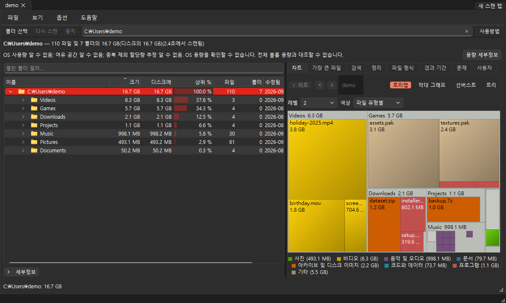

# FileTree

분석 또는 파일 작업 대화 상자를 닫으면 취소를 요청하고 작업 스레드의 종료를 확인한 뒤 비동기로 닫습니다. 네이티브 호출이 실행 중이면 작업 소유권을 유지하고 충돌하는 원본 작업을 막습니다. 닫기를 반복해도 첫 결정을 유지하며 부분 결과와 오류를 닫기 전에 표시합니다. 변경된 미리보기는 취소한 읽기가 끝난 뒤 마지막 요청만 시작하고, 시작 전에 취소된 작업은 실행하지 않습니다. Qt 위젯과 모델은 GUI 스레드에서 처리합니다. 전체 프로그램을 종료할 때는 작업 종료 후 객체를 해제합니다.

원본 작업과 분기 재검색도 취소된 백그라운드 읽기가 끝날 때까지 비동기로 기다립니다. 휴지통으로 이동, 실행 취소 및 승인된 휴지통 비우기는 소유한 읽기 스레드가 종료된 후 시작합니다. 결과 처리도 작업 스레드가 종료된 뒤 다른 작업의 제한을 해제합니다. 중지하면 대기 중인 이동, 실행 취소 또는 분기 재검색 요청은 네이티브 작업을 호출하지 않고 취소됩니다.

변경 감시를 전환하면 이전 읽기를 비동기로 종료하고 종료를 확인한 뒤 마지막 요청만 시작합니다. 기록 및 비교 결과, 정기 검토로의 인계와 가상 디스크 조회 완료도 작업 종료를 비동기로 확인한 뒤 다음 작업을 활성화합니다.

드래그 협상은 복사한 로컬 경로만 사용하고 파일 시스템을 조회하지 않습니다. 작업 스레드가 처음 발견한 실제 폴더와 명시적으로 선택한 여러 폴더를 검증합니다. 연속 드롭은 합쳐지고 새 검색은 대기 중인 드롭을 무효화합니다. 여러 폴더 검증은 개수 제한과 선택 순서를 유지하며 취소된 조회가 끝난 뒤 비동기로 닫힙니다. 백그라운드 용량 조회와 검색 완료도 비동기 종료 확인을 사용합니다.

폴더 검증과 시작 화면의 드라이브 검색은 소유한 작업 스레드에서 실행하며, 화면 표시와 작업 상태에는 복사한 드라이브 값을 사용합니다. 스캔을 변경하면 취소를 요청하고 이전 스캔, 변경 감시 및 저부하 스캔의 종료를 비동기로 확인한 뒤 마지막 요청을 시작합니다. 연속 요청은 합쳐지고 중지를 누르면 시작 전 요청을 버립니다. 시간이 걸리는 네이티브 호출이 끝날 때까지 작업 객체를 유지하면서 GUI 이벤트 처리를 계속합니다. 스캔 속도 향상을 입증하는 변경은 아닙니다.

**디스크 공간이 어디에 있는지 확인하세요.** FileTree는 폴더 또는 전체 드라이브를 검색하고 그 안에 있는 모든 파일을 합산한 다음 가장 큰 폴더와 파일부터 폴더 트리, 다채로운 트리맵 및 가장 큰 파일 목록으로 표시합니다. 더 이상 필요하지 않은 항목을 찾으면 창에서 바로 휴지통으로 이동하세요.

**옵션 → 변경 사항 따르기**(기본적으로 꺼져 있음)에서 각 결과 탭은 전체 물리적 Windows/Linux 스캔을 독립적으로 따릅니다. 백그라운드 네이티브 USN/directory-notification/inotify 피드는 제한된 변경 사항을 잠시 통합하고 캡처된 영향을 받은 폴더만 다시 검색합니다. 관련되지 않은 보류 중인 분기는 대기열에 남아 있습니다. 스캔, 분석, 소스 작업 검토, 모달 질문 및 실시간 실행 취소는 새로 고침을 연기합니다. 손실된 이벤트, 알 수 없는 범위, 하드 링크 회계 및 소스 작업 격차에는 전체 검사가 필요합니다. 5분 동안의 전체 조정은 관찰 설정/재준비 공백을 다룹니다. 불완전하거나 결합된 루트 및 지원되지 않는 범위는 다음을 시작할 수 없습니다. 운영체제 오류는 자동 재시도 없이도 계속 표시됩니다. 공유 파일이 있는 부분 Windows 루트에는 외부 별칭을 포함하기 위해 읽기 가능한 USN이 필요합니다. 옵트아웃 및 탭 닫기를 취소하고 모니터 작업 종료를 기다림하세요. 알림은 소스 작업 권한을 부여하지 않습니다. 독립적인 Python API는 `change_watch.watch`입니다. 운영체제 CI는 Windows/Linux 외부 별칭 쓰기를 포함하여 Windows USN 및 Linux inotify를 확인했습니다.

**옵션 → 백그라운드 모니터…**은 기본적으로 꺼져 있습니다. 창을 닫을 때 시스템 트레이에 FileTree를 유지하려면 이를 활성화하십시오. **Quit**은 항상 모든 작업이 끝날 때까지 기다린 후 종료합니다. 트레이를 사용할 수 없는 경우 창은 계속 표시됩니다. 트레이를 잃어버리면 숨겨진 창이 복원됩니다. 1분에 한 번씩 작업자는 OS의 사용 가능한 용량을 읽고 지원되는 시스템 알림 및 상태/도구 설명을 통해 임계값 미만 초과(기본적으로 10%)를 보고합니다. OS 기본 설정은 알림을 표시하지 않을 수 있습니다. 알 수 없는 용량은 알 수 없는 상태로 유지됩니다. 활성화된 로컬 기록에 저장되는 단일 스레드 젠틀 스캔에 대해 최대 32개의 폴더와 1~720시간 간격을 선택합니다. 스캔 결과 탭과 소스는 그대로 유지됩니다. 불완전한 적용 범위는 명시적으로 유지됩니다. 프로세스 전반에 걸친 영구 실행 기록은 중복 시도를 방지합니다. 실패/취소된 기간은 제한된 상태로 유지되고 누락된 기간은 한 번 통합됩니다. 일반 스캔이나 원본 작업 검토를 시작하면 저부하 백그라운드 작업을 취소하고 종료를 기다립니다. 비활성화하면 백그라운드 작업이 끝날 때까지 기다리고 창이 복원됩니다. `py -3 start_file_tree.py --background`은 권한 상승을 생략하고 이미 활성화된 모니터링과 사용 가능한 트레이에서만 숨깁니다. 플래그는 이를 활성화하지 않습니다. 자동 정리는 수행되지 않습니다. 핵심 API `background.MonitorConfig`, `claim_scan`, `due_roots` 및 `SpaceWarnings`은 독립적으로 유지됩니다.

**로그인할 때 이 모니터 시작**은 동일한 대화 상자에서 별도의 선택 사항입니다. 실제 기본 등록과 해당 위치(고정된 현재 사용자 Windows HKCU 실행 값, Linux `$XDG_CONFIG_HOME/autostart/je-file-tree-background.desktop`(기본값 `~/.config`) 또는 macOS `~/Library/LaunchAgents/io.github.jechen.FileTree.background.plist`)를 보여줍니다. 소유한 항목을 제거하려면 선택을 취소하고 수락하십시오. 모니터링을 비활성화하면 이 선택 사항도 지워집니다. 이는 두 번째 복사본을 실행하거나 이 세션을 종료하지 않고 향후 로그인에 적용됩니다. 외부/변경된 항목, 연결된 POSIX 디렉터리/파일 및 공유 메타데이터는 눈에 보이는 오류와 함께 거부됩니다. 등록은 리터럴 절대 인수를 사용하고 쉘은 사용하지 않습니다. 먼저 이전 로그인 항목을 제거한 다음 새 위치를 등록하여 프로그램을 이동합니다. 260개의 UTF-16 문자를 초과하는 Windows 명령과 백분율 기호가 있는 Linux 경로(또는 등호가 있는 실행 경로)는 거부됩니다. OS 시작 정책은 실행을 억제할 수 있습니다. 기본 픽스쳐 검증은 실제 로그인 실행을 증명하지 않습니다.

운영체제 CI는 소유한 배경/기록/용량 소스에 대한 JSON 단계 및 CJK 스크린샷을 유지합니다. 격리된 Linux X11 데스크탑에는 실제 트레이와 시각적 알림 캡처가 필요합니다. Windows/macOS 사용 가능한 트레이 동작 또는 사용할 수 없는 트레이 동작을 명시적으로 보고합니다. 알림 발송만으로는 OS 표시 권한이 입증되지 않습니다. 이러한 프로브는 호스트 로그인 작업을 등록하거나 기존 사용자 소스를 변경하지 않습니다. 반복 제안 검토 프로브는 각 네이티브 환경에서 Qt 위젯 확인 대화상자를 사용하고 실제 아니요 버튼을 누른 뒤 프로세스 대화상자 설정을 복원합니다. OS 고유 경고창 상호작용은 아직 검증하지 않았습니다. 검토한 Cocoa 재실행에서 소유한 Qt 검토/아니요 확인 8회와 APFS 정리 2회를 완료했습니다: [네이티브 Qt 검증](../docs/updates/background-20261009-native-widget.json).

독립적인 Python API `recurring.capture` / `prepare`은 캡처된 스캔 메타데이터, 효과적인 정리 정책 및 제한된 저장 기록을 결합하여 새로운 후보와 최대 폴더 증가를 설명합니다. 기록 관찰의 최대 100행/48KiB를 유지합니다. 누락, 부분, 불일치 또는 잘린 기준선은 알 수 없습니다. 메타데이터 한도에는 기록 저장 시각을 위한 공간을 남기며, 헤더만으로 한도를 넘으면 명시적으로 거부합니다. `ScanHistory.save(..., baseline=...)`는 일반 보존 한도 아래에 선택적 관찰을 저장합니다. `load_recurring`은 기록 바인딩을 확인합니다. 파일 전용 검사 오류에는 불완전한 기록도 표시됩니다. 날짜가 지정된 제안은 다음 예정된 기간에 만료되며 변경된 규칙, 작업 기록 또는 캡처된 경로를 거부합니다. 이러한 API는 소스를 스캔하거나 이동하지 않습니다.

파일 → 예약된 검색 제안에는 예약된 작업자가 준비한 보고서가 표시됩니다. 즉, 이전 바운드 검색 이후의 새로운 정크, 현재 후보 및 가장 큰 논리적 폴더 증가가 표시됩니다. 각 목록은 최대 100개의 행을 포함하며 전체 경로 도구 설명과 Ctrl+C를 지원합니다. 날짜, 만료, 전체/보유 후보 항목, 적용 범위 및 알 수 없는 비교가 계속 표시됩니다. 규칙/일정/작업 기록 변경으로 상태가 업데이트됩니다. 보고서는 현재 세션에서 예약된 검사 후에 나타납니다. 기준선은 로컬 기록 보존 하에 유지됩니다. 잘못된 제안 메타데이터는 일반적인 저장된 내역과 눈에 보이는 오류를 유지합니다. 소스가 자동으로 이동되지 않습니다. 현재 후보 재스캔 및 검토는 새 탭에서 일반적인 전경 스캔을 열고 작업자에서 캡처된 전체/네이티브 트리의 유효성을 검사한 다음 기존 편집 가능한 정리 대기열 및 보호된 폴더/휴지통 확인을 사용합니다. 변경/부분/만료된 제안은 계속할 수 없습니다. 재검색을 취소하거나 해당 탭을 닫으면 검토 의도가 삭제됩니다. 이동 작업자는 배치 전에 전체 운영체제에서 확인한 트리를 다시 확인하고 각 항목 전에 날짜/규칙/일정/작업 기록을 다시 확인합니다. 일반적인 기본 소스별 유효성 검사는 계속 적용됩니다. 이러한 검사는 파일 시스템 트랜잭션이 아닌 관찰용입니다.

[English](../README.md) | [繁體中文](README_zh-TW.md) | [简体中文](README_zh-CN.md) | [日本語](README_ja.md) | [한국어](README_ko.md)

원본 작업 확인의 기본 선택은 “아니요”입니다. 회수 요약은 용량을 설명하며 사용 가능한 여유 공간의 증가를 보장하지 않습니다. 휴지통으로 이동하는 것만으로는 여유 공간이 늘어나지 않습니다.

macOS arm64의 실제 컴파일과 번들 패키징은 Desktop builds [37788683269](https://github.com/JeffreyChen-s-Utils/FileTree/actions/runs/37788683269)에서 통과했습니다. 원본 항목 167개가 모두 보존되었으며 압축 해제 결과도 일치했습니다. 이는 검증한 커밋의 컴파일과 패키징에 대한 증거이며 앱을 실행하거나 게시하지 않았습니다. Finder 작업·동의 검증 및 Developer ID·공증 환경이 없어 POSIX 릴리스 게이트는 비활성 상태를 유지합니다.

Windows 릴리스에서 Azure Artifact Signing과 OIDC 서명을 명시적으로 활성화할 수 있습니다. 활성화된 설정이 누락되거나 서명·타임스탬프·게시자 검증에 실패하면 Windows 산출물과 GitHub 릴리스 게시를 중지합니다. 버전 커밋·태그와 PyPI 업로드가 먼저 완료되며 이후 Windows 작업 실패로 취소되지 않습니다. 단일 파일 및 독립 폴더 실행 파일은 패키징 전에, MSI는 업로드와 매니페스트 해시 계산 전에 검증합니다. 개발 빌드는 서명되지 않습니다. 계정과 실제 운영체제 서명 성공 검증은 아직 사용할 수 없습니다. [Windows 서명 설정](../docs/windows-signing.md)을 참조하세요.



일본어·한국어는 설치된 적절한 글꼴을 사용하며 시스템 글꼴 크기와 스타일을 유지합니다. 글꼴을 다운로드하거나 함께 배포하지 않습니다. 적절한 글꼴이 없으면 시스템 글꼴을 사용합니다.

트리, 검색 또는 가장 큰 파일에서 실제 항목을 선택하고 마우스 오른쪽 버튼을 클릭하고 → **폴더로 이동…** 또는 **이름 바꾸기…**. 모달 미리보기에는 모든 가장 바깥쪽 소스/대상 및 거부 사유가 최대 1,000개까지 선택 항목으로 나열됩니다. 기존 폴더를 선택하거나 리터럴 `{name}`, `{stem}`, `{ext}`, `{n}` 토큰이 포함된 파일 이름 패턴을 선택합니다. 기존 이름의 기본값은 **skip**입니다. 명시적인 번호가 붙은 접미사를 선택하면 정확한 대체 이름을 미리 볼 수 있습니다. 옵션을 변경하면 승인이 무효화됩니다. **미리보기 경로**을 다시 선택합니다. **검토된 ​​경로 적용...**은 세부정보의 모든 적합한 쌍에 대해 기본적으로 일반 텍스트가 없는 질문을 묻습니다. 거부되거나 변경되지 않은 행은 계속 표시되고 건너뜁니다. 실행 시 옵션이 고정되고, 전체 소스 범위와 캡처된 상위 ID가 다시 확인되며, 복사나 덮어쓰기 없이 기본 동일 볼륨의 배타적 이름 변경이 사용됩니다. 보호됨, 링크됨, 특별함, 알려진 사용 불가능, 변경됨 및 교차 볼륨 항목은 거부됩니다. 중지/닫기는 현재 이름 바꾸기를 기다리고 완료된 변경 사항을 유지합니다. 항목별 오류 및 실제 경로는 계속 표시됩니다. 예상치 못한 이름 변경 후 작업 기록은 단독 롤백을 시도하며, 롤백이 실패할 경우 보관된 대상이 보고됩니다. 동시 파일 시스템 변형은 트랜잭션이 아닙니다. 외부 대상 부모는 소유된 작업자에서 다시 스캔되며 개수/오류가 표시됩니다. 닫으면 현재 루트를 재구축하여 그 안에 영향을 받는 모든 상위 항목을 새로 고치고 기존 용량 메타데이터를 무효화합니다. 취소된 새로 고침은 계속 표시됩니다. Python API는 이동/건너뛰기/실패한 결과와 두 상위 경로를 모두 포함하는 `namespace_moves.prepare_namespace` / `execute_namespace`을 제공합니다. 기본 macOS은 확인되지 않은 상태로 남아 있습니다. 확인된 사본을 위해 별도의 **다른 드라이브로 이동…** 워크플로를 사용하세요.

트리에서 검색된 폴더를 선택하고 검색 또는 가장 큰 파일을 마우스 오른쪽 버튼으로 클릭한 후 → **다른 드라이브로 이동…**. 다른 볼륨에 있는 기존 폴더를 선택하십시오. 모든 정확한 쌍과 명시적인 건너뛰기/접미사 충돌 선택을 검토합니다. **검토된 ​​폴더 복사 및 확인…**은 기본적으로 일반 텍스트가 아닌 질문을 하고 옵션을 고정합니다. 진행률은 현재 파일의 이름을 지정합니다. 중지/닫기는 취소하고 작업자에 합류합니다. 원본과 부분 대상은 그대로 유지되며 실제 경로/오류가 표시됩니다. 성공적인 복사를 사용하면 **확인된 원본을 휴지통으로 이동...**할 수 있습니다. 이는 기존 보호 폴더 승인과 소스/사본 쌍 및 64MiB 확인 제한을 나열하는 별도의 기본 휴지통 없음 질문을 사용합니다. 휴지통 작업자는 원본을 이동하기 직전에 모든 복사본을 다시 확인합니다. 검사에 실패하면 나머지 이동이 중지됩니다. **접합/기호 링크 남기기**은 기본적으로 꺼져 있으며 일괄 처리를 위해 캡처됩니다. 성공적인 휴지통만이 원래 경로 리디렉션을 생성합니다. 충돌은 도착을 덮어쓰지 않습니다. 실패한 리디렉션은 확인된 복사본과 원본을 휴지통에 보관하고 정확한 경로를 보고하며 Windows에 빈 원본 경로 디렉터리를 남길 수 있습니다. 복사 후에는 자동 휴지통이 없습니다. 외부 대상 부모는 작업자에 대해 다시 검색됩니다. 현재 소스 상위는 휴지통 후에 새로 고쳐지거나, 휴지통이 거부되면 현재 루트가 새로 고쳐집니다. 기본 창을 닫으면 활성 경로 작업 대화 상자가 결합되고 휴지통을 결합하는 동안 수신된 복사 게이트 오류가 보고됩니다. 기본 Windows C→D 사본/ADS 및 소유 설비의 접합이 확인되었습니다. 기본 macOS은 확인되지 않은 상태로 유지됩니다.

Python API는 교차 볼륨 대상을 포함하여 명시적으로 검토된 배타적 일반 폴더 복사본에 대해 `verified_copy.prepare_copy` / `copy_folders` / `verify_copy`을 추가합니다. 미리보기는 모든 가장 바깥쪽 쌍/거부 및 명시적 건너뛰기/접미사 충돌 선택 항목을 최대 1,000개까지 유지합니다. 보호된 일반 소스를 읽을 수 있습니다. 최종 휴지통 승인은 기존의 보호된 소스 흐름으로 유지됩니다. 연결된 페이로드, 특수한 페이로드, 사용할 수 없는 것으로 알려진/재분석, 불완전한 페이로드, 변경 및 마운트된 페이로드는 거부됩니다. 기존 이름을 덮어쓰지 않습니다. 복사본은 빈 폴더를 보존하고 하드 링크 이름의 별도 복사본을 만듭니다. 전체 하위 이름, 파일 수 및 길이가 비교됩니다. 64MiB보다 작은 모든 기본 파일/Windows 명명된 스트림은 SHA-256 비교되는 반면 더 큰 값은 길이에만 해당됩니다. 기본 Windows 복사 시 ADS이 유지됩니다. 스트림 쿼리 실패로 인해 확인이 불가능합니다. POSIX 확장 속성은 복사되어 엄격하게 비교됩니다. macOS은 길이가 64MiB 이상인 속성만 사용하여 기본 설명자 복사/리소스 포크 비교를 사용합니다. 파일 메타데이터는 플랫폼 지원을 사용합니다. Windows 디렉터리 보안은 대상을 상속하며 POSIX setuid/setgid/sticky 비트는 전송되지 않습니다. 알려진 파일 시스템 경계 및 Linux 동일 장치 마운트 ID는 대상 설명자에서 확인됩니다. 실패하면 일괄 처리가 중지되고 모든 원본이 유지되며 부분 대상이 유지됩니다. 취소하면 부분 데이터도 유지됩니다. 별도로 승인된 기존 휴지통 조치 전에 검증된 증거를 다시 확인해야 합니다. 이 API는 원본을 폐기하거나 삭제하거나 리디렉션하지 않습니다. 관찰은 동시 파일 시스템 트랜잭션이 아닙니다. 소유한 네이티브 macOS CI는 완전한 리소스 포크/xattr 해시 및 빈 폴더가 포함된 동일 볼륨 복사본을 확인했습니다. [전용 APFS 증거](../docs/updates/apfs-20261009-native.json)는 볼륨 간 네이티브 복사와 소스/빈 폴더 보존도 확인합니다. 이후 Finder 휴지통/리디렉션은 아직 검증되지 않았습니다.

Windows 또는 Linux에서 성공적으로 승인된 휴지통 이동이 완료되면 정확한 기본 복원 계획을 캡처할 수 있는 상태 표시줄에 8초 동안 **실행 취소(수)**이 표시됩니다. 한 번 클릭하면 캡처된 항목을 복원할 수 있습니다. 자동으로 복원되지 않습니다. 누락/안전하지 않거나 변경된 메타데이터 및 드라이브 간 복사 리디렉션을 포함하여 사용 중인 원본으로 인해 표시된 이유와 함께 실행 취소를 사용할 수 없습니다. 만료, 새 스캔, 승인된 다른 휴지통 또는 경로 작업 대화 상자는 이전 제안을 삭제합니다. 자동 원본-상위 재검색은 제안이 만료되거나 역 작업이 완료될 때까지 기다립니다. 소유한 작업자는 동결된 계획을 다시 확인하고 조치를 취하기 전에 새로운 역승인을 기록하며 원래의 휴지통 감사는 그대로 유지됩니다. **최근 작업**에는 명시적 실행 취소 및 복원된 결과가 포함됩니다. 스캔 및 기타 변형은 복원과 겹칠 수 없습니다. 중지는 시작되지 않은 항목을 건너뜁니다. close는 운영체제 작업의 종료를 기다리고 일반 텍스트의 정확한 경로와 함께 늦은 기본/부분/수신/감사 오류를 보고합니다. 원래 경로 도착은 덮어쓰여지지 않으며 실행 취소를 활성화하기 위해 리디렉션이 제거되지 않습니다. Windows 소유의 CJK 폴더 검증으로 버튼, 기본 복원, 보존된 해시/빈 폴더, 별도의 이동/복원된 감사 항목 및 원본-상위 재검색을 확인했습니다. 보관된 Shell 작업 기록은 진실한 경고를 생성합니다. 네이티브 Linux CI는 일반 GUI 캡처, 인식된 개인용 저장소 준비, 복원, 작업 기록 정리/컨테이너 보존 및 새로운 소유 설비에 대한 영향을 받은 상위 재검색을 확인했습니다. macOS 실행 취소를 사용할 수 없습니다.

읽기 전용 `duplicate_links.prepare_links` / `verify_link_pair` API는 명시적 중복 유지할 파일에서 최대 1,000개의 추가 복사본 교체를 미리 봅니다. 각 행은 정확한 경로를 고정하고, 증거 및 부모 신원을 스캔/처리합니다. protected/changed/unknown/linked/special/cloud/이미 하드 링크된 결정은 거부되고 다른 볼륨 또는 동일 장치 Linux 바인드 마운트 추가 항목은 거부된 행으로 유지됩니다. 확인은 현재 트리와 모든 관찰을 다시 확인하고, 완전히 SHA-256 기본 페이로드와 모든 Windows ADS을 모든 크기로 해시하고 원본 중복 BLAKE2 다이제스트를 확인합니다. POSIX 확장 속성은 일치해야 합니다. macOS 64MiB 이상 또는 64MiB를 초과하는 집계 페이로드의 속성/리소스 포크는 길이로만 처리되지 않고 거부됩니다. 취소하면 모든 페이로드가 그대로 유지됩니다. 이 API는 연결, 교체 또는 삭제를 수행하지 않으며 이후 변형 권한을 부여하지 않습니다. 명시적으로 검토된 `duplicate_link_ops.execute_links` API는 각 그룹/쌍을 완전히 다시 확인하고 기본 동일한 볼륨 하드 링크를 생성하며 게시 전에 소유된 형제 백업 아래에 이전 추가 항목을 독점적으로 유지합니다. 캡처된 백업만 폐기하기 전에 전체 페이로드를 다시 확인합니다. 실패는 도착을 덮어쓰지 않고 독점 롤백을 시도합니다. 결과는 실제 게시된 별칭과 유지된 백업/임시 경로를 보고합니다. 취소하면 시작되지 않은 작업이 중지되고 부분적인 결과가 보존됩니다. 이전 복사본은 휴지통에 보관되지 않으며, 어떤 이름을 통한 편집이나 메타데이터/보안 변경 사항은 연결된 모든 이름에 영향을 미칩니다. 유지할 파일/추가 부모 모두 새로운 스캔이 필요합니다. 복구된 용량은 알 수 없습니다. 기본 소유 Windows 테스트를 통해 여러 복사본, ADS 폐기, 취소 및 충돌을 확인했습니다. 검토된 GUI 작업 흐름은 아래에 설명되어 있습니다. 소유한 네이티브 macOS CI는 일반 코어 연결, 유지할 파일 ID 및 완전한 리소스 포크/xattr 해시를 확인했습니다. 보호된 GUI 승인은 아직 확인되지 않은 상태입니다.

**Clean up → Duplicates**에서 정확한 중복 항목을 찾고 각 **Kept 사본**을 명시적으로 선택합니다. **추가 복사본 연결…**은 모든 정확한 유지할 파일/추가 경로 및 거부된 행(최대 1,000개 추가)의 읽기 전용 미리 보기를 엽니다. 유사한 사진 및 폴더 일치는 이 작업을 활성화할 수 없습니다. **Link가 추가 사본을 검토했습니다...**은 세부 정보의 모든 쌍/거절에 대해 기본적으로 일반 텍스트가 없는 질문을 하고, 향후 콘텐츠/메타데이터/보안 편집을 공유했으며, 휴지통 복사본이 없고 자동 실행 취소가 없습니다. 소유한 작업자는 교체 전에 별도의 작업 승인을 유지하고 원래의 추가 ID와 실제 게시된 각 결과를 기록합니다. 승인 오류로 인해 실행이 방지되고, 결과 감사 오류로 인해 완료된 링크가 보존되고 이후 작업이 중단됩니다. 진행률은 현재 파일의 이름을 지정합니다. 중지/닫기는 해싱 및 시작되지 않은 행을 취소하고 운영체제 호출의 종료를 기다리며 실제 연결/연결되지 않은 상태, 유지된 백업/임시 경로 및 지연 오류를 일반 텍스트로 표시합니다. 이 모달 작업 중에는 경로를 변경할 수 없습니다. 스캔, 휴지통 및 실행 취소가 직렬화됩니다. 일괄 처리를 시도한 후 닫으면 현재 루트 전체를 다시 작성하여 유지할 파일/추가 관찰을 모두 새로 고치고 이전 용량/중복 결과를 무효화합니다. 교체된 루트는 이전 재검색을 수신하지 않습니다. 기본 Windows 소유 CJK/ADS 고정 장치 및 전체 루트 새로 고침이 확인되었습니다. 기본 Linux CI는 동일한 소유 GUI 워크플로, 감사 및 전체 루트 새로 고침을 통과했습니다.

Python API는 Linux에서 명시적인 동일 볼륨 freedesktop 실행 취소를 위해 `trash_restore.capture_origin` / `prepare_restore` / `restore`을 추가합니다. 스캔한 원본 스냅샷과 상위 ID를 휴지통으로 캡처한 다음 실제 인식된 현재 사용자 개인 `files`/`info` 대상과 정확한 `.trashinfo` 경로/날짜만 준비합니다. 준비는 제한된 팔로우 없음 메타데이터(100,000개 항목/128개 레벨)를 읽었습니다. 복원에서는 전체 페이로드/수신/상위/소유자/마운트 관찰을 다시 확인하고 기본 배타적 이름 바꾸기를 사용합니다. 기존 또는 도착하는 원래 경로 이름은 덮어쓰여지지 않습니다. 변경된 이름 변경 후 관찰은 단독 롤백을 시도합니다. 성공적인 복원 후에는 일치하는 작업 기록만 제거됩니다. 메타데이터 정리 실패는 정확한 복원/보존 상태와 실제 경로를 보고합니다. 페이로드 삭제/복사 대체가 없습니다. Windows `windows_restore.prepare_windows_restore` / `restore_windows`은 현재 사용자의 Shell bin에 있는 정확한 원래 경로 및 기본 ID와 일치하고 제한된 페이로드/수신 관찰을 다시 확인하고 정식 `undelete`만 호출합니다. Qt 대상이 없으면 고유한 ID 일치가 필요합니다. 원본 보유, 변경된 출품작 및 취소가 거부됩니다. 운영체제 오류와 확인되지 않은 완료는 계속 표시됩니다. Windows 페이로드 또는 `$I` 작업 기록이 수동으로 이동/삭제되지 않습니다. 기본 소유 폴더 유효성 검사를 통해 동일한 ID, SHA-256 콘텐츠 및 빈 폴더가 복원되었습니다. 이 Windows 쉘은 작업 기록을 보관했으며 경고와 함께 복원된 것으로 보고되었습니다. 기본 Linux 증명은 전용 CI 작업의 일회용 개인 설비에서 실행됩니다. 기존 사용자 휴지통 범위는 사용되지 않습니다. 취소된 복원은 페이로드/작업 기록을 유지하면서 눈에 보이는 이유를 보고합니다. 운영체제 CI는 성공, 충돌 거부, 변경된 페이로드 거부 및 소유 설비에 대한 대체 정보 상위 거부를 확인했습니다.

읽기 전용 `virtual_disks.find_virtual_disks` Python API는 기록된 `.vhdx`, `.vhd`, `.vmdk`, `.vdi` 및 `.qcow2` 후보와 현재 사용자 WSL2 등록 및 기존 유추된 Docker Desktop 기본 디스크 경로를 찾습니다. 최대 1,000개의 가장 큰 백업 파일 행을 유지하면서 검색된 모든 수를 보존하고 폴더당 생성하며 취소를 지원합니다. 기록된 스캔 길이/할당은 추정치로 유지됩니다. 외부 등록 파일은 최종 파일 no-follow 메타데이터 및 Windows 할당 쿼리를 사용합니다. 연결된 파일, 클라우드 파일, 누락되거나 변경된 외부 파일은 알 수 없는 상태로 표시됩니다. 공급자 레이블은 위치 힌트일 뿐 유효한 디스크 형식, 소유권 또는 중지된 상태를 증명하지는 않습니다. 검색 시 헤더, 게스트 또는 명령이 열리지 않으며 VM이 시작, 중지, 마운트 또는 압축되지 않습니다. 공급자 읽기 오류, 생략된 행 및 불완전한 스캔 범위는 명시적으로 남아 있습니다. 사용자 정의 Docker 위치는 해당 폴더를 스캔하여 찾을 수 있습니다. 명시적 `virtual_disk_info.inspect_virtual_disk`은 상위 디스크를 열지 않고 기본 메타데이터 전용/읽기 전용 플래그를 사용하여 Windows에서 캡처한 일반 VHD/VHDX 헤더를 별도로 쿼리합니다. 파일/상위 ID를 고정하고, 변경되거나 사용할 수 없는 레코드를 거부하고, 기본 형식/공급업체를 확인하고, 가상 용량, 공급자의 물리적 바이트, 고정/동적/차등 유형, 마운트된 상태 및 디스크 식별자를 보고합니다. 이러한 관찰은 압축 권한이나 정지 기계 증명을 부여하지 않습니다. 공급자의 물리적 바이트는 게스트가 사용하는 바이트가 아니므로 아직 알려지지 않았습니다. 첨부 파일이나 권한 상승 없이 변경되지 않은 완전한 파일 해시와 정확한 식별자를 사용하여 새로 소유된 고정/동적 VHD 및 VHDX 테스트를 통과했습니다. 보기 → 가상 디스크는 전체 개수, 문제 및 스캔 범위가 포함된 제한적이고 복사 가능한 읽기 전용 테이블을 엽니다. VHD/VHDX를 선택하고 명시적 Windows 기본 쿼리에 대해 선택한 VHD 헤더 쿼리를 선택합니다. 파일 길이, 기록된 할당, 가상 용량, 공급자 바이트 및 알 수 없는 게스트 사용량에는 별도의 숫자 열이 있습니다. 지원되지 않는 형식과 운영체제 오류는 계속 표시됩니다. 기록된 항목 표시는 스캔한 원본 노드만 활성화합니다. 외부 공급자 행에는 트리 작업이 없습니다. 중지/닫기는 인벤토리와 현재 기본 호출을 결합하고 늦은 응답을 거부합니다. 소유된 모달 대화 상자는 스캔 및 파일 작업을 직렬화합니다. 기본 CJK GUI 검증은 새로 소유한 VHDX만 사용하고 전체 해시/스냅샷을 보존하며 정확한 UUID를 확인했습니다. 별도의 Python `virtual_disk_compaction.prepare_compaction/execute_compaction` API는 이제 고정된 읽기 전용 리뷰와 고정 로컬 NTFS의 분리된 동적 VHD/VHDX에 대해 명시적으로 승인된 기본 제로 블록 압축을 제공합니다. 파일/상위 ID, 전체 스냅샷, 런타임 등록/중지된 관찰 및 변형 전 기본 UUID/유형/용량을 다시 확인합니다. WSL을 실행하는 알려진 Docker/게스트 프로세스, 불완전한 공급자 및 변경된 레코드가 실행을 거부합니다. 고정된 System32 WSL 메타데이터 쿼리는 게스트를 시작/중지하지 않습니다. 발신자는 소유 컴퓨터가 중지된 상태인지 확인하고 지속적으로 기본값을 감사해야 합니다(승인 없음). 진행 중인 운영체제 호출의 종료를 기다리고 시도된 모든 작업을 다시 검색해야 합니다. 기본 성공, 이후 오류 및 알 수 없는 할당은 별도로 유지됩니다. 제로 저장은 유효하며 게스트 사용량은 알 수 없는 상태로 유지됩니다. 새로 소유한 빈 VHDX는 관련 없는 도착을 유지하면서 네이티브 제로 절약 성공과 정확한 UUID/용량/파일 ID를 입증했습니다. 보기 → 가상 디스크 → 압축을 선택한 VHD는 별도의 읽기 전용 미리 보기를 엽니다. 전체 리터럴 소스, UUID, 용량 및 분리된 제로 블록 백엔드를 검토한 다음 기본 No로 해당 머신이 중지된 상태인지 확인합니다. 지속적인 승인 실패로 인해 실행이 방해됩니다. 결과 감사 실패는 실제 기본 성공을 유지합니다. 조인을 중지/닫고 관찰되지 않은 결과를 보고하며 쓰기 가능한 작업을 시도하면 전체 루트 재검색을 위해 닫힐 때까지 오래된 헤더/압축 권한이 비활성화됩니다. 기존 휴지통 실행 취소는 실행 요청 시 만료됩니다. 작업은 직렬화된 상태로 유지됩니다. 최근 작업은 원래 경로/ID 및 관찰된 할당/오류로 압축을 기록합니다. 권한 오류가 발생하면 검토를 닫고 기존 관리자를 다시 시작한 후 다시 검사하고 승인해야 합니다. 네이티브 CJK GUI 증명은 관련 없는 호스트 런타임이 격리된 새로 알려진 할당되지 않은 빈 VHDX만 사용했습니다. 제로세이브 성공과 감사/UUID/용량이 첨부/승격 없이 검증되었습니다. 기본 권한 테스트에서는 새로 소유한 VHD 및 VHDX에 채워진 게스트 데이터 전체가 보존되었습니다. 관찰된 지원 감소는 각각 약 30MiB와 0이었습니다.

**옵션 → 관찰된 하드 링크를 한 번 계산합니다**은 기본적으로 꺼져 있으며 향후 스캔을 위해 지속되고 캡처됩니다. 명명된 파일 길이, 할당 및 개수를 유지하면서 별도의 계산된 논리적/할당 총계를 추가합니다. 요약에는 계산된 총계, 관찰된 별칭 및 알 수 없는 기록이 표시됩니다. 헤더 메뉴는 처음에 숨겨진 **계산된 크기/계산된 디스크 크기** 열을 제공합니다. 처음으로 관찰된 어휘 이름은 바이트 수에 기여합니다. 별칭은 계산된 필드에서만 0으로 계산됩니다. 차트와 해당 범례는 계산된 합계를 사용합니다. 최대/검색/유형/연령/소유자 목록 및 상위/드라이브 공유는 명명된 의미를 유지합니다. 알 수 없거나 일관성이 없는 메타데이터는 명명된 추정치를 유지합니다. 공유 범위와 디렉터리 메타데이터는 아직 알려지지 않았습니다. 분기 및 사후 휴지통 재검색은 이 모드에서 전체 루트를 다시 빌드하여 계산된 이름이 떠날 때 기여도를 전송합니다. 실행 중인 작업자는 캡처된 옵션을 유지합니다. CSV는 `accounted_size_bytes`, `accounted_allocated_bytes` 및 `hard_link_accounting`(0/1)을 추가합니다. JSON 폴더는 계산된 값과 모드 플래그를 추가하고 저장된 비교/기록을 위해 `size`라는 이름을 유지합니다. HTML/XLSX 보고서에는 명명된 테이블과 계산된 항목/요약 열이 포함됩니다. CLI는 `--count-hard-links`을 허용하고 계산된 바이트 총계와 `hard_link_accounting` 메타데이터를 내보냅니다. 비활성화된 계산 필드는 명명된 추정값으로 대체됩니다. Python API는 `ScanOptions(count_hard_links=True)` 및 `Node.accounted_size/accounted_allocated`을 사용합니다. 캡처된 트리를 변형한 후 작업자에 `account_hard_links`을 다시 적용합니다. 이는 추가 OS/페이로드 호출 없이 기록된 통계를 재사용합니다. 기본 소유의 2개 이름 픽스쳐는 2MiB의 명명된 총계, 1MiB의 총계, 2개의 실제 파일 길이 및 1개의 별칭을 유지했습니다.

요청 시 내용을 읽으려면 스캔 후 기록된 **ZIP / 7z / RAR** 파일을 확장하세요. **[virtual]**로 표시된 행은 선언된 압축되지 않은 크기를 표시합니다. 디스크 합계, 차트, 내보내기 및 파일 작업 외부에 유지됩니다. 멤버는 추출되지 않으며 중첩된 아카이브는 열리지 않습니다. ZIP은 표준 라이브러리를 사용하고, 7z는 설치된 `py7zr`을 사용하고, RAR은 PATH에서 `unrar` 또는 `bsdtar`과 함께 `rarfile`을 사용합니다. 하나도 없으면 RAR은 툴팁에 이유가 포함된 일반 파일로 유지됩니다. 변경되었거나, 읽을 수 없거나, 형식이 잘못되었거나, 비밀번호로 보호된 헤더도 일반 파일로 남아 있습니다. 알려진 클라우드 자리 표시자 및 소스 링크는 거부됩니다. 멤버 링크, 순회/절대 이름, 중복 충돌 및 과도한 이름/깊이는 표시 개수와 함께 생략됩니다. 인벤토리는 항목 100,000개, 이름 1,024자, 레벨 128개, 누적 파서 읽기 32MiB로 제한됩니다. 디코딩된 7z 헤더 크기는 디코딩 전에 확인됩니다. 최대 2개의 읽기가 함께 실행됩니다. 소스 파일을 마우스 오른쪽 버튼으로 클릭 → **이 아카이브 읽기 중지** 중지합니다. 현재 디코더 호출을 통해 대기를 중지하거나 닫습니다. 다시 검색하면 미리보기가 다시 시도됩니다. 새로운 스캔이나 트리 편집은 이전 응답을 무효화합니다. 확장된 폴더 텍스트 필터는 실제 파일 시스템 항목을 다루고 활성화된 동안 가상 행을 숨깁니다. 미리보기는 멤버 콘텐츠가 아닌 헤더를 읽기 때문에 CRC나 실제 추출된 크기를 확인하지 않습니다.

**정리 → 중복**에서 **유사한 사진** 및 최소 파일 크기(기본값 1MiB)를 선택한 다음 **유사한 사진 찾기**를 선택합니다. 이 별도의 검색은 설치된 `Pillow`을 사용하여 기록된 이미지 유형을 디코딩하고 EXIF ​​방향과 첫 번째 애니메이션 프레임을 정규화하며 회색 9×8 이미지의 64비트 차이 해시를 비교합니다. 해밍 거리를 0~16(기본값 4)으로 설정합니다. 각 그룹은 처음 관찰된 이미지의 임계값 내에 유지됩니다. 멤버들은 서로 더 멀리 떨어져 있을 수 있습니다. 색상, 균일한 이미지 또는 관련 없는 장면이 충돌할 수 있으므로 썸네일과 원본을 비교하세요. 이것은 시각적 후보 목록입니다. 명시적인 유지할 파일/추가 복사본 선택 및 복구 추정치는 정확한 복제본에 대해서만 사용할 수 있습니다. 수동으로 선택한 파일 작업은 기존 확인/보호 흐름을 사용합니다. 작업자는 변경된/링크/알려진 클라우드 파일을 거부하고, 지원되지 않는/깨진/크기가 큰 이미지를 개수와 함께 건너뛰고, 기록된 하드 링크 ID를 중복 제거하고, 성공적인 서명을 100,000으로 제한하고, 소스를 128MiB로, 픽셀을 4천만으로, 이미지 행/썸네일을 1,000으로 표시합니다. 중지/새 스캔/모드 변경/트리 편집은 응답을 무효화합니다. 닫기는 현재 디코딩 호출이 끝날 때까지 기다립니다. 썸네일은 메모리에 유지되고 소스 바이트는 변경되지 않으며 이 검색에는 네트워크 호출이나 자동 파일 작업이 없습니다.

**옵션 → Windows 파일별 할당 측정**은 기본적으로 꺼져 있으며 향후 전체/분기 스캔에 적용됩니다. 활성화하고 다시 스캔하십시오. 이는 no-follow 메타데이터 핸들과 `FILE_STANDARD_INFO`을 사용하여 전체 64비트 볼륨/128비트 파일 ID(3.12 이전 Python의 레거시 통계 ID), 크기 및 수정 시간을 검증합니다. 이는 일반 압축 플래그가 없는 경우에도 일반 및 XPRESS/WOF 할당을 측정합니다. 알려진 클라우드/오프라인 파일은 쿼리 없이 0을 유지합니다. 지원되지 않거나 거부되거나 변경된 메타데이터는 문서화된 크기 추정으로 대체됩니다. 파일별 쿼리에는 추가 검색 시간이 소요됩니다. 파일 페이로드는 읽혀지지 않습니다. 공유 범위와 디렉터리 메타데이터는 아직 알려지지 않았으며 하드 링크는 여전히 이름별로 계산됩니다. 기본 스캔은 일반 파일에 대한 클러스터 추정치를 유지합니다. NTFS 및 XPRESS8K 압축/압축 해제를 통해 기본 소유 픽스처 유효성 검사로 콘텐츠가 보존됩니다. 정확한 재검색에서는 일반 압축 플래그가 없는 2MiB XPRESS 고정 장치에 대해 할당된 73,728바이트를 유지했습니다.

Windows에서 검색된 폴더의 상황에 맞는 메뉴는 **NTFS 압축…**을 제공합니다. 취소 가능한 읽기 전용 미리 보기에는 최대 1,000개의 기록된 로그/텍스트/코드/실행 가능/압축되지 않은 이미지 후보, 전체 개수 및 논리적/명명된 할당이 표시됩니다. 잠재적인 절약은 **0–후보 할당**이며 압축률이나 여유 공간은 보장되지 않습니다. NTFS, XPRESS8K(거의 수정되지 않은 데이터)를 선택하거나 압축을 해제합니다. 복원은 압축 플래그에 관계없이 안전한 기록 유형을 나열합니다. **목록에 나열된 파일을 처리합니다...**은 범위, 모드, 나열된 개수 및 논리 바이트의 이름을 지정하는 기본 선택이 “아니요”인 확인 질문을 표시합니다. 모든 후보가 아닌 나열된 파일만 처리됩니다. 디렉터리 기본값과 목록에 없는 파일은 변경되지 않습니다. 기본 도구는 현재 고정 로컬 NTFS에서만 실행되며, 기록된 ID를 다시 확인하고 이름 바꾸기/삭제를 위해 모든 조상/파일을 고정합니다. 링크, 알려진 클라우드/오프라인, 스파스, 숨김/시스템, 하드 링크, 보호 및 변경/알 수 없는 항목은 거부됩니다. 쉘, 와일드카드 또는 `/s` 재귀는 사용되지 않습니다. 압축 해제는 `/u` 및 `/u /exe`을 모두 호출합니다. 압축하면 쓰기 속도가 느려질 수 있으며 압축을 풀려면 여유 공간이 필요합니다. 중지/닫기는 명령을 종료하고 결합합니다. 이전/현재 파일은 부분적인 변경 사항을 유지할 수 있습니다. 결과에는 할당 전/후에 일치하는 것으로 알려진 항목, 알 수 없는 항목 및 처음 20개의 오류가 표시됩니다. 닫으면 임시 파일별 할당으로 전체/분기 재검색이 트리거됩니다. 향후 수동 검색은 옵션 설정을 따릅니다. 미리보기에서는 페이로드를 읽지 않습니다. 확인된 기본 작업에서 읽을 수 있습니다. 처리하기 전에 녹음된 파일을 두 번 클릭하여 선택하고 Ctrl+C를 사용하여 행을 복사합니다. 기본 새로 소유한 픽스처 유효성 검사가 SHA-256 보존되고, 할당이 복원되고, 하드 링크가 거부되고, 접합 피어가 그대로 유지되었습니다.

**Users** 탭은 전체 스캔에 걸쳐 기록된 파일을 소유자별로 그룹화하여 전체 그룹/파일/바이트 수, 논리적 크기, 명명된 할당, 파일 수 및 논리적 공유와 함께 최대 1,000개의 소유자 그룹을 표시합니다. POSIX uid는 기존 스캔 통계에서 나옵니다. Windows **옵션 → Windows 파일 소유자 캡처**은 파일별 보안 쿼리에 비용이 많이 들기 때문에 기본적으로 꺼져 있습니다. 활성화하고 다시 스캔하십시오. 이 설정은 향후 전체/분기 스캔에 적용됩니다. 공유된 불변 uid/SID 키는 하나의 소유자 슬롯(노드당 +8바이트 측정)을 추가합니다. Windows은 일반 파일 소유자 SID를 읽기 전용으로 캡처하고, 링크와 클라우드/오프라인 파일을 건너뛰고, 쿼리 후 기록된 메타데이터를 다시 확인합니다. 비활성화, 거부, 누락 또는 변경된 소유자는 명시적인 **알 수 없는 소유자** 그룹을 형성합니다. 불완전한 스캔은 생략된 데이터에도 플래그를 지정합니다. 탭을 열면 GUI 스레드에서 취소 가능한 분석 및 계정 이름 확인이 시작됩니다. 확인되지 않은 이름은 uid/SID를 유지합니다. 중지, 탭 변경, 새 스캔 및 닫기 취소된 응답 취소 및 닫기는 소유한 작업자를 조인합니다. 이동 및 분기 재검색으로 인해 총계가 무효화됩니다. **기록된 총계 새로 고침**은 스캔을 다시 집계합니다. 변경된 파일 소유권을 얻으려면 다시 검색하세요. Ctrl+C 및 현재 목록 CSV 내보내기가 여기서 작동합니다. 폴더 소유권은 하위 항목을 할당하지 않습니다. 하드 링크는 여전히 이름별로 계산되며 할당량은 추정된 상태로 유지됩니다. 파일 소유권은 실제 사용 또는 제거 권한을 증명하지 않으며 이 탭은 정리 작업을 생성하지 않습니다. 파일 소유자 레코드가 폴더 전용 JSON/history에 없습니다.

**옵션 → 파일 액세스/생성 시간 캡처**은 기본적으로 꺼져 있으며 향후 전체/분기 스캔에 적용됩니다. 활성화하고 다시 스캔하십시오. 새 노드 필드나 추가 타임스탬프 쿼리 없이 이미 읽은 통계를 사용하여 일반 파일 스냅샷당 16바이트를 추가합니다. 트리 헤더는 기본적으로 숨겨진 선택적 **Recorded access** 및 **Created** 열을 제공합니다. **파일 → 파일 시간…** 선택한 일수(0~36,500, 기본값 730) 이상으로 기록된 액세스/생성 날짜별로 파일을 필터링하고, 전체 일치/바이트/알 수 없는 개수로 가장 큰 1,000개의 일치 항목을 표시하고, Ctrl+C 및 정확한 트리 활성화를 지원하며, 조인 중지/닫기가 있습니다. 전체 트리 필터링은 작업자에서 실행됩니다. 누락된 날짜/향후 날짜는 알 수 없습니다. 디렉토리와 링크에는 캡처된 날짜가 없습니다. 생성은 가능한 경우 생년월일을 사용하며(생년월일이 없는 Python 버전에서만 레거시 Windows ctime) POSIX ctime은 사용하지 않습니다. NTFS `NtfsDisableLastAccessUpdate`은 초기화/시스템 관리 비트를 포함하여 읽기 전용으로 쿼리됩니다. 비활성화되거나 알 수 없는 구성은 액세스 연령 일치를 생성할 수 없지만 생성 필터링은 계속 사용할 수 있습니다. 레지스트리 값은 다시 시작해야 할 수 있으며 모든 볼륨에 대한 효과적인 정책을 입증하지 못합니다. 다른 파일 시스템/공급자도 시간을 연기하거나 억제할 수 있으며 백그라운드 읽기가 이를 변경할 수 있습니다. 기록된 날짜는 실제 사용을 증명하지 않습니다. 이 보기는 정리 작업을 준비하지 않습니다. 가장 큰 파일 CSV은 `accessed`/`created` ISO 날짜를 추가하며 사용할 수 없으면 비어 있습니다. 폴더 전용 JSON/history에는 파일 날짜가 없습니다.

새 폴더 가져오기를 일시 중지하려면 스캔 막대에서 **일시 중지/재개**을 사용하세요. 현재 폴더 읽기가 완료되고 라이브 트리가 계속 새로 고쳐집니다. **Stop** 및 닫기는 일시 중지된 동안에도 계속 작동합니다. 최종 분석은 일시 중지할 수 없습니다. 경과 시간에는 일시 중지가 포함됩니다. 재개하면 동일한 스캔과 카운트가 유지됩니다.

**옵션 → 부드러운 스캔**은 기본적으로 꺼져 있으며 새 스캔에 적용됩니다. 각 일회용 스캔 스레드는 Windows 백그라운드 CPU/I/O 모드 또는 Linux nice 10에 가장 낮은 최선의 I/O 우선순위를 더한 값을 사용합니다. UI 스레드는 영향을 받지 않습니다. 지원되지 않는 플랫폼, 거부된 변경 사항 및 부분 우선 순위 적용이 보고됩니다. 읽을 수 있는 폴더는 계속 검색됩니다. I/O 효과는 장치 스케줄러에 따라 다르며 검색 시간이 더 오래 걸릴 수 있습니다. CLI 및 측정 도구는 `--gentle`을 허용합니다. CLI JSON에는 `warnings`이 포함되어 있습니다.

트리맵과 Sunburst는 **색상 → 수정된 연령에 따라**을 공유하며 연령 목록과 동일한 연령 범위 및 밝은(최근)부터 어두운(이전)까지의 범례를 사용합니다. 색상은 마우스 오버 시 현재 시계가 아닌 스캔/분석 시간을 사용합니다. 폴더 색상은 가장 최근에 기록된 수정 사항을 나타냅니다. 사용할 수 없는 날짜/미래 날짜 및 그룹화된 작은 타일은 회색으로 표시됩니다. 이는 마지막 액세스나 파일이 사용되지 않았는지 여부가 아닌 수정 기간을 표시합니다.

**파일 → 내보내기** 및 차트 컨텍스트 메뉴를 사용하면 화면에 차트를 **PNG**로 저장할 수 있습니다. PNG에는 현재 뷰포트, 색상 모드 및 선택 항목이 포함됩니다. **SVG**은 막대 및 선버스트에 사용할 수 있습니다. 전체 경계 막대 행 또는 링은 캐시된 선버스트 비트맵을 사용하지 않고 벡터 모양/텍스트로 그려집니다. PNG 인코딩 및 파일 쓰기는 내보내기 작업자에서 실행됩니다. 파일은 원자적으로 교체되며 닫으면 내보내기가 기다립니다.

**파일 → 현재 보기 인쇄**(`Ctrl+P`)은 시스템 인쇄 대화 상자를 엽니다. **파일 → 내보내기 → 현재 보기(PDF)**는 캡처된 보기에서 선택한 가로/세로와 함께 A4 페이지 한 장을 저장합니다. 둘 다 현재 탭 및 뷰포트를 포함하여 표시되는 결과를 왜곡이나 자르기 없이 인쇄 가능한 여백 내에 맞춥니다. 캡처된 픽셀을 인쇄합니다. 스크롤 숨겨진 항목은 이 보기 외부에 있습니다. PDF 쓰기는 Qt의 PDF 엔진을 사용하여 내보내기 작업자에서 실행되고 요청된 파일을 원자적으로 대체합니다. 종결은 완료를 기다립니다.

차트 탭에는 클릭 가능한 폴더 이동 경로와 **뒤로/앞으로**(`Alt+Left`/`Alt+Right`)이 있습니다. 기록은 현재 스캔에서 최대 100개의 방문을 유지합니다. 뒤로 이후 탐색은 앞으로 분기를 대체합니다. 새로 검사는 재설정 기록을 검사하고 분리된 항목을 삭제하여 다시 검사합니다. **…**에서 사용 가능한 이전 상위 항목을 포함하는 긴 경로 스크롤.

폴더 트리 아래의 **Details**을 확장하면 선택한 항목의 논리적 크기, 디스크 크기, 파일/폴더 수, 기록된 수정 날짜, 소형 유형 및 기간 분포를 볼 수 있습니다. 패널은 확장 여부를 기억합니다. 배포는 스캔 후 확장된 경우에만 취소 가능한 백그라운드 작업자에 대해 실행되며, 기록된 항목을 사용하고 알 수 없는 날짜/미래 날짜를 구분합니다. 다른 곳을 선택하면 오래된 결과가 대체됩니다. 폐쇄는 노동자들과 합류합니다.

**파일 → 내보내기 → 현재 목록(CSV)**은 표시된 레이블, 단위, 필터 및 정렬과 함께 검색, 중복, 변경 사항, 파일 형식, 기간, 가장 큰 파일, 정리 제안 또는 문제를 저장합니다. 그룹화된 목록에는 축소된 경우에도 제목과 해당 항목이 포함됩니다. 목록이나 폴더 트리에 포커스가 있는 동안 **Ctrl+C**은 열 제목이 있는 선택한 행을 인용 탭으로 구분된 텍스트로 복사합니다. 텍스트 필드는 일반 복사를 유지합니다. 스프레드시트에서는 수식과 유사한 텍스트가 이스케이프됩니다. CSV 제한된 대기열을 통해 원자 내보내기 작업자에 대한 짧은 GUI 배치와 스트림 간의 산출량을 캡처합니다. 목록을 변경하면 내보내기가 취소되고 기존 대상이 유지됩니다.

**파일 유형**에서 확장자를 두 번 클릭하면 최대 1,000개의 **포함 폴더**이 일치하는 바이트, 파일 수 및 일치하는 모든 바이트의 공유와 함께 표시됩니다. 폴더 합계는 각 폴더 내에 있는 파일만 계산하므로 중첩된 폴더는 겹치지 않습니다. 두 목록 모두 취소 가능한 작업자에 대해 함께 계산되며 **선택한 폴더만**을 존중합니다. 확장자, 검색 또는 범위를 변경하면 이전 응답이 삭제됩니다. **모두 표시**은 일반 목록을 복원합니다. 연령 드릴다운은 UI 스레드에서도 실행됩니다.

Windows, **Details**에서는 최대 절전 모드/페이지/스왑 파일, Windows.old, 휴지통, 시스템 볼륨 정보, WinSxS, Windows 업데이트 다운로드 및 배달 최적화 캐시에 대해 설명합니다. 인식에서는 어디에서나 이름을 일치시키는 대신 하위 항목을 포함하여 드라이브 루트 또는 설치된-Windows 경로를 사용합니다. 버튼은 관련 Windows 설정 또는 시스템 도구를 엽니다. FileTree는 정리 명령을 실행하거나 이러한 시스템 관리 항목을 이동하지 않습니다. 또한 작업 작업자는 해당 폴더가 포함된 폴더를 거부하고 확인된 경로를 다시 확인합니다. WinSxS 합계에는 공유 하드 링크가 포함될 수 있습니다. 보이지 않는 시스템 데이터는 알 수 없는 상태로 유지됩니다.

4개의 차트에는 접근 가능한 이름, 키보드 지침, 현재 폴더/선택한 항목이 기록된 크기 및 개수와 함께 표시됩니다. Tab을 사용하거나 클릭하여 차트에 초점을 맞추세요. **화살표 키** 렌더링된 항목을 선택하고 **Enter**을 누르면 선택한 폴더가 열리고 **백스페이스**이 위로 이동합니다. 트리 다이어그램은 위쪽/아래쪽 카드 선택 및 오른쪽/왼쪽 확장/축소를 유지합니다. 막대 및 트리 다이어그램은 선택한 행을 스크롤하여 표시합니다. 탐색은 제한된 차트 기하학을 사용합니다. 그룹화되거나 숨겨진 항목은 폴더 트리에서 계속 사용할 수 있습니다. Alt+왼쪽과 같은 수정된 단축키는 기존 동작을 유지합니다.

**보기 → 테마 → 시스템 / 밝음 / 어두움** 즉시 전환되고 선택을 기억합니다. 시스템은 기본 플랫폼 스타일/팔레트를 복원합니다. 명시적인 테마는 일관된 Qt 컨트롤과 대조되는 텍스트, 선택 및 비활성화된 색상을 사용합니다. 팔레트/스타일 변경으로 인해 차트 이미지가 무효화됩니다. Treemap 및 Sunburst는 실제 채우기 대비를 기준으로 검정/흰색 레이블을 선택합니다. 트리맵 그라데이션은 양쪽 끝이 최소 4.5:1 대비를 유지하는 경우에만 유지됩니다. 막대 이름과 값은 색상 막대 외부의 활성 팔레트를 사용합니다.


새로운 `multi_scan.scan_roots(paths, ...)` 코어 API는 하나의 가상 루트 아래에서 최대 256개의 명시적 루트를 검색합니다. 중복/겹치는 일반 경로는 축소됩니다. 별도로 선택된 마운트 범위는 독립적으로 유지됩니다. 각 하위 항목은 실제 절대 소스 경로를 유지하는 반면 가상 `Node.path`은 `None`이며 파일 시스템 작업이나 OS 용량 권한을 부여하지 않습니다. 실패/보류 중인 루트는 불완전한 적용 범위를 유지합니다. 취소는 진행 중인 스캔 작업의 종료를 기다리고 부분 데이터를 보존합니다. 선택적 하드 링크 계산은 관찰된 모든 루트에 대해 한 번 적용됩니다. JSON은 가상 루트를 명시적으로 표시하고, 저장된 비교에서는 이를 유지하며, CSV/report 루트 경로는 공백으로 유지됩니다. 역사에는 개별 소스 루트가 필요합니다. **파일 → 여러 폴더 스캔…**을 사용하여 폴더 목록을 캡처하거나 시작 페이지에서 **모든 드라이브 스캔**을 사용하여 현재 준비된 드라이브를 캡처합니다. 결합된 결과는 차트, 검색, 비교 및 ​​내보내기를 지원합니다. 소스 변경 작업이 비활성화됩니다. Rescan은 캡처된 소스 목록을 재사용하고, 기록은 각 실제 소스를 별도로 저장합니다. CLI `scan ROOT --also ROOT`는 반복되는 `--also` 인수를 허용합니다. 스캔 기록에는 `root: null`, 실제 `roots` 및 알 수 없는 결합 OS 용량이 있습니다. 단일 루트 스캔은 정상적인 동작을 유지합니다.

읽기 전용 가상 디스크 검색은 Windows `\\?\UNC\server\share` 등록을 해당 일반 `\\server\share` 기록된 경로와 병합하고 마찬가지로 확장된 드라이브 경로를 처리합니다. 원본 캡처 경로와 소스 증명이 유지됩니다. 볼륨 GUID/장치 접두사는 명시적으로 유지됩니다. 이 일치는 파일 작업 권한을 부여하지 않으며 실제 UNC 연결 또는 할당 동작을 설정하지 않습니다.

**옵션 → 매일 업데이트 확인**이 기본적으로 켜져 있습니다. 일반 GUI 실행 후 30초가 지나면 자체 백그라운드 확인에서 릴리스 메타데이터에 대해 확인된 HTTPS를 통해 `https://pypi.org/pypi/je_file_tree/json`만 묻습니다. 이것은 FileTree의 첫 번째 자동 네트워크 호출입니다. 스캔한 경로나 파일 콘텐츠가 전송되지 않습니다. 최신 안정 릴리스에서는 상태 표시줄에 비모달 PyPI 링크를 추가합니다. 업데이트는 자동으로 다운로드되거나 설치되지 않습니다. 예약을 중지하고 보류 중인 응답을 삭제하려면 옵션을 끄세요. 지속적인 교차 프로세스 클레임은 실패를 포함한 시도를 경과된 24시간당 한 번으로 제한합니다. CLI, Python 스캐닝 및 창 구성은 검사를 시작하지 않습니다. 응답은 2MiB로 제한되고 리디렉션은 거부되며 네트워크 읽기에는 시간 초과가 발생하고 종료는 현재 요청에 조인됩니다. 오프라인 오류는 검색을 중단하지 않고 진단 상태를 유지합니다.

응용 프로그램은 독립적인 **스캔 탭**을 엽니다. 다른 드라이브/폴더에 대해서는 **새 스캔 탭** 또는 `Ctrl+T`을 사용하고, 활성 탭을 닫으려면 `Ctrl+W`을 사용하십시오(마지막 탭 종료를 닫으면 종료됩니다). 최대 16개의 탭을 동시에 스캔할 수 있습니다. 각각은 트리, 결과 보기, 필터, 작업자 및 기록 캡처를 소유합니다. 하나를 닫으면 자체 작업자가 합류합니다. Quit은 모든 탭을 조인합니다. 언어 변경 사항은 모든 탭에 적용됩니다. 소스 작업 검토, 휴지통, 실행 취소, 복사, 이름 바꾸기, 하드 링크 교체, 압축 및 디스크 압축은 여러 탭에서 하나의 바쁜 가드를 공유합니다. 스냅샷과 승인은 여전히 ​​각 소스에 대해 별도로 다시 확인됩니다. 결합된 루트는 하나의 읽기 전용 탭으로 유지됩니다. 스캔 동시성과 우선순위가 탭별로 적용되므로 여러 스캔을 실행할 때 작업자를 줄이거나 부드러운 스캔을 활성화하세요. `create_window` Python 통합은 여전히 ​​하나의 창을 생성합니다. GUI 진입점은 `create_workspace`을 사용합니다.

## 특징

**옵션 → 작업자 스캔…**은 새 스캔 및 분기 재스캔에 대해 동시성을 1에서 32로 설정합니다. 기존 기본값은 최대 4개(CPU 수에 따라 제한됨)로 유지되며 잘못 저장된 설정은 해당 기본값을 사용합니다. 스캔을 실행하면 작업자가 유지됩니다. 느린 공유는 더 많은 동시성으로 인해 이점을 얻을 수 있는 반면, 디스크/서버는 과도한 로드로 인해 속도가 느려질 수 있습니다. 환경에 따라 선택하세요. Windows에 현재 계정의 권한을 사용하여 `\\server\share`와 같은 절대 UNC 경로를 붙여넣습니다. 거부되거나 연결이 끊긴 분기는 불완전한 상태로 유지됩니다. 시작 페이지에는 이 힌트가 포함되어 있습니다. 일회용 네이티브 SMB 루프백 공유에서 UNC와 임시 매핑 드라이브를 1／4개 작업자로 스캔해 로컬 트리 및 공유 루트 할당 단위와 일치함을 확인했습니다. 접근 거부와 스캔 중 연결 해제는 불완전한 범위를 유지하며 빈 폴더 정리 제안을 만들지 않았습니다. 소유한 테스트 ACL의 완전한 복원과 원본 식별 정보 및 내용 보존도 통과했습니다. 느린 원격 연결 처리량은 아직 검증하지 않았습니다. 증거: [네이티브 SMB 검증](../docs/updates/share-20261009-native.json).

**휴지통…** 시작, 정리 또는 보기 메뉴에서 드라이브 총계를 검토합니다. Windows에서 로컬 드라이브 하나를 선택하고 **선택한 드라이브의 휴지통 비우기…**을 선택합니다. 두 가지 질문은 드라이브, 보고된 바이트 및 항목 수를 보여주고 영구 삭제에 대해 설명합니다. 작업자는 총계를 다시 쿼리하고 변경된 총계 또는 불완전한 재고를 거부한 다음 해당 명시적 드라이브에 대해 `SHEmptyRecycleBinW`을 호출합니다. 이는 현재 사용자의 OS 저장소로 제한되는 영구 삭제 예외입니다. 임의의 경로나 전체 드라이브 범위는 허용되지 않습니다. 기본 비우기는 시작된 후에는 취소할 수 없습니다. 중지/닫기 및 활성화는 반환될 때까지 비활성화됩니다. OS 작업 중에 도착하는 항목도 제거될 수 있습니다. 오류로 인해 저장소가 부분적으로 비어 있을 수 있으며 새로 고쳐진 총계와 함께 보고됩니다. 이후 용량/bin 메타데이터가 새로 고쳐집니다. 업데이트된 메인 트리를 다시 검색하세요. macOS은 아래에 설명된 별도로 검토된 Finder 전체 작업을 사용합니다. 확인은 실제 사용자 저장소를 비우지 않습니다.

Linux에서 동일한 버튼을 사용하면 취소 가능한 작업자의 하나의 표준 마운트 볼륨에서 현재 사용자의 freedesktop 휴지통을 먼저 인식합니다. 두 개의 기본 선택이 “아니요”인 확인 질문에는 각각 정확한 `files` 및 `info` 경로, 논리적 페이로드 바이트, 최상위 항목 및 되돌릴 수 없는 항목이 나열됩니다. 일치하는 작업 기록이 있는 완전한 비공개 current-uid 범위만 허용됩니다. 범위 디렉토리의 링크, 외국 소유자, 특별 항목, 누락/고아 작업 기록, 마운트 경계 및 대형 재고는 거부됩니다. 제거 직전에 작업자는 전체 승인을 다시 도출하고 비교합니다. 설명자 상대 제거는 페이로드 링크를 따르거나 작업 기록의 원래 경로를 사용하지 않습니다. OS-bin 디렉터리는 그대로 유지됩니다. 변경된 항목은 건너뜁니다. 동시 변경 또는 권한 오류로 인해 부분적인 결과가 남을 수 있으며, 해당 결과의 제거된 개수와 오류는 계속 표시됩니다. 정지/폐쇄는 활성 비우기를 중단할 수 없습니다. 용량/빈 행 새로 고침; 이전 주 용량 원장은 삭제되고 다시 검색하면 기록된 트리가 업데이트됩니다. 기본 Linux 유효성 검사는 개인 마운트 네임스페이스의 새로운 ext4 이미지에서만 실행되며 외부 링크 대상은 변경되지 않은 상태로 유지됩니다. 실제 사용자 저장소는 비어 있지 않습니다. 기본 macOS 유효성 검사가 아직 진행되지 않았습니다.

macOS에서 승격되지 않은 프로세스 uid는 로그인한 기본 콘솔 사용자와 일치해야 합니다. 루트, 전환된/알 수 없는 사용자 및 승격된 ID는 거부됩니다. 계정 home은 HOME과 독립적으로 pwd에서 가져옵니다. **비어 있음 Finder 마운트된 모든 볼륨의 휴지통…**은 선택한 행에 관계없이 현재 사용자의 전체 Finder 휴지통을 검토합니다. 소유하고 있는 취소 가능한 작업자는 마운트된 모든 루트에 대해 Qt을 요청하고, 사용할 수 없는/생략/과대 크기의 재고를 거부하고, 다음 링크 없이 개인 현재 UID 홈 `.Trash` 및 마운트된 `.Trashes/<uid>`을 조사합니다. 물리적 범위는 중복 제거되고, 총 메타데이터는 항목 100,000개/수준 128개로 제한되며, 실패하면 승인이 비활성화됩니다. 일반 텍스트가 아닌 기본 질문 두 개에는 범위, 마운트된 루트, 논리적 바이트/항목 및 비가역성이 나열되어 있습니다. 작업자는 셸이나 경로 보간 없이 `/usr/bin/osascript -e 'tell application "Finder" to empty the trash'`만 실행하기 전에 새로 파생된 전체 승인을 비교하고 애플리케이션 응답을 기다립니다. Finder은 장착된 모든 상자에 영향을 미치며 새로 도착한 상자를 제거할 수 있습니다. 활성 비우기는 취소할 수 없습니다. 자동화 권한, OS 오류 또는 남아 있거나 액세스할 수 없는 콘텐츠는 새로 고쳐진 메타데이터를 통해 계속 표시됩니다. Finder은 오류 후에도 계속 작동할 수 있습니다. 이전 주 용량 원장은 폐기됩니다. 현재 트리 데이터를 다시 검색합니다. 테스트에서는 일회용 POSIX 고정 장치와 모의 Finder 실행을 사용하며 실제 사용자 휴지통을 비우지 않습니다. Mac을 사용할 수 없기 때문에 기본 macOS 권한, APFS, 다중 볼륨 및 Finder 동작은 확인되지 않은 상태로 유지됩니다.

환영 메시지에는 준비된 각 드라이브 아래에 저장소 크기/항목 라벨이 표시됩니다. 정리에는 현재 검사의 드라이브가 표시됩니다. 레이블은 처음에 **쿼리되지 않음**이라고 표시됩니다. **빈 합계 새로 고침** 취소 가능한 작업자의 읽기 전용 스냅샷을 쿼리합니다(최대 256개의 준비된 루트, 스캔 드라이브 우선 순위 지정). 또한 휴지통 작업을 수행하거나 저장소 관리자를 닫은 후에도 레이블이 새로 고쳐집니다. 누락된 범위는 쿼리되지 않은 상태로 유지됩니다. 부분 실패는 **총 알 수 없음**, 알려진 바이트/항목 및 일반 텍스트 오류를 ​​표시하며 총계가 비어 있지 않습니다. POSIX 크기는 논리적 페이로드 바이트이며 범위가 겹칠 수 있습니다. 라벨을 합산하지 마세요. 형식은 선택한 단위/언어를 따릅니다. 새로운 전체 검색은 보류 중인 응답을 삭제하고 정리 범위를 재설정합니다. 조인을 닫는 동안 처리되지 않은 쿼리가 발생했습니다. 이러한 라벨은 정리 제안을 생성하거나 기록된 트리를 변경하지 않습니다.

**보기 → 드라이브 개요…** 또는 **드라이브 개요…** 시작 페이지에는 전체 개수, 파일 시스템 이름, 총/사용된 용량, 사용 가능한 공간 표시줄, 할당 단위, 휴지통 바이트 및 항목 개수와 함께 최대 256개의 준비된 마운트 볼륨이 나열됩니다. 두 번 클릭하면 루트를 검색합니다. Ctrl+C는 행을 복사합니다. 취소 가능한 작업자는 페이로드 콘텐츠를 열거나 항목을 수정하지 않고 OS 값을 새로 고치고 저장소를 쿼리합니다. 사용 가능한 공간은 예약/할당량을 제외할 수 있으며 반복 마운트는 용량을 공유할 수 있습니다. 행을 합산하지 마세요. Windows 클러스터 쿼리는 스캐너의 대체 추정치를 사용하는 대신 알 수 없는 결과를 유지합니다. POSIX 장치는 Qt의 최적 전송 블록 크기가 아닌 파일 시스템 조각을 사용합니다. Windows 통 합계는 `SHQueryRecycleBinW`에서 나옵니다. Linux는 홈 프리데스크톱 휴지통과 마운트된 루트 사용자 저장소, macOS 사용자의 `.Trash`/`.Trashes`을 포함합니다. POSIX 용량은 디렉터리/작업 기록 메타데이터 및 공유 할당을 제외한 논리적 페이로드 바이트입니다. 오류에는 알 수 없는 총계와 알려진 바이트가 표시됩니다. macOS 기본 유효성 검사가 보류 중입니다. 중지/닫기는 현재 OS 호출 후 백그라운드 작업이 끝날 때까지 기다립니다. 취소된 답변은 삭제됩니다. 빈 비우기는 이 읽기 전용 개요와 별도로 유지됩니다.

**파일 → 내보내기 → 스캔 보고서(HTML/Excel)**은 취소 가능한 모달 작업자를 통해 현재 필터 또는 차트 탐색에 관계없이 기록된 전체 스캔을 저장합니다. 두 형식 모두 요약/적용 범위, 가장 큰 폴더, 가장 큰 파일, 확장자, 카테고리 및 수정 기간 목록을 포함합니다. 제목에는 표시된/총 개수가 표시됩니다. 가장 큰 폴더가 겹칩니다. 크기/개수는 원시 바이트/숫자이며 할당은 추정된 상태로 유지되며 불완전한 범위가 표시됩니다. 폴더/파일 목록은 각각 1,000개의 행과 10,000개의 확장자를 유지합니다. HTML에는 전체 루트 트리맵, 막대 및 Sunburst PNG 캡처가 제한된 기하학으로 포함되어 있습니다. 스크립트, 외부 자산 또는 네트워크 요청이 없습니다. Excel은 고정된 헤더 및 필터가 포함된 목록당 워크시트를 사용하고, 수식과 유사한 텍스트 및 XML 컨트롤을 이스케이프하고, 셀을 32,767자로 제한하고, 16자리 이상의 정수를 정확한 텍스트로 저장합니다. 중지/닫기는 원자 교체가 성공할 때까지 기존 대상을 유지합니다. `openpyxl`은 설치된 애플리케이션 종속성입니다. 보고서 생성 시 원본 파일 내용을 읽지 않습니다.

**파일 → 프로젝트 및 재구성 가능한 데이터…**은 취소 가능한 작업자에 대해 기록된 스캔을 조사하여 최대 1,000개의 인식된 프로젝트와 전체 개수를 관리하는 매장을 유지합니다. 기록된 할당 및 적용 범위와 함께 알려진 논리 바이트를 **Source / other**, `.git` 및 **재구성 가능한 데이터**로 분리합니다. 소스/기타에는 분류되지 않은 데이터가 포함되어 있습니다. 중첩된 프로젝트는 겹치므로 해당 행을 합산하면 안 됩니다. Git 포인터 파일에는 외부 메타데이터가 생략되어 있습니다. Python/conda 환경 마커와 프로젝트 매니페스트는 환경에 대한 보수적인 정리 인식기, `node_modules`, Rust 출력 및 프로젝트 로컬 Gradle 데이터를 공유합니다. 두 번 클릭하면 트리에서 프로젝트가 선택됩니다. Ctrl+C는 행을 복사합니다. **재구성 가능한 적격 항목 검토**은 최소 기간, 적용 범위, 규칙 설정 및 제외 사항을 준수하여 검토된 기존 휴지통 작업 흐름에 최대 1,000개의 항목을 보냅니다. 중지된 스캔은 항목을 제안할 수 없습니다. 생성된 데이터에는 사용자 정의 파일이 포함될 수 있으며 수동 검토가 필요합니다. 독립형 환경, Maven `.m2`, 전역 Gradle 캐시 및 Docker 데이터는 별도로 식별되며 일회용으로 간주되지 않습니다. 캐시 제거 또는 Docker 명령이 실행되지 않습니다.

**파일 → Git 기록…**은 `git rev-list --objects --all --no-object-names` 및 `git cat-file --batch-check`을 사용하여 선택한 작업 폴더(또는 선택한 파일의 폴더)를 검사합니다. `.git`이 프로젝트를 지배할 때 사용하세요. 취소 가능한 120초 작업자는 도달 가능한 최대 1,000개의 객체 ID, 유형, **압축되지 않은 길이** 및 전체 개수를 유지합니다. 경계 파이프는 전체 기록을 버퍼링하지 않습니다. Ctrl+C는 행을 복사합니다. `git count-objects -v`은 gc가 통합할 수 있는 느슨한 개체를 식별하지만 모든 참조에 도달 가능한 개체는 그대로 유지되며 실제 절약 효과는 알 수 없습니다. Git 소유권 확인은 유지됩니다. 선택적 잠금, 자동 유지 관리, 파일 시스템 모니터 후크 및 지연 가져오기가 비활성화됩니다. 리포지토리 데이터가 수정되지 않고 gc가 실행되지 않으며 누락된 개체가 다운로드되지 않습니다. `--no-lazy-fetch`을 지원하는 설치된 Git이 필요합니다. 이전/누락된 Git에서 오류를 보고합니다. Git의 이름 힌트는 모호할 수 있고 개행 문자를 변경할 수 있으므로 개체 이름은 생략됩니다.

트리 위의 **Filter 확장 폴더…** 상자는 이미 확장된 폴더 아래에만 대소문자에 관계없이 이름과 일치합니다. 취소 가능한 백그라운드 쿼리는 일치하는 행과 해당 상위 항목을 유지합니다. 접힌 내용은 검색되지 않습니다. 트리 및 확장 상태를 복원하려면 상자를 선택 취소하세요. 차트/목록에서 숨겨진 대상을 선택하면 필터가 지워져 대상이 표시될 수 있습니다. 소스/프록시 매핑은 선택, 정렬, 영구 색인 및 실시간 업데이트를 보존합니다. 총계, 차트 및 내보내기는 전체 스캔을 사용하여 계속됩니다.

**파일 → 두 폴더 비교…**은 젠틀 워커에서 두 개의 라이브 폴더를 독립적으로 스캔하고 정확한 상대 경로, 왼쪽/오른쪽 항목만, 다양한 유형/크기/시간 및 각 측면의 메타데이터를 표시합니다. 유니코드와 대소문자가 정확히 일치합니다. 링크는 절대 따라가지 않으며 읽을 수 없는 폴더 아래에 누락된 항목은 알 수 없는 상태로 남아 있습니다. 동일한 메타데이터는 **콘텐츠가 확인되지 않았습니다**입니다. 쌍을 선택하고 **선택한 내용 확인**을 선택하면 중지를 통해 완전한 스냅샷 보호 해시가 생성됩니다. 변경 사항, 읽기 오류 및 알려진 클라우드 자리 표시자는 계속 사용할 수 없습니다. 해시 결과는 확인 시간을 설명합니다. Ctrl+C 및 원자성 CSV 내보내기는 표시된 행을 포함합니다(최대 10,000개, 총 개수 및 불완전한 적용 범위가 표시됨). 이 비교는 읽기 전용이며 동기화 작업을 제공하지 않습니다.

**파일 → 클라우드 및 특수 파일…**은 취소 가능한 작업자에 기록된 메타데이터를 검사하여 완전한 일치 개수/총계와 함께 최대 1,000개의 일치 항목을 표시합니다. 리콜/오프라인 속성은 OneDrive, Dropbox 또는 다른 공급자를 설명할 수 있습니다. 공급자와 로컬 콘텐츠 비율을 알 수 없습니다. **전체 콘텐츠 크기**은 온라인 콘텐츠를 포함한 논리적 길이이지만 다운로드 후 할당은 알 수 없습니다. 목록은 또한 Windows 압축/희소 플래그를 식별합니다. 해당 플래그 없이 논리적 크기보다 작은 할당은 원인을 알 수 없는 상태로 유지됩니다(희소, 압축 또는 상주일 수 있음). 리콜/오프라인 0 할당은 스캐너의 추정치입니다. 불완전한 적용 범위와 사용할 수 없는 메타데이터가 표시됩니다. 이 보기는 콘텐츠를 열거나 다운로드하지 않으며, 항목별 검색 필드를 추가하지 않으며, 정렬, Ctrl+C 및 두 번 클릭을 지원하여 트리에서 항목을 선택합니다.

NTFS 명명된 스트림 연구는 `python tools/measure_streams.py <folder> --entries 10000 --repeats 5`과 함께 Windows에서 별도로 사용할 수 있습니다. 전체 폴더를 일반 스캔한 다음 파일 및 디렉터리에 대한 제한적인 추가 메타데이터 조사를 수행하고 JSON을 인쇄합니다. 재분석 항목을 제외하고 실패를 알 수 없음으로 보고하며 스트림 콘텐츠를 열지 않습니다. 명명된 스트림 길이는 디스크 할당이 아닌 논리적 바이트입니다. 2026-10-07 소스 체크아웃 샘플에서는 9,749개 항목 중 아무것도 발견하지 못했습니다. 추가 설문 조사 비용은 1.694초 대 0.466초 스캔입니다(항목당 2번의 신원 확인을 포함하여 5회 실행 중앙값). 이 샘플은 드라이브 전체의 유병률 증거가 아닙니다. 일반 스캔은 변경되지 않습니다.

Windows에서 **옵션 → 탐색기 통합…**은 계정의 탐색기 폴더 메뉴에서 FileTree**을 사용하여 **스캔을 추가하거나 제거합니다(Windows 11: **더 많은 옵션 표시**). 저장하기 전까지는 꺼져 있고 관리자 권한이 필요하지 않으며 소유되지 않은 등록을 덮어쓰거나 제거하는 것을 거부합니다. 실행 파일을 재배치하거나 소스 체크아웃을 한 후 다시 등록하세요. 항목은 인용된 절대 실행 프로그램을 사용하므로 소스 복사본은 Explorer의 작업 디렉터리에서도 작동합니다. FileTree의 항목 컨텍스트 메뉴는 Windows의 기본 **Properties** 대화 상자도 제공합니다.

- **한 번 클릭으로 시작**: 폴더를 선택하고, 드라이브를 클릭하고, 폴더를 창으로 끌거나, 경로를 붙여넣습니다.
- **병렬 및 라이브**: 여러 폴더를 한 번에 읽습니다. 200만 항목 Windows 시스템 드라이브는 파일 ID 스냅샷과 두 개의 작업자를 포함하여 약 208초가 걸렸습니다. 검색이 실행되는 동안 트리는 가장 큰 폴더부터 채워지며 중지는 지금까지 읽은 내용을 유지합니다.
- **폴더 트리** 각 항목이 디스크에서 차지하는 공간, 폴더 공유, 파일 및 폴더 수, 내부의 마지막 변경 사항을 표시하는 막대를 사용하여 가장 큰 항목부터 정렬합니다.
- **Chart**, 탭 모서리에서 전환된 폴더를 보는 네 가지 방법(트리맵 먼저): **treemap**(모든 파일은 차지하는 공간에 따른 직사각형 크기, 폴더의 파일은 너무 작아서 해치 타일 하나를 공유할 수 없음), **bars**(폴더 항목당 하나의 막대, 가장 큰 것부터, 크기와 공유 포함: 정확히 읽기 쉬움: 정확히 읽기 쉬움) 및 **sunburst**(중앙에 있는 폴더, 각 더 깊은 수준의 링: 한눈에 전체 계층 구조) 및 **트리 Diagram**(확장 가능한 폴더 분기, 왼쪽에서 오른쪽 또는 위에서 아래로, 각 카드의 크기 및 상위 공유). 폴더 트리에서 항목을 찾으려면 클릭하고, 폴더에 초점을 맞추려면 두 번 클릭합니다. 네 가지 견해가 모두 따릅니다.
- **가장 큰 파일**: 필터 상자가 포함된 스캔 내 어디에서든 가장 큰 1,000개의 파일입니다.
- **검색**(Ctrl+F): 스캔 내 어디에서나 이름이나 `*.mp4`과 같은 패턴으로 파일과 폴더를 찾습니다.
- **정리**: 임시 파일, 브라우저 캐시, 크래시 덤프, 패키지 캐시, 다시 빌드할 수 있는 빌드 출력, 다운로드의 이전 설치 프로그램 및 빈 폴더 등 일반적으로 제거할 수 있는 항목에 대한 제안을 각 종류 삭제 작업과 함께 그룹화합니다.
- **Duplicates** (*Clean up*에서): 동일한 내용을 가진 파일, 그룹화, 추가 복사본이 차지하는 공간; 보관된 복사본을 명시적으로 선택한 후 추가 복사본을 선택하고 휴지통으로 이동합니다.
- **이전 스캔과 비교**: 스캔을 JSON로 저장하고 나중에 그 이후로 어떤 폴더가 커지거나, 줄어들거나, 나타나거나 사라졌는지 확인하세요.
- **파일 유형** 및 **Age**: 확장자 및 종류(사진, 비디오, 아카이브…) 및 파일이 마지막으로 변경된 시점에 사용되는 공간입니다. 행을 두 번 클릭하면 가장 큰 파일이 나열됩니다.
- **안전한 여유 공간**: *휴지통으로 이동* 항상 먼저 묻고 영구적으로 삭제하지 않습니다. 이동하기 전에 작업자에 대한 항목의 유효성을 다시 검사하고 영향을 받은 폴더를 다시 검사합니다.
- **내보내기**: 폴더 목록이나 최대 파일 목록을 CSV로 저장하거나(Excel에서 열 수 있음), 폴더 트리를 JSON으로 저장합니다.
- **English, 繁體中文, 简体中文, 日本語, 한국어**를 언제든지 전환할 수 있으며 사용 방법 안내를 제공합니다.
- 링크와 접합은 나열되지만 따라갈 수 없으므로 아무것도 두 번 계산되지 않으며 링크 루프가 스캔을 트랩할 수 없습니다. 읽을 수 없는 폴더는 검사를 중지하는 대신 *Problems* 아래에 나열됩니다.

## 설치

FileTree는 Windows, macOS 및 Linux에서 실행됩니다.

**Windows, Python 없음**: [Releases](https://github.com/JeffreyChen-s-Utils/FileTree/releases) 페이지에서 `FileTree-<version>.exe`을 다운로드하고 실행합니다. 설치할 것이 없습니다.

다음 릴리스부터 동일한 페이지에서 `FileTree-<version>-windows-standalone.zip`도 제공됩니다. 더 빠른 시작을 위해 **전체 폴더**를 추출하고 해당 `FileTree.exe`을 실행합니다. DLL, 플러그인 및 번역을 옆에 보관하세요. 단일 EXE는 휴대하기가 더 쉽지만 시작할 때마다 번들 파일의 압축을 풉니다. 두 형식 모두 Python 없이도 작동합니다.

다음 릴리스 워크플로에서는 전체 독립 실행형 폴더에서 `FileTree-<version>-windows-x64.msi`도 빌드합니다. Program Files 아래의 모든 사용자를 위해 설치되고 관리자 승인이 필요하며 시작 메뉴 바로 가기를 추가하고 Windows을 통한 업그레이드/제거를 지원합니다. 설치자 CI가 새 일회용 비품을 확인합니다. 별도의 데스크탑 빌드 CI는 실제 독립형 프로그램을 컴파일하고 ZIP/MSI을 유지하며 일회용 Windows 실행기의 모든 페이로드 해시에 대해 설치, 패키지 버전 업그레이드 및 제거를 확인합니다. 업그레이드된 파일 104개 모두, 바로가기, 소스 보존 및 전체 제거에 대한 기본 검사를 통과했습니다. 패키지 업그레이드는 동일한 컴파일된 페이로드에 유효성 검사 표시를 추가합니다. 컴파일러 출력을 보존하고 앱을 실행하지 않습니다. `tools/prepare_packages.py`은 정확한 MSI/ZIP 해시 및 읽기 전용 MSI 메타데이터에서 Winget, Scoop 및 Chocolatey 검토 초안을 생성합니다. CI는 이를 유지합니다. 릴리스에는 패키지 초안 ZIP이 첨부됩니다. 로컬 기본 Winget 검증이 통과되었습니다. 초안은 게시 취소되었으며 해당 릴리스 URL에는 게시된 아티팩트와 일치해야 합니다. 서명 및 저장 제출에는 여전히 소유자의 인증서/계정이 필요합니다.

데스크탑 빌드 CI는 또한 Ubuntu 22.04의 완전한 x86_64 Linux AppImage와 macOS의 arm64 macOS `.app` ZIP을 준비합니다. 기본 추출은 전체 런타임/번들을 비교하고 소스 해시/ID를 보존합니다. 앱이 실행되지 않습니다. CI는 개발 아티팩트와 증명을 7일 동안 보관합니다. 정식 릴리스 첨부 파일은 macOS이 진행 중인 항목 #4를 확인한 후 `FILETREE_POSIX_RELEASE_VERIFIED=true`에 의해 제어됩니다. 개발자 ID 서명/공증 및 Finder/OS 동의는 확인되지 않은 상태로 유지됩니다. 컴파일러 런타임 휠 잠금은 정확한 버전과 해시 확인을 유지하면서 네이티브 Windows/Linux/macOS을 포함합니다. macOS 빌드는 외부 PNG 변환 없이 기본 다중 크기 ICNS를 그립니다. 패키징은 컴파일러의 `start_file_tree.app`을 ZIP의 별도 확인된 `FileTree.app`에 복사합니다. 기본 패키징 명령은 [Nuitka 가이드](../nuitka.ko.md)을 참조하세요. AppImage 로그인 등록은 임시 마운트 외부의 원래 실행 파일을 사용합니다. 해당 파일을 등록된 위치에 보관하세요.

**Python 3.10 이상**, PyPI에서:

```bash
pip install je_file_tree
je-file-tree
```

또는 소스 복사본에서 실행합니다.

```bash
git clone https://github.com/JeffreyChen-s-Utils/FileTree.git
cd FileTree
pip install -r requirements.txt
python start_file_tree.py
```

`python -m je_file_tree`도 마찬가지입니다.

### 독립형 프로그램 구축

Python이 없는 사람에게 FileTree를 제공하려면 Nuitka를 사용하여 프로그램 폴더 또는 단일 `.exe`로 컴파일하십시오. 명령과 각 옵션의 기능은 [nuitka.md](../nuitka.ko.md)을 참조하세요.

## 사용방법

1. **검사 대상 선택**: *폴더 선택…* 또는 시작 페이지의 드라이브 중 하나를 클릭하거나 폴더를 창으로 드래그하거나 상단 상자에 경로를 입력하고 Enter 키를 누릅니다. `je-file-tree D:\Projects`(또는 `python start_file_tree.py D:\Projects`) 명령줄에서 스캔을 시작할 수도 있습니다. 폴더를 삭제하면 폴더가 제자리에 스캔되고 복사 작업만 허용되며 Shift가 이동을 요청하는 경우에도 소스가 유지됩니다. 2. **채워지는 것을 지켜보세요**: 트리가 즉시 나타나고 FileTree가 작동하는 동안 가장 큰 폴더가 맨 위로 이동합니다. 스캔이 끝나면 가장 큰 파일과 파일 형식이 따릅니다. *Stop*(또는 Esc)은 언제든지 스캔을 종료하고 지금까지 읽은 내용을 불완전으로 표시하여 유지합니다. 3. **공간을 차지하는 항목 찾기**: 가장 큰 폴더가 트리 상단에 있습니다. 옆에 화살표가 있는 폴더를 열거나 오른쪽에 있는 차트를 탐색하세요.

### 결과 읽기

| 위치 | 정보 |
|---|---|
| 폴더 트리 | 크기, *디스크에* (실제로 차지하는 공간: 전체 클러스터이므로 일반적으로 조금 더 많습니다. 압축 파일의 경우 더 적고 온라인에만 보관되는 파일의 경우 아무것도 없습니다.) *상위 %* (위 폴더의 공유), 내부의 파일 및 폴더 수, 마지막 변경 사항 |
| 차트 | *Treemap*: 파일당 하나의 직사각형, 사용된 공간에 따라 크기가 조정됩니다. 각 폴더에는 이름과 크기가 표시된 스트립이 있으며 타일에는 크기가 표시됩니다. 너무 작아서 보거나 가리킬 수 없는 폴더의 파일은 하나의 회색 해칭 타일(*12개 더*, 크기 포함)을 공유합니다. 해당 폴더를 자체적으로 표시하려면 해당 폴더를 두 번 클릭하세요. *레벨*은 그려지는 레벨 수(처음에는 2개, 최대 모두), *Colours* 색상을 파일 유형(범례는 그 아래에 있음) 또는 최상위 폴더별로 설정합니다. *Bars*: 표시되는 폴더 항목당 막대 하나(가장 큰 막대부터), 폴더의 크기 및 공유. *Sunburst*: 중앙의 폴더와 링 형태의 각 더 깊은 레벨, 크기별 각도, 고유한 색상의 각 최상위 폴더; 중앙을 클릭하면 위로 올라갑니다. *Tree*: 할당된 크기 및 상위 공유가 있는 확장 가능한 폴더 카드. 더 많은 항목을 보려면 더하기 기호를 클릭하거나 "기타 폴더" 카드를 열고, 수평 또는 수직 방향을 선택하고, Ctrl+휠을 눌러 확대/축소하고 스크롤 막대를 사용하여 이동하세요. 초점을 맞추려면 폴더를 두 번 클릭하고 되돌아가려면 *Up*을 클릭하세요. 네 개의 보기는 모두 동일한 폴더를 따르며 FileTree는 선택한 보기와 트리 방향을 기억합니다. |
| 가장 큰 파일 | 크기가 가장 큰 파일 1,000개를 표시합니다. 필터 상자로 목록을 좁히고, 파일을 두 번 클릭하면 트리에서 해당 파일을 찾습니다 |
| 검색 | 이름에 입력한 문자열이 포함된 파일과 폴더를 찾습니다. 패턴(`*.mp4`)은 이름 전체와 비교하며 여러 패턴은 `;`(`*.iso;*.zip`)로 구분합니다. 크기, 수정 시점, 파일 유형, 파일만 또는 폴더만 조건을 사용할 수 있으며 조건만으로도 검색할 수 있습니다. 검색 조건에 이름을 붙여 저장할 수 있습니다. 가장 큰 결과 1,000개와 전체 결과의 개수 및 총 크기를 표시합니다 |
| 정리 → 제안 | 기본 규칙에는 경과 기간과 경로·프로젝트의 근거가 필요합니다. 도구 설명에 위험과 재생성 방법을 표시합니다. 불확실한 그룹은 수동 검토가 필요하며 처음에는 선택되지 않습니다. 위험이 낮은 캐시는 일괄 선택하여 검토할 수 있습니다. 패키지 저장소는 제외됩니다. 옵션 → 정리 정책에서 규칙, 기간 및 별도의 제외 조건을 설정합니다 |
| 정리 → 중복 | 헤드/전체 해시로 동일한 크기의 파일 찾기(하드 링크는 한 번 계산됨); 기본 최소값은 1MB입니다. 각 그룹에서 명시적으로 보관된 복사본을 선택하고 해당 경로와 추정치를 검토한 다음 삭제를 위해 확인된 추가 항목을 선택하거나 별도로 검토합니다. **추가 복사본을 연결합니다…**(휴지통 복사본 없음, 향후 변경 사항 공유). 변경, 보호, 확인되지 않고 하드 링크된 그룹은 그대로 유지됩니다. |
| 파일 유형 | 확장자당 공간; 해당 종류만 보려면 표 위에서 종류를 선택하고, 해당 유형의 가장 큰 파일을 나열하려면 행을 두 번 클릭하세요. |
| 경과 기간 | 마지막 수정 시점별 파일 용량(한 달 이내부터 2년 이상 전까지)을 표시합니다. 행을 두 번 클릭하면 해당 구간에서 가장 큰 파일을 나열합니다 |
| 문제 | FileTree에 읽기 권한이 없는 폴더입니다. 내부 항목은 집계에 포함되지 않습니다 |

### 여유 공간

항목을 마우스 오른쪽 버튼으로 클릭하여 열고, 파일 관리자에 표시하고, 경로를 복사하고, 차트에 표시하고, FileTree 외부에서 변경한 후 해당 폴더를 다시 검색하고(나머지 결과는 유지됨) 해당 폴더를 자체적으로 검색하거나 휴지통(macOS 및 Linux의 휴지통)으로 이동합니다. 한 번에 여러 항목을 이동하려면 폴더 트리, 가장 큰 파일 목록 또는 검색 결과에서 Ctrl+클릭 또는 Shift+클릭으로 항목을 선택합니다. FileTree는 한 번 묻고 전체 크기와 함께 나열합니다. 이동하기 전에 항상 묻고 영구적으로 삭제되지 않습니다. 시스템 및 프로그램 폴더(Windows 폴더, 프로그램 파일, AppData의 프로그램 설정, 사용자 프로필 폴더, macOS 및 Linux의 해당 항목)는 그 이유와 함께 두 번 질문됩니다. 임시 폴더와 캐시는 정리 목적이므로 그렇지 않습니다.

이동할 때마다 FileTree는 검사의 파일 ID, 종류, 크기 및 타임스탬프, 현재 상위 항목, 확인된 보호 및 폴더 내용을 확인합니다. 변경, 누락 또는 불완전한 항목은 이유 때문에 건너뜁니다. 이동, 건너뛰기, 실패 횟수는 별개입니다. *Stop*은 남은 항목을 취소합니다. 영향을 받은 부모는 다시 검색됩니다. 상태는 이동된 바이트를 보고합니다. 여유 공간은 휴지통을 비운 후에만 증가합니다. 파일 ID를 기록하려면 특히 Windows에서 추가 검색 시간과 메모리가 필요합니다.

이동이 실패하면 백그라운드 진단에서는 열려 있는 파일을 보유하고 있는 관찰된 프로그램 및 프로세스 ID의 이름을 지정합니다(Windows 재시작 관리자 또는 Linux `/proc`). 어떤 프로그램도 자동으로 닫히지 않습니다. 폴더 진단은 최대 256개의 스캔된 파일을 포함합니다. 액세스할 수 없는 프로세스, 디렉터리 핸들 및 기타 실패 원인은 알려지지 않은 상태로 남아 있을 수 있으며, 관찰된 보유자는 이동이 실패한 이유에 대한 증거가 아닙니다.

정리 그룹 선택 및 *모두 선택* 기존 확인 전에 하나의 검토 대기열을 엽니다. 모든 경로에는 규칙, 이유, 날짜, 논리적/할당 크기, 보호 및 결과가 있습니다. 선택한 행에 대한 전체 설명이 표 아래에 나타납니다. 항목을 선택 취소하여 유지하거나 포함된 폴더를 엽니다. 상위/하위 선택은 가장 바깥쪽 항목으로 축소됩니다. 백그라운드 추정에서는 공유 하드 링크 할당을 한 번 계산하고 다른 이름이 남아 있는 파일에 대해서는 복구 크레딧을 제공하지 않습니다. 복구 가능한 파일 데이터는 휴지통을 비운 후의 보수적인 범위입니다. 공유 범위와 디렉터리 메타데이터는 아직 알려지지 않았습니다. 전체 복구 요약은 테이블 아래에 표시되며 추정치 및 창 너비가 변경될 때 계속 표시됩니다.

**파일 → 최근 작업**에는 이동, 건너뛰기 및 실패를 포함하여 승인된 최근 500개의 작업이 표시됩니다. 저널은 Qt이 제공하는 경우 시간, 원래 경로, 장치/파일 ID, 이유, 결과 및 휴지통 대상만 유지합니다. 파일 내용을 저장하지 않습니다. 원자 추가 전용 JSONL 세그먼트는 `journal/` 아래 애플리케이션의 로컬 데이터 디렉터리에 있으며 90일/50MB 동안 유지됩니다. 승인은 행동하기 전에 작성됩니다. 녹음할 수 없으면 이동을 건너뜁니다. 결과 쓰기 실패는 가능한 경우 남은 이동을 중지하고 기록이 불완전할 수 있음을 경고합니다. 충돌 후 승인된 전용 항목에는 알 수 없는 최종 결과가 있습니다. CSV 내보내기는 홈 디렉터리 접두사를 `{HOME}`으로 바꿉니다. 기록된 휴지통 대상은 복원을 보장하지 않습니다. 보존은 FileTree의 자체 저널 세그먼트만 제거하며 파일은 스캔되지 않습니다.

규칙은 해당 범주, 증거, 최소 연령, 위험 및 재구축 지침을 설명합니다. 최근 날짜 또는 알 수 없는 날짜는 후보 항목 자격을 박탈합니다. 폴더는 최신 하위 항목을 사용합니다(캐시/빌드/임시 파일/빈 폴더의 경우 7일, 패키지 다운로드/크래시 덤프의 경우 30일, 설치 프로그램의 경우 90일). 브라우저 프로필, 패키지 저장소(`.m2/repository`, `.nuget/packages`, `.gradle/caches`) 및 베어 캐시/빌드 이름은 제외됩니다. 프로젝트 결과에는 명백한 증거가 필요합니다. Python 캐시에는 생성된 파일 증거가 필요합니다. 임시 파일, 충돌 증거, 다운로드, 빌드 출력 및 빈 폴더는 *수동 검토*을 사용하고 선택 해제된 상태로 시작되며 *모두 선택*에서 제외됩니다. 위험이 낮은 캐시라도 검토와 확인이 필요합니다.

**옵션 → 정리 정책**은 각 규칙을 활성화/비활성화하고 최소 기간을 설정하며 절대 경로 또는 이름 패턴(한 줄에 하나씩)을 제외합니다. 제외된 하위 항목은 상위 항목을 전체적으로 제안하는 것도 방지합니다. 설정은 **스캔 중 건너뛰기**과 무관합니다. 제외된 정리 데이터는 여전히 디스크 사용량에 포함됩니다. 기본값은 편집될 때까지 기본 제공 규칙을 유지합니다. 현재 스캔의 미리 보기에는 저장 전에 추가/제거된 후보 및 논리 바이트가 표시됩니다. 편집하면 미리보기가 무효화됩니다. 정책은 QSettings에 저장되며 검증된 버전-1 JSON 가져오기만 허용합니다(지원되는 규칙 키, 부울 플래그, 0~36500일, 제외). 잘못된 저장된 설정은 검토될 때까지 제안을 비활성화합니다. 수동 위험은 다운그레이드할 수 없으며 사용자 정의 실행 규칙은 지원되지 않습니다.

### 무엇이 성장했는지 확인하기

**파일 → 스캔 기록…**은 이 루트의 시간 경과에 따른 보존 크기 선 차트와 최대 1,000개의 스캔을 보여줍니다. 파일을 선택하지 않고 기존 변경 탭을 열려면 이전 스캔을 선택합니다. Ctrl+C는 행을 복사합니다. 기록은 기본적으로 모든 루트에 걸쳐 **1 GiB 총 용량**으로 활성화됩니다. **옵션 → 스캔 기록 설정…**은 향후 저장을 비활성화하거나 한도(1–16384MiB)를 변경합니다. 다음 저장에는 더 낮은 한도가 적용됩니다. 비활성화된 경우 기존 기록을 계속 읽을 수 있습니다. 전체 스캔은 폴더 경로/이름, 총계 및 적용 범위를 호환 가능한 저장된 스캔 JSON으로 응용 프로그램의 로컬 데이터 디렉터리 `history/<root-path-hash>/`에 저장합니다. 파일 내용이 저장되지 않습니다. 중지된 검사 및 분기 재검사는 제외됩니다. 읽기 오류가 있는 완료된 스캔은 완료되지 않은 것으로 표시됩니다. 누락된 폴더는 삭제된 것으로 입증되지 않습니다. 명명된 할당에는 별도의 하드 링크 이름이 포함됩니다. 비교는 검증된 내용이 아닌 메타데이터를 설명합니다. 모든 루트에서 한도를 충족하기 위해 가장 오래 인식된 기록 메타데이터가 제거됩니다. 연결된 디렉터리/파일 및 외부 메타데이터는 거부됩니다. 한도를 초과하는 단일 스냅샷은 스캔이 완료되는 동안 눈에 띄는 오류와 함께 건너뜁니다. 저장/읽기 오류는 계속 표시됩니다. 중지/닫기는 소유한 리더에 연결됩니다. 기록은 로컬이며 검색을 예약하지 않으며 기록된 소스 파일을 제거하지 않습니다.

**파일 → 내보내기 → 폴더 트리(JSON)**를 사용하여 스캔을 저장합니다. 나중에 새 스캔을 수행한 후 **파일 → 저장된 스캔과 비교…**을 선택하고 해당 파일을 엽니다. **Changes** 탭에는 변경된 모든 폴더가 당시와 현재의 크기와 함께 가장 많이 증가한 항목부터 나열됩니다. 새 폴더에는 *new*이 표시되고 제거된 폴더는 *gone*입니다. *비교 중지*을 누를 때까지 비교가 계속해서 다시 검색됩니다. 폴더는 스캔한 폴더 아래의 경로와 일치하므로 스캔을 백업 등 다른 곳에 있는 동일한 트리의 복사본과 비교할 수도 있습니다.

### 키보드 단축키

| 키 | 작업 |
|---|---|
| Ctrl+O | 폴더 선택 |
| F5 | 다시 스캔 |
| Esc | 스캔 중지 |
| Ctrl+F | 이름으로 검색 |
| Delete | 선택한 항목을 휴지통으로 이동 |
| F1 | 사용 방법 |
| Ctrl+Q | 종료 |

macOS에서는 Ctrl 대신 ⌘를 사용합니다(⌘R 재검색).

### 알면 좋은 점

- Sizes는 Windows Explorer와 동일하게 이진 단위(1KB = 1,024바이트)의 실제 파일 크기입니다. *보기 → 크기 단위*에서 고정 단위를 선택합니다.
- On Windows, FileTree는 보호된 폴더도 읽을 수 있도록 TreeSize와 같이 시작 시 관리자 권한을 요청합니다. 아니오라고 말하면 정상적으로 실행됩니다. 읽을 수 없는 폴더는 *관리자로 다시 시작* 버튼(또한 *파일* 메뉴에도 있음)과 함께 *Problems* 아래에 나열됩니다. *보기 → 시작 시 관리자 권한 요청*에서 질문을 끄세요.
- *가장 큰 파일*, *파일 유형* 및 *Age*은 전체 스캔을 포괄합니다. *선택한 폴더만*, 해당 탭의 오른쪽 상단에 트리에서 선택한 폴더를 따르도록 합니다.
- 숨겨진 파일도 계산됩니다. *보기 → 숨김 파일 포함*을 꺼서 다음 검사에서 제외하세요.
- Clean-up은 알려진 바이트 수와 건너뛴 폴더, 액세스할 수 없는 폴더, 읽지 않은 폴더 수를 표시합니다. 생략된 바이트는 알 수 없습니다. 불완전한 분기는 전체 또는 비어 있는 것으로 제안되지 않습니다. *모두 선택*은 불완전한 스캔에 대해 비활성화됩니다. 정리하기 전에 관련 지점을 다시 검색하십시오. 새로고침하면 오래된 제안이 삭제됩니다.
- 모든 스캔에서 폴더를 제외하려면 *보기 → 스캔 중 건너뛰기 *에 나열하십시오. `node_modules` 또는 `*.cache`과 같은 이름은 해당 이름의 모든 폴더를 건너뛰고 경로는 한 폴더를 건너뜁니다. 건너뛴 폴더는 회색으로 표시되며 크기는 0입니다.
- 언어, 크기 단위, 창 레이아웃 및 최근에 검사한 폴더가 기억됩니다(레지스트리 `HKEY_CURRENT_USER\Software\JE-Chen\FileTree` 아래의 Windows에 있음).

총계 레이블 추가 사본 크기를 **논리적 크기**로 중복합니다. 파일 행을 선택하고 각 그룹에 대해 **선택한 사본 유지**을 누르세요. 전체 유지 경로가 표시됩니다. 이름, 날짜 및 상위 폴더는 계속 표시됩니다. 추정치는 이러한 선택 사항을 사용하고 휴지통을 비운 후 고유한 할당 및 보수적으로 복구 가능한 파일 데이터를 표시하며 결정되지 않은 그룹은 알 수 없는 상태로 둡니다. **추가 복사본 선택**에는 멤버십, 보호, 변경 사항 및 하드 링크 별칭(스캔 외부 이름 포함)에 대한 검사를 통과한 그룹만 포함됩니다. 확인 후 모든 구성원은 검색 다이제스트에 대해 완전히 다시 해시되고 해당 그룹이 이동하기 전에 다시 확인됩니다. 검사에 실패하면 그룹은 그대로 유지되고 다시 검사를 요청합니다. 중지는 남은 작업을 취소합니다. 플랫폼 이동 실패로 인해 여전히 부분 배치가 생성될 수 있습니다. 휴지통은 원자 그룹 작업이 아닙니다. 압축/스파스 파일은 할당을 사용합니다. 알려진 클라우드 자리 표시자는 해싱으로 열리지 않습니다. 공유 범위 및 디렉터리 메타데이터는 알 수 없는 상태로 남아 있으며 휴지통으로 이동해도 공간이 확보되지 않습니다. 격리된 볼륨 검증이 보류 중입니다.

내용을 다시 읽지 않고 검색의 기존 해시를 사용하여 일치하는 폴더가 파일 그룹 위에 **copy = 원본**로 표시됩니다. 비어 있지 않은 모든 파일에는 확인된 해시가 있어야 합니다. 상대 이름, 크기, 해시 및 빈 폴더 구조가 일치해야 합니다. 해시되지 않은 작은/고유 파일, 링크 및 불완전한 분기로 인해 폴더 일치가 방지됩니다. 외부 쌍으로 덮힌 중첩된 일치 항목은 축소되지만 추가 외부 복사본은 계속 나열됩니다. 이 줄은 검색 스냅샷을 비교하고 폴더 제거를 승인하지 않습니다.

### 용량 세부정보

Windows에서 **파일 → 설치된 프로그램…**은 최대 1,000개의 Windows 제거 등록 및 인식된 Steam/Epic 게임 이름을 나열하며, 전체 검색 개수와 표시되는 메타데이터 오류가 표시됩니다. HKLM/HKCU 32/64비트 보기는 레지스트리를 수정하지 않고도 읽을 수 있습니다. `EstimatedSize`은 보고된 KiB 추정치입니다. 논리적/할당된 폴더 총계는 현재 검색의 링크되지 않은 정확한 폴더에서만 나옵니다. 누락된 위치 및 읽을 수 없거나 생략된 분기는 알 수 없거나 불완전한 상태로 유지됩니다. Steam 매니페스트는 스캔된 `steamapps`에서 읽혀집니다. Epic의 고정된 `%PROGRAMDATA%/Epic/EpicGamesLauncher/Data/Manifests` 위치도 읽히므로 이름이 다른 드라이브에서 검색된 게임과 일치할 수 있습니다. 매니페스트 읽기는 1MiB로 제한되며, 기록된/열린 파일 스냅샷을 확인하고 알려진 클라우드/링크 상태를 건너뜁니다. 기형/변경된 기록이 보고됩니다. 공유/중첩 설치 폴더가 겹칠 수 있으므로 행을 합산하거나 제거 비용 절감액을 추론하지 마세요. 일부 패키지/휴대용 앱이 없습니다. 두 번 클릭하면 일치하는 트리 폴더가 선택됩니다. Ctrl+C는 행을 복사합니다. 버튼은 고정 URI를 사용하여 Windows' 설치된 앱 설정을 엽니다. 레지스트리 제거 명령이 실행되지 않습니다. 중지/닫기는 백그라운드 작업자에 합류하고 취소된 응답을 무시합니다. 이 보기는 Windows 전용입니다.

트리 위의 줄에는 OS 사용/여유 공간과 하드 링크가 한 번 계산된 파일 할당 추정치가 표시됩니다. **용량 세부 정보**은 명명된 할당, 하드 링크 초과 계산, 표시된 휴지통 데이터(이미 포함됨), 생략/읽을 수 없는 분기 및 기타 마운트된 볼륨을 구별합니다. 전체 전체 볼륨을 스캔하면 설명할 수 없는 나머지 부분이 **unaccounted**으로 표시될 수 있습니다. 폴더 검사, 부분 검사, 누락된 ID 또는 OS 사용 공간보다 큰 추정치는 드라이브를 조정할 수 없습니다. 파일 시스템 메타데이터/예약된 공간, 생략된 바이트 및 기타 볼륨 합계는 **unknown**로 유지되며 절대 0이 아닙니다. OS 용량과 파일 스냅샷은 서로 다른 순간에 측정됩니다. 공유 익스텐트, 스냅샷 및 Windows 할당 추정치가 나머지에 영향을 미칠 수 있습니다. 소유한 ext4 용량/예약 및 하드링크/스파스 복구 사례가 CI를 통과했습니다. 소유한 NTFS/APFS 케이스도 운영체제 CI를 통과했습니다. 독립적인 공유/예약 바이트는 알 수 없는 상태로 남아 있으므로 원장은 추정치입니다. Linux 논리적 휴지통 페이로드 바이트는 원장의 할당된 페이로드 및 작업 기록 바이트와 다릅니다. 추가 버킷도 아닙니다. 원장은 절대적인 사용자 정의 `XDG_DATA_HOME/Trash`을 인식합니다. 상대 값은 기본 데이터 폴더를 사용합니다. CLI 스캔 기록에는 `capacity` 아래에 동일한 수치가 포함되어 있습니다. 다른 장치 디렉터리 마운트는 순회 없이 나열됩니다. Linux는 탐색 전과 결과를 반환하기 전에 `/proc/self/mountinfo`을 읽고 동일한 장치 바인드 마운트 및 상위 별칭을 통해 도달한 루트를 포함하여 정확한 디렉터리 마운트 지점을 건너뜁니다. 마운트 경계가 문제에 나타나며 생략된 바이트를 알 수 없게 만듭니다. 마운트된 디렉터리 자체를 명시적으로 검색하는 것은 허용됩니다. 누락되거나 잘못된 형식의 마운트 테이블은 순회 전에 검색을 중지합니다. macOS은 또한 제한된 완전한 기본 getfsstat 테이블을 쿼리하고 fstatfs ID 확인을 통해 각 디렉터리를 고정합니다. 기형/잘린 테이블 또는 변경된 범위/루트 마운트는 완료된 스캔을 거부합니다. 나머지 POSIX 시스템은 장치 경계 감지를 유지합니다. 기본 동일 장치 macOS 사례는 확인되지 않은 상태로 남아 있습니다. Linux은 항목 메타데이터 읽기를 통해 각 디렉터리 설명자를 열어두고 마운트 ID와 기록된 ID를 확인하며 관련 마운트 지점이나 루트 마운트가 변경되면 완료된 결과를 거부합니다. 오류 후 다시 검색하십시오. 실패한 스캔은 기록에 입력되지 않습니다. 선택한 범위 밖의 관련 없는 마운트 변경 사항은 무시됩니다. Linux에는 마운트 ID(커널 3.15 이상)가 있는 읽기 가능한 프로세스 마운트 메타데이터가 필요합니다. libc를 지원하는 커널 5.8 이상에서 확인된 statx 설명자 쿼리는 각 폴더에 대한 proc 파일 열기/파싱을 방지합니다. 지원되지 않거나 거부되거나 누락된 결과는 fdinfo로 대체됩니다. 반환된 statx 마스크는 마운트 ID를 확인해야 합니다. 이는 트랜잭션 파일 시스템 스냅샷이 아닙니다. 프라이빗 Linux 네임스페이스의 소유된 정적 동일 장치 바인드 마운트가 CI를 통과했습니다. 또한 CI는 폴더를 열기 전후에 실시간 바인딩을 조사하고 보호된 폴더 읽기 비용을 기록합니다.

표시되는 열을 선택하려면 폴더 트리 헤더를 마우스 오른쪽 버튼으로 클릭하세요. 선택은 기억된다. 이름은 계속 표시되고 읽을 수 있는 너비로 시작하며 추가 열에 대해서는 가로 스크롤이 가능합니다. 드라이브의 **%**은 선택 사항이며 논리적 바이트를 상위 **의 **%와 함께 OS에서 보고한 총 용량으로 나눕니다. 트리 변경 후 및 기타 볼륨 항목의 경우 용량을 사용할 수 있을 때까지 알 수 없습니다. 하드 링크 이름은 여전히 ​​별도로 계산되므로 할당된 공간이나 복구 가능한 공간을 측정하지 않습니다.

64비트 시스템의 FreeBSD 12+는 제한된 기본 getfsstat 테이블과 고정된 fstatfs ID도 사용합니다. 알 수 없는 ABI 버전과 변경된 경계는 완료를 거부합니다. 별도의 일회용 FreeBSD 14.3 CI 게스트는 디렉토리를 열기 전후에 1/4개의 작업자와 라이브 마운트를 사용하여 새로운 읽기 전용 nullfs 마운트를 테스트합니다. JSON에는 소스 보존 및 확인된 마운트 해제/정리 기능이 포함됩니다. [검토한 네이티브 증거](../docs/updates/mounts-20261009-freebsd.json)는 위 사례, 소스와 원래 내용 보존 및 정리 완료를 확인합니다. FreeBSD는 nullfs에 다른 장치 ID를 제공합니다. 이 경우에는 동일한 장치 동작이 설정되지 않습니다. 진단에서는 데스크톱 호스트를 거부하고 기존 마운트 선택기를 허용하지 않습니다. JSON 단계에서는 명시적 UTF-8 원자 쓰기를 사용합니다. 초기 증거 작성 오류도 소유한 정리에 들어갑니다.

## 창이 없는 명령줄

콘솔 항목은 코어만 사용하며 Qt을 가져오지 않습니다. 동일한 원자적 CSV/JSON 내보내기를 창으로 작성합니다. 비교는 최대 `--limit`(기본적으로 1,000)까지 가장 큰 절대 변경 사항을 인쇄합니다. 콘솔 출력은 스캔 범위를 포함하여 고정 키(`file-tree-cli/1`)가 있는 개행으로 구분된 JSON입니다. 비교는 `changes` 레코드를 추가합니다. 오류는 stderr에서 JSON입니다. 두 개의 스캔 작업자가 기본값입니다. `--workers`, 반복되는 `--exclude` 패턴 및 `--no-hidden`이 스캔을 제어합니다.

```bash
je-file-tree-cli scan D:\ --folders folders.csv --largest largest.csv --json tree.json
je-file-tree-cli scan D:\ --compare old.json --limit 20
python -m je_file_tree.cli scan D:\ --exclude node_modules --workers 2
python -m je_file_tree.cli scan D:\ --count-hard-links
python -m je_file_tree.cli scan C:\ --also D:\ --json drives.json
```

종료 코드: **0** 전체 적용 범위, **1** 불완전한 적용 범위(제외/읽을 수 없는 항목 포함), **2** 잘못된 인수, **3** 스캔/비교/내보내기 I/O 또는 잘못된 저장된 스캔 오류, **130** 중단되었습니다. Ctrl+C는 스캔을 중지하고 부분 스냅샷을 내보냅니다. 두 번째 Ctrl+C는 즉시 중단됩니다. 각 내보내기는 독립적으로 원자성입니다. 내보내기에 실패해도 이전에 완료된 보고서는 롤백되지 않습니다. 콘솔에서는 제거나 자동 정리가 불가능합니다.

## 개발

SonarCloud 자동 분석은 [.sonarcloud.properties](../.sonarcloud.properties)로 주 소스와 `test/`를 구분합니다. 앱, 도구, 워크플로와 버전 관리 메타데이터는 계속 분석되며 제외나 품질 게이트 변경은 설정하지 않습니다. 서비스 문서는 기본 브랜치에서의 활성화를 요구하므로 dev에만 파일을 추가해도 용량 제한 해결을 입증할 수 없습니다. 최신 API 결과로 분석 완료와 품질 게이트를 확인해야 합니다.

소유자의 승인으로 SonarCloud 프로젝트를 공개로 변경했습니다([설정 확인](../docs/updates/sonar-20261009-public.json)). 한도 해결 후 새 PR 분석이 완료되었으며 [보관한 품질 게이트 결과](../docs/updates/sonar-20261009-gate.json)는 병합 전에 해결할 보안 문제를 보여 줍니다. CI와 Linux 데스크톱 컨테이너는 `.github/requirements/`의 버전과 해시가 고정된 파일에서 wheel만 설치합니다. 의존성 변경 시 runtime과 test 파일을 함께 갱신해야 합니다. 데스크톱 이미지는 해당 비관리자 사용자로 실행합니다. 파일 관리자 실행은 Windows 경로의 잘못된 따옴표와 제어 문자를 거부하고 macOS open에 하나의 절대 경로를 전달합니다. MSI 버전은 범위가 정해진 숫자로 제한합니다. Linux 데스크톱 검증은 `/evidence`에 기록하며 전용 파이프에서 Xvfb 준비 완료와 디스플레이 번호를 받고 생성한 자식 프로세스의 종료를 항상 기다립니다. 대체 동작 검증 진입점은 고정된 전용 Linux 검증 데이터만 사용하며 CLI 대상이나 출력 선택 인자를 받지 않습니다.

표준 라이브러리만 사용하는 `core/mft.py`는 범위를 제한하여 NTFS 3.1 원시 FILE 레코드, 이름, 속성 목록, 비상주 영역과 크기/할당 정보를 분석합니다. 불완전하거나 지원하지 않는 레코드를 거부하고 재사용 시퀀스를 유지하며 상주 주 파일/명명된 스트림 내용은 보관하지 않습니다. Python API의 `ScanOptions(experimental_mft=True)`로 순차 메타데이터 감사를 명시적으로 선택할 수 있습니다. 일반 스캔이 기본값입니다. `core/mft_reader.py`는 기존 관리자 토큰으로 로컬 고정 NTFS 볼륨에 범위를 제한한 읽기 전용 접근을 제공하며 지오메트리와 확장 레코드의 시퀀스/소속을 확인합니다. 권한 상승이나 권한 변경을 요청하지 않습니다.

`core/windows_directory.py`는 일반 디렉터리 권한 확인 후 범위를 제한한 네이티브 표시 이름/파일 ID 정보를 제공합니다. 변경, 재분석, 클라우드 범위를 거부하고 중지 시 자체 핸들을 닫습니다. 호출자는 상위 경로를 고정해야 합니다. 후보 트리는 일반 디렉터리 가시성과 각 경로의 링크를 따르지 않는 stat을 확인한 다음 원시 이름/상위/시퀀스/날짜/링크 수/크기를 비교합니다. 할당, 소유자, 옵션과 링크 경계는 일반 Node 규칙을 유지합니다. 지원하지 않거나 원시 분석이 실패하면 후보를 폐기하고 루트 ID 확인 후 일반 스캔을 다시 시작합니다. 진행 상황이 다시 시작될 수 있습니다. 성공이나 취소 결과는 게시된 단일 루트에 반영됩니다.

[검토한 Windows 네이티브 증거](../docs/updates/mft-20261009-native.json)는 새 전용 NTFS 이미지에서 다음 검증을 통과했습니다. 원시/네이티브 디렉터리 관측 238개, 상주 용량과 별칭/확장 레코드, 실제 MFT 백엔드를 사용한 트리/옵션 비교 5개, 목록 접근 거부 시 불완전 범위와 정확한 DACL 복원, 집계된 단일 루트의 취소, 소스/스트림/내용 보존, 네이티브 심볼릭 링크의 전체 스냅샷/대상 보존과 이미지 정리입니다. 전용 드라이브 전체의 비교 3개도 통과했지만 Windows가 관리하는 System Volume Information의 열거/경로 수정 시간 차이로 일반 스캔으로 대체되었습니다. 이 측정은 대체 실행 시간이며 성공한 전체 드라이브 MFT 샘플이 없어 해당 중앙값은 null입니다. 기본 활성화를 검토하기 전에 대규모 실제 드라이브의 MFT 결과 일치와 성능 검증이 필요합니다. 순차 감사는 속도 향상을 보장하지 않습니다.

원시 상주 DATA는 별도 데이터 클러스터를 소유하지 않습니다. 네이티브 `FILE_STANDARD_INFO`는 정렬 패딩을 포함한 상주 공간을 보고할 수 있습니다. 파서는 논리 길이와 범위를 제한한 상주 값 용량을 별도로 유지하고 진단은 원시/네이티브 할당 관측을 구분하여 기록합니다.

두 운영체제 정보가 각각 일반 디렉터리임을 확인한 경우에만, 열거 결과와 링크를 따르지 않는 경로 정보를 비교할 때 NTFS 내부의 `0x10000000` 디렉터리 속성을 정규화합니다. 스냅샷에는 전체 원본 속성을 유지하며, 식별자·날짜·재분석 및 클라우드 플래그·다른 모든 속성은 여전히 일치해야 합니다.

실제 NTFS 검증은 모든 Node 필드와 전체 검사 범위를 비교합니다. 각각 확인된 일반 비링크 디렉터리에 대해서만 알려진 내부 DIRECTORY 속성의 표현 차이를 동등하게 취급합니다. 두 전체 스냅샷은 그대로 유지하며 알 수 없는 비트, 재분석·클라우드 플래그, 식별자, 시간, 크기, 링크 수 및 선택적 날짜 바이트는 일치해야 합니다.

일반 Windows 스캔은 열거 결과에 캐시된 파일 ID가 있어도 각 운영체제 항목의 링크를 따르지 않는 경로 정보를 가져옵니다. 이후 경로 검증을 위해 전체 속성을 유지하며 접근이 거부된 경로는 불완전 상태로 유지됩니다. 실험적 감사는 이미 검증한 정보를 유지하고 두 번째 조회로 대체하지 않습니다. 다른 플랫폼의 캐시된 stat 동작은 유지됩니다.

Python 통합의 경우 [core API 가이드](../docs/core-api.md): 지원되는 가져오기, 스캔/검색/중복/비교 예시, 취소, 원자 내보내기 및 할당 제한을 참조하세요. 코어는 Qt을 가져오지 않습니다.

```bash
pip install -r dev_requirements.txt
python -m pytest
python -m ruff check .
python tools/make_screenshots.py
```

`tools/make_screenshots.py`은 구성된 폴더에서 모든 언어로 README 그림을 다시 그립니다. 코드 레이아웃, 주요 흐름 및 디자인 규칙은 [architecture.md](../architecture.md)에 설명되어 있습니다.

명시적인 리소스 예산(2명의 작업자, 기본적으로 512MB 및 180초)을 사용하여 전체 드라이브 스캔을 측정합니다. 보고서는 중지된 스캔을 부분적으로 표시합니다. 중복 해싱은 별도로 제한됩니다. CSV 및 JSON은 스트림을 임시 형제로 내보내 대규모 스캔에도 추가 메모리를 작게 유지합니다.

```bash
python tools/measure_scale.py C:\ --gui --memory-mb 768 --duplicates-seconds 10 --output scale.json
```

Linux 데스크톱 CI 프로브는 새로운 컨테이너인 Xvfb/X11 및 개인 세션 버스를 사용하여 엄격한 `ShowItems(as, s)` 서비스, 전체 소유 픽스처 휴지통 워크플로, 로깅 `xdg-open`을 통한 연결이 끊긴 버스 폴더 대체 및 기본 중국어 번체 글꼴 렌더링을 확인합니다. 실패 시에도 로그, 증명 JSON 및 스크린샷을 유지합니다. 불완전한 아티팩트는 작업에 실패합니다. 저장소는 읽기 전용으로 마운트됩니다. 런타임은 1GB 및 CPU 2개로 제한됩니다. Docker가 실행 중인 Linux 셸에서 재현하려면 다음을 수행하세요.

```bash
docker build --build-arg DESKTOP_UID="$(id -u)" --build-arg DESKTOP_GID="$(id -g)" -t filetree-desktop-probe -f tools/linux_desktop/Dockerfile .
mkdir -p desktop-evidence
docker run --rm --user "$(id -u):$(id -g)" --memory=1g --cpus=2 -v "${PWD}:/workspace:ro" -v "${PWD}/desktop-evidence:/evidence" filetree-desktop-probe
```

또한 이 프로브는 실제 Thunar-to-FileTree X11 드래그를 구동하고 스캔된 경로를 확인하며 원본 파일의 ID와 내용을 보존합니다. 바탕 화면 캡처 전/후가 유지됩니다. macOS Finder 상호 작용에는 별도의 기본 증거가 필요합니다.

macOS 15 arm64 / Python 3.12 CI 작업은 새로 소유한 일회용 소스를 사용하여 전체 제품군과 별도의 기본 코코아 프로브를 실행합니다. `validate_macos_sources.py`은 프로덕션 동일 볼륨 fcopyfile 복사본, 완전한 기본/리소스 포크/확장 속성 해시, 빈 폴더, 일반 중복 하드 링크 실행 및 유지할 파일 ID를 확인한 다음 소스 보존을 확인하면서 중국어 번체와 4가지 차트 모드를 모두 렌더링합니다. JSON 단계와 스크린샷은 실패를 포함해 7일 동안 보관됩니다. 이 프로브는 휴지통 또는 Finder 자동화를 호출하지 않으며 교차 볼륨 복사, Finder 동의/선택/드래그, APFS 복구 또는 bin 속성을 증명하지 않습니다. 완전한 기본 증거만이 범위가 지정된 검사를 확인합니다.

Linux CI는 또한 개인 마운트 네임스페이스에 자체 64MiB ext4 루프 이미지를 생성합니다. 폴더를 열기 전/후에 예약된 용량, 하드 링크 할당, 서로 다른 논리적 휴지통 및 할당된 원장 범위, 중복 복구, 스파스 파일 복구, 실제 동일 장치 바인딩 마운트 및 라이브 바인딩을 확인합니다. 새로 생성된 일회용 고정 장치만 제거됩니다. 기존 볼륨과 사용자 저장소는 거부됩니다. JSON 증거는 7일 동안 보관됩니다. 또한 1,001개 폴더와 2,000개 파일에 대한 보호된 폴더 읽기와 경로 기반 폴더 읽기를 측정합니다. 압축, 실제 클라우드 자리 표시자, NTFS/APFS 및 공유 범위에는 별도의 검증이 필요합니다. Linux에서 종속성이 설치되고 비대화형 sudo를 사용할 수 있는 경우:

```bash
python tools/validate_linux_volume.py --evidence volume-evidence
```

`validate_macos_volume.py`은 권한이 없는 기본 macOS 사용자로만 실행되며 기본 볼륨과 새로운 예약/할당량 피어에 충분히 큰 새로운 개인 1GiB UUID APFS 희소 이미지를 생성합니다. 운영체제 CI는 OS 용량, 기본 할당, 하나/마지막/모든 하드 링크 추정치, 스파스 파일, 기본 압축/복제, 현재 UID Bin 논리 대 할당된 바이트 및 확인된 정리를 확인했습니다. 실제 여유 공간 변경에는 지연된 회수 및 파일 시스템 메타데이터가 포함됩니다. 공유 익스텐트와 독립 예약 바이트는 아직 알려지지 않았습니다. macOS 복구 추정치는 불확실성을 명시적으로 보여줍니다. 첫 번째 기본 8MiB 클론 제거에서는 0바이트가 릴리스되었지만 최종 피어는 8MiB가 릴리스되었습니다. 프로덕션 간 볼륨 fcopyfile은 소유한 스크래치와 이미지 간의 전체 페이로드/리소스 포크 메타데이터를 확인했습니다. 기존 이미지/장치/bin을 선택할 수 없으며 Finder 자동화가 호출되지 않으며 모호한 소유권/분리로 인해 고정 장치가 유지됩니다. JSON 단계는 유지됩니다. 추가 `macos_apfs_peer.py` 사례는 소유한 이미지의 확인된 실제 저장소에서만 컨테이너를 파생하고 설치된 예약/할당량 옵션을 확인하고 명시적인 바이트 제한이 있는 하나의 새로운 피어를 만듭니다. 기본 실행 37745569607은 16MiB 예약 및 64MiB 할당량, 기본 원장 및 완전한 분리/정리를 확인했습니다. 피어는 마운트 해제된 상태로 유지됩니다. 기본 OS 값이 관찰되는 동안 해당 용량/원장은 알 수 없는 상태로 유지됩니다. 사용자 정의/기본 호스트 마운트 지점이나 권한 도우미는 사용되지 않습니다. 컨테이너를 공유하는 용량 행을 합산하면 안 됩니다. 실제 클라우드 자리 표시자와 데스크톱 동의에는 별도의 환경이 필요합니다.

```sh
python tools/validate_macos_volume.py --evidence macos-volume-evidence
```

별도의 Windows CI 작업은 `validate_windows_volume.py`을 관리자로 실행합니다. 완성된 기본 증명은 새로운 UUID를 사용하여 새로운 512MiB VHDX를 생성하고, 라이브 기본 핸들에서만 물리적 장치 번호를 파생하며, 빈 RAW 비부팅/비시스템 가상 디스크만 포맷하고 Windows에서 드라이브 문자를 할당하도록 합니다. 모든 고정물 변형은 장치 매핑과 볼륨 GUID를 다시 확인합니다. 용량과 정확한 할당, 하드 링크, 압축 및 희소 파일 절약을 비교한 다음 기본 거부 없음, 새 도착, 두 가지 질문 기본 비우기 및 결합된 GUI 수명/새로 고침을 사용하여 개인 저장소만 테스트합니다. 기존 이미지, 디스크, 드라이브 또는 저장소를 허용하지 않습니다. 분리 실패 시 스크래치가 유지되고 정리는 캡처된 스크래치/이미지 ID를 확인합니다. 확인된 소유 분리/정리를 포함하여 기본 용량/할당/절약 범위 및 개인 저장소 증명이 통과되었습니다. 읽을 수 없는 시스템 폴더는 불완전한 적용 범위와 null 나머지를 유지합니다. OS bin 항목이 여전히 관찰된 bin 메타데이터 바이트로 남아 있습니다. 사례별 하드 링크/압축/희소 자유 복구에는 이제 개인 볼륨 운영체제 CI 프로브가 있습니다. 기본 단일/성/전체 하드 링크 이름, 압축 및 8MiB 스파스 복구가 확인된 정리와 함께 두 가지 새로운 형식 모두에 전달되었습니다. 클라우드 공급자, 공유 범위 및 독립적으로 예약된 바이트는 아직 알려지지 않았습니다. APFS 사건에는 별도의 기본 증거가 있습니다. 나중에 기본 검사가 실패하면 부분 단계 JSON가 보존됩니다. 완전한 증거만이 분리/청소를 확인합니다. JSON은 7일 동안 보관됩니다. 이미 높이 올려진 일회용 Windows 테스트 기계에서만 실행하세요. UAC 요청이 이루어지지 않았습니다.

프라이빗 Windows 유효성 검사기는 512MiB 이미지에서 새로 생성된 희박한 논리적 길이인 8/16/32/48/64/96MiB도 비교합니다. `python tools/validate_windows_sparse_trash.py --output sparse-trash.json`은 기존 관리자 토큰을 사용하여 새로 고정된 2GiB VHDX에 대한 비교를 반복합니다. 포맷하기 전에 이 두 가지 새로운 개인 디스크 용량만 허용되고 확인됩니다. 전체 소스 해시, Qt 작업 기록, 제한된 개인 저장소 인벤토리, 기본 합계, 읽기 전용으로 관찰된 볼륨 기본 설정 및 OS 무료 변경 사항을 기록합니다. 누락된 기본 인벤토리는 알 수 없는 상태로 남아 있으며 비우기를 승인하지 않습니다. 기본 설정은 변경되거나 유효 할당량으로 처리되지 않습니다. 기본 결론에는 CI 증거가 필요합니다.

승인된 Windows 소스 이동 전에 FileTree는 이제 알 수 없거나 비활성화된 재활용 기본 설정, 이름이 불완전한 소스 크기, 확인되지 않은 기본 저장소 메타데이터 및 선택 항목과 1MiB 헤드룸으로 관찰된 볼륨당 제한을 초과하는 현재 저장소 콘텐츠를 거부합니다. 범위는 드라이브 문자 루트 및 볼륨 GUID가 있는 현재 고정 로컬 NTFS이어야 합니다. 설정과 볼륨이 다시 확인됩니다. 레지스트리 기본 설정은 변경되지 않습니다. 거부하면 소스를 유지하고 건너뛴 감사 이유를 기록하고 상위 항목을 새로 고칩니다. 이는 중복 정리 및 복사 후 휴지통에도 적용됩니다. 이 보수적인 검사를 통과하는 것은 관찰일 뿐 신뢰할 수 있는 유효 할당량이나 보존을 보장하는 것은 아닙니다. 동시 OS 설정/bin 변경은 계속 가능합니다. 기본 개인 진단은 거부된 파일에 대해 실제 작업자를 시험하고 별도의 원시 Qt 고정 장치 프로브 전에 전체 해시/ID 및 내구성 있는 건너뛴 상태를 확인합니다.

네이티브 Windows 11 / Qt 6.11.2 CI는 두 512MiB VHD/VHDX 고정 장치 모두에서 큰 희소 불일치를 재현했습니다. 8~48MiB 이름에는 실제 $R/$I 페이로드/작업 기록 인벤토리가 있는 반면 64/96MiB 이름은 Qt 성공을 보고했지만 실패했습니다. 기본 bin 항목 또는 페이로드를 처리하고 할당된 65,536바이트를 즉시 해제합니다. 새로운 2GiB 고정 장치는 6개 길이를 모두 유지했습니다. 관찰된 MaxCapacity 기본 설정은 각각 49와 203으로 논리적 크기 할당량 경계와 일치합니다. 유효 할당량과 Shell 대체 메커니즘은 아직 입증되지 않은 상태입니다. 소유한 디스크 3개를 모두 분리하고 정리했습니다. 빈이 없는 결과는 아직 알려지지 않았습니다. 프로덕션 휴지통 프리플라이트는 이제 알 수 없거나 비활성화된 기본 설정, 불완전한 크기 및 관찰된 용량 오버플로를 보수적으로 거부합니다. 운영체제 CI는 실제 작업자가 Qt 디스패치 없이 변경되지 않은 전체 해시/스냅샷 및 내구성 있는 건너뛴 작업 기록이 포함된 64/96MiB 소스를 유지했음을 확인했습니다. 이 가드를 통과하더라도 가역적 유지가 보장되지는 않습니다.

```powershell
py -3 tools/validate_windows_volume.py --output windows-volume.json
py -3 tools/validate_windows_volume.py --kind vhd --output windows-volume-vhd.json
```

CI 도구는 또한 `--kind vhd`을 사용하여 새로운 VHD 설비를 생성합니다(VHDX는 기본값으로 유지됨). 확인된 분리/정리를 포함하여 기본 채워진 VHD 및 VHDX 증명이 통과되었습니다. 관찰된 지원 감소는 각각 31,518,720바이트와 0이었습니다. 형식은 별도의 단계로 실행되므로 성공적인 명령 하나가 다른 실패를 숨길 수 없습니다. 자체 설정 및 분리 후 고정된 원본 이미지는 새로운 검토 UUID에 대해 읽기 전용으로 쿼리됩니다. 생성 및 검토 UUID는 별도로 기록됩니다. 생산 승인/실행 UUID 확인은 변경되지 않습니다. 새 게스트 파일, 하드 링크 및 명명된 스트림만 작성하고, 전체 콘텐츠를 해시하고, 소유한 핸들을 분리/닫고, 원본 이미지/스크래치 ID를 확인 및 고정한 다음 프로덕션 런타임/미리 보기/네이티브 실행 및 내구성 감사를 사용합니다. 드라이브 문자나 형식이 없는 읽기 전용 UUID만 다시 연결하고 정확한 게스트 네임스페이스, 파일 ID/링크 수/길이 및 전체 메인/스트림 해시를 비교합니다. 실패한 후크 또는 읽기 전용 분리는 이미지를 유지합니다. 완전한 증거만이 청소를 확인합니다. 기존 이미지 선택기나 실제 사용자 게스트는 허용되지 않습니다.

## 라이센스

MIT — [LICENSE](../LICENSE)을 참조하세요.

복구 프로브는 휴지통 이전, 휴지통 이후 및 하나, 성 및 모든 하드 링크 이름, 압축 파일 및 스파스 파일에 대한 기본 비우기를 검토한 후 OS 여유 공간을 측정합니다. 전체 해시/ID/링크 수를 기준으로 보관된 별칭을 확인하고 이후 사례가 실패하더라도 완료된 각 사례를 저장합니다. 원시 여유 델타에는 독립적으로 알려지지 않은 파일 시스템/bin 메타데이터가 포함됩니다. 보수적인 0 하한을 변경하지 않거나 파일 데이터 복구를 약속하지 않습니다.

64MiB 스파스 페이로드가 Qt 휴지통 성공을 보고했지만 기본 bin 쿼리에서는 작은 개인 볼륨에서 항목을 찾지 못했습니다. 기본 비우기가 주장되지 않았습니다. 할당 증명에서는 64MiB 고정물을 유지하는 반면, 실제 검토된 복구에서는 별도의 8MiB 스파스 파일을 사용합니다. 보류 중인 휴지통 후처리 JSON에는 비우기를 승인하기 전에 작업 기록, 무료 OS 및 관찰된 휴지통 메타데이터가 포함됩니다.
