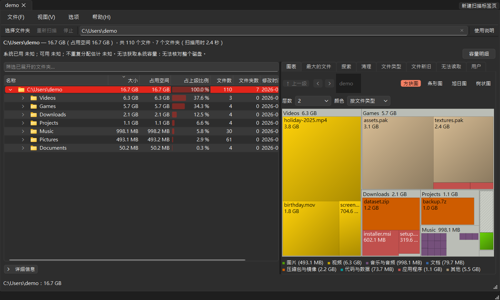

# FileTree

**看看磁盘空间都用到哪里去了。** FileTree 会扫描一个文件夹或整个磁盘，把里面每个文件的大小加总，先列出最大的文件夹和文件——用文件夹树、彩色的方块图和最大文件列表呈现。找到不需要的东西时，直接在窗口里把它移到回收站。

[English](../README.md) | [繁體中文](README_zh-TW.md) | [简体中文](README_zh-CN.md)



## 功能

- **点一下就开始**：选一个文件夹、点一下磁盘、把文件夹拖到窗口上，或粘贴路径。
- **快速、边扫边看**：同时读取多个文件夹；在 SSD 上约 74 万个文件与文件夹只要 6–8 秒。扫描时文件夹树就会陆续出现，最大的文件夹排在最前面；点停止会留下已经读到的部分。
- **文件夹树**：从大到小排列，每一行有它实际占用的磁盘空间、显示它占所在文件夹比例的条形，还有文件数、文件夹数与里面最近一次变动的时间。
- **方块图**：每个文件都是一个方块，大小代表占用的空间，颜色代表文件类型。单击可以在文件夹树中找到它，双击可以放大到那个文件夹。
- **最大的文件**：整个扫描范围内最大的 1,000 个文件，附筛选框。
- **搜索**（Ctrl+F）：按名称，或 `*.mp4` 这类模式，在整个扫描范围内找文件和文件夹。
- **文件类型**与**文件新旧**：按扩展名与种类（图片、视频、压缩包…），以及按最后修改时间统计占用的空间；双击一行就列出它最大的文件。
- **安全地释放空间**：“移到回收站”每次都会先询问，不会永久删除；数字会立刻更新，不必重新扫描。
- **导出**文件夹列表或最大的文件为 CSV（可用 Excel 打开），或把文件夹树导出为 JSON。
- **English、繁體中文、简体中文**，随时切换；内置“使用说明”。
- 链接与目录联接会列出来，但不会进入计算，所以不会重复计算，链接形成的循环也不会让扫描停不下来。无法读取的文件夹列在“无法读取”标签页，不会中断扫描。

## 安装

FileTree 需要 Python 3.10 或更新版本，可在 Windows、macOS 与 Linux 上运行。

```bash
pip install git+https://github.com/JeffreyChen-s-Utils/FileTree.git
je-file-tree
```

或从源代码运行：

```bash
git clone https://github.com/JeffreyChen-s-Utils/FileTree.git
cd FileTree
pip install -r requirements.txt
python start_file_tree.py
```

`python -m je_file_tree` 的效果相同。

### 编译成独立程序

要把 FileTree 给没有安装 Python 的人使用，可以用 Nuitka 编译成程序文件夹或单个 `.exe`：命令与每个选项的用途请见 [nuitka.zh-CN.md](../nuitka.zh-CN.md)。

## 使用方法

1. **选择要扫描的地方**：在起始页点“选择文件夹…”或其中一个磁盘、把文件夹拖到窗口上，或在上方的输入框输入路径后按 Enter。也可以从命令行直接开始扫描：`je-file-tree D:\Projects`（或 `python start_file_tree.py D:\Projects`）。
2. **边扫边看**：文件夹树会立刻出现，FileTree 一边加总，最大的文件夹一边往上排；最大的文件与文件类型在扫描结束时补上。随时可以点“停止”（或按 Esc）结束扫描，已经读到的部分会留下来并标示为不完整。
3. **找出占空间的东西**：最大的文件夹排在最上面。点文件夹旁的箭头看里面的内容，或在右边的方块图里浏览。

### 看懂结果

| 位置 | 告诉你什么 |
|---|---|
| 文件夹树 | 大小、“占用空间”（实际占用的空间：按整个簇计算，通常比大小多一点；压缩文件较少，只在云端的文件是 0）、“占上级比例”（占上一级文件夹的比例）、里面的文件数与文件夹数、最近一次变动的时间 |
| 方块图 | 每个文件一个方块，大小代表占用的空间、颜色代表文件类型；图例在方块图下方 |
| 最大的文件 | 最大的 1,000 个文件；在筛选框输入文字可以缩小列表，双击可以在文件夹树中找到那个文件 |
| 搜索 | 名称含有输入文字的文件和文件夹；模式（`*.mp4`）要匹配完整名称，多个模式用 `;` 分开（`*.iso;*.zip`）；列出最大的 1,000 个匹配项目，并显示全部的数量和总大小 |
| 文件类型 | 每种扩展名占用的空间；在表格上方选一种类型就只显示那一类，双击一行会列出那种文件里最大的几个 |
| 文件新旧 | 按最后修改时间（一个月内……超过 2 年）统计占用的空间；双击一行会列出那一段里最大的文件 |
| 无法读取 | FileTree 没有权限读取的文件夹；里面的内容不会算进去 |

### 释放空间

在任何项目上点右键，可以打开它、在文件管理器中显示、复制路径、在方块图中显示、在 FileTree 以外改过东西之后重新扫描这个文件夹（其余结果不变）、只扫描这个文件夹，或移到回收站（macOS 与 Linux 是“废纸篓”）。要一次移走好几个项目，在文件夹树、“最大的文件”或“搜索”列表里用 Ctrl+单击或 Shift+单击选中，只会询问一次，并列出它们和总大小。FileTree 移动任何东西之前都会先询问，而且不会永久删除。

### 键盘快捷键

| 按键 | 操作 |
|---|---|
| Ctrl+O | 选择文件夹 |
| F5 | 重新扫描 |
| Esc | 停止扫描 |
| Ctrl+F | 按名称搜索 |
| Delete | 把选中的项目（可以好几个）移到回收站 |
| F1 | 使用说明 |
| Ctrl+Q | 退出 |

在 macOS 上请用 ⌘ 代替 Ctrl（⌘R 是重新扫描）。

### 小知识

- 大小是文件的实际大小，按二进制单位计算（1 KB = 1,024 字节），和 Windows 资源管理器相同；可以在“视图 → 大小单位”改用固定的单位。
- 在 Windows 上，FileTree 启动时会像 TreeSize 一样请求管理员权限，受保护的文件夹也能读取。拒绝的话它照常以普通权限运行，读不到的文件夹列在“无法读取”标签页，那里有“以管理员身份重新启动”按钮（“文件”菜单里也有）。不想每次被问，可以关掉“视图 → 启动时请求管理员权限”。
- 默认会计算隐藏文件；关掉“视图 → 包含隐藏文件”，下次扫描就不会算进去。
- 语言、大小单位、窗口布局与最近扫描过的文件夹都会记住（Windows 上保存在注册表的 `HKEY_CURRENT_USER\Software\JE-Chen\FileTree`）。

## 开发

```bash
pip install -r dev_requirements.txt
python -m pytest
python -m ruff check .
python tools/make_screenshots.py
```

`tools/make_screenshots.py` 会用一个虚构的文件夹重新绘制 README 里每种语言的图片。代码结构、主要流程与设计规则写在 [architecture.md](../architecture.md)。

## 许可证

MIT——详见 [LICENSE](../LICENSE)。
