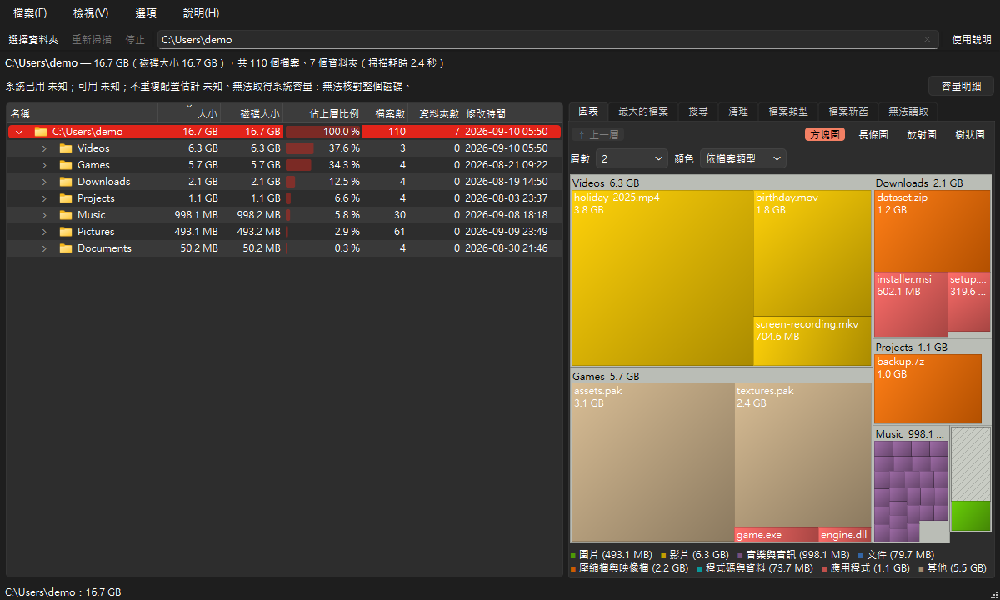

# FileTree

**看看磁碟空間都用到哪裡去了。** FileTree 會掃描一個資料夾或整顆磁碟，把裡面每個檔案的大小加總，先列出最大的資料夾和檔案——用資料夾樹、彩色的方塊圖和最大檔案清單呈現。找到不需要的東西時，直接在視窗裡把它移到資源回收筒。

[English](../README.md) | [繁體中文](README_zh-TW.md) | [简体中文](README_zh-CN.md)



## 功能

- **按一下就開始**：選一個資料夾、按一下磁碟、把資料夾拖曳到視窗上，或貼上路徑。
- **快速**：同時讀取多個資料夾；在 SSD 上約 74 萬個檔案與資料夾只要 6–8 秒，掃描期間視窗照樣可以操作，隨時可以停止。
- **資料夾樹**：由大到小排列，每一列有長條顯示它佔所在資料夾的比例，還有檔案數、資料夾數與裡面最近一次變動的時間。
- **方塊圖**：每個檔案都是一個方塊，大小代表佔用的空間，顏色代表檔案類型。按一下可以在資料夾樹中找到它，按兩下可以放大到那個資料夾。
- **最大的檔案**：整個掃描範圍內最大的 1,000 個檔案，附篩選框。
- **檔案類型**：依副檔名與種類（圖片、影片、壓縮檔…）統計佔用的空間。
- **安全地釋出空間**：「移到資源回收筒」每次都會先詢問，不會永久刪除；數字會立刻更新，不必重新掃描。
- **匯出**資料夾清單或最大的檔案成 CSV（可用 Excel 開啟），或把資料夾樹匯出成 JSON。
- **English、繁體中文、简体中文**，隨時切換；內建「使用說明」。
- 連結與目錄連接會列出來，但不會跟進去計算，所以不會重複計算，連結形成的迴圈也不會讓掃描停不下來。無法讀取的資料夾列在「無法讀取」分頁，不會中斷掃描。

## 安裝

FileTree 需要 Python 3.10 以上，可在 Windows、macOS 與 Linux 上執行。

```bash
pip install git+https://github.com/JeffreyChen-s-Utils/FileTree.git
file-tree
```

或從原始碼執行：

```bash
git clone https://github.com/JeffreyChen-s-Utils/FileTree.git
cd FileTree
pip install -r requirements.txt
python start_file_tree.py
```

`python -m file_tree` 的效果相同。

### 編譯成獨立程式

要把 FileTree 給沒有安裝 Python 的人使用，可以用 Nuitka 編譯成程式資料夾或單一 `.exe`：指令與每個選項的用途請見 [nuitka.zh-TW.md](../nuitka.zh-TW.md)。

## 使用方式

1. **選擇要掃描的地方**：在起始頁按「選擇資料夾…」或其中一顆磁碟、把資料夾拖曳到視窗上，或在上方的方框輸入路徑後按 Enter。也可以從命令列直接開始掃描：`file-tree D:\Projects`（或 `python start_file_tree.py D:\Projects`）。
2. **稍等一下**：FileTree 工作時會即時更新數量與正在讀取的資料夾。隨時可以按「停止」（或 Esc）結束掃描。
3. **找出佔空間的東西**：最大的資料夾排在最上面。按資料夾旁的箭頭看裡面的內容，或在右邊的方塊圖裡瀏覽。

### 看懂結果

| 位置 | 告訴你什麼 |
|---|---|
| 資料夾樹 | 大小、「佔上層比例」（佔上一層資料夾的比例）、裡面的檔案數與資料夾數、最近一次變動的時間 |
| 方塊圖 | 每個檔案一個方塊，大小代表佔用的空間、顏色代表檔案類型；圖例在方塊圖下方 |
| 最大的檔案 | 最大的 1,000 個檔案；在篩選框輸入文字可以縮小清單，按兩下可以在資料夾樹中找到那個檔案 |
| 檔案類型 | 每種副檔名佔用的空間；在表格上方選一種類型就只顯示那一類 |
| 無法讀取 | FileTree 沒有權限讀取的資料夾；裡面的內容不會算進去 |

### 釋出空間

在任何項目上按右鍵，可以開啟它、在檔案總管中顯示、複製路徑、在方塊圖中顯示、只掃描這個資料夾，或移到資源回收筒（macOS 與 Linux 是「垃圾桶」）。FileTree 移動任何東西之前都會先詢問，而且不會永久刪除。

### 鍵盤快速鍵

| 按鍵 | 動作 |
|---|---|
| Ctrl+O | 選擇資料夾 |
| F5 | 重新掃描 |
| Esc | 停止掃描 |
| Delete | 把選取的項目移到資源回收筒 |
| F1 | 使用說明 |
| Ctrl+Q | 結束 |

在 macOS 上請用 ⌘ 取代 Ctrl（⌘R 是重新掃描）。

### 小知識

- 大小是檔案的實際大小，以二進位單位計算（1 KB = 1,024 位元組），和 Windows 檔案總管相同；可以在「檢視 → 大小單位」改用固定的單位。
- 有些系統資料夾只有系統管理員能讀取；用系統管理員身分執行 FileTree 就能一起計算。
- 預設會計算隱藏檔案；關掉「檢視 → 包含隱藏檔案」，下次掃描就不會算進去。
- 語言、大小單位、視窗配置與最近掃描過的資料夾都會記住（Windows 上存在登錄檔的 `HKEY_CURRENT_USER\Software\JE-Chen\FileTree`）。

## 開發

```bash
pip install -r dev_requirements.txt
python -m pytest
python -m ruff check .
python tools/make_screenshots.py
```

`tools/make_screenshots.py` 會用一個虛構的資料夾重新繪製 README 裡每種語言的圖片。程式架構、主要流程與設計規則寫在 [architecture.md](../architecture.md)。

## 授權

MIT——詳見 [LICENSE](../LICENSE)。
